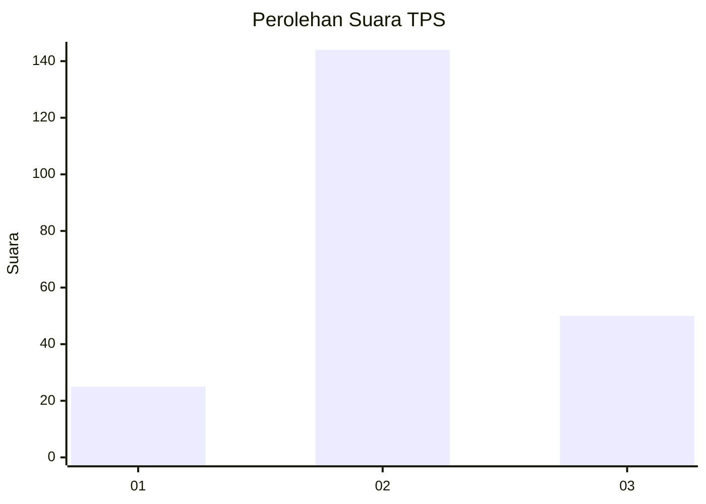
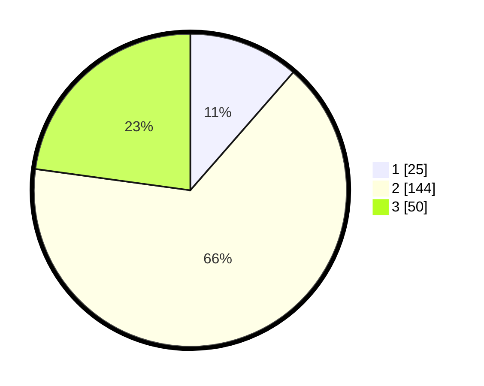

# Hasil

## Grafik

## Tabel

| No. | Nama Paslon    | Suara | Suara (raw) | Persentase |
|:--- |:-------------- | -----:| -----------:| ----------:|
| 1   | ANIES MUHAIMIN | 25    | [25][p-1]   | 11,42      |
| 2   | PRABOWO GIBRAN | 144   | [144][p-2]  | 65,75      |
| 3   | GANJAR MAHFUD  | 50    | [50][p-3]   | 22,83      |

[p-1]: https://github.com/gigit-pemilu/pemilu-2024/blob/main/pilpres/hitung-suara/sub/35-jawa-timur/sub/10-banyuwangi/sub/13-rogojampi/sub/2013-rogojampi/sub/005-tps/sub/paslon-1.txt
[p-2]: https://github.com/gigit-pemilu/pemilu-2024/blob/main/pilpres/hitung-suara/sub/35-jawa-timur/sub/10-banyuwangi/sub/13-rogojampi/sub/2013-rogojampi/sub/005-tps/sub/paslon-2.txt
[p-3]: https://github.com/gigit-pemilu/pemilu-2024/blob/main/pilpres/hitung-suara/sub/35-jawa-timur/sub/10-banyuwangi/sub/13-rogojampi/sub/2013-rogojampi/sub/005-tps/sub/paslon-3.txt

## Foto C Plano

https://sirekap-obj-formc.kpu.go.id/c0ab/pemilu/ppwp/35/10/13/20/13/3510132013005-20240220-082417--8a273ac0-f1ab-4aca-a391-ad974e116f94.jpg

https://sirekap-obj-formc.kpu.go.id/c0ab/pemilu/ppwp/35/10/13/20/13/3510132013005-20240214-222418--e8d05a92-dedd-45ec-a4c5-ef52562ca18c.jpg

https://sirekap-obj-formc.kpu.go.id/c0ab/pemilu/ppwp/35/10/13/20/13/3510132013005-20240214-222706--18223786-81f8-4cc4-a3b4-0e40db9b7981.jpg

## Metadata

| Key        | Value               |
| ---------- | ------------------- |
| Time Stamp | 2024-02-24 22:31:28 |

