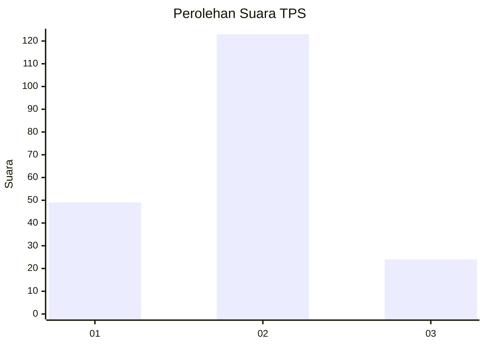
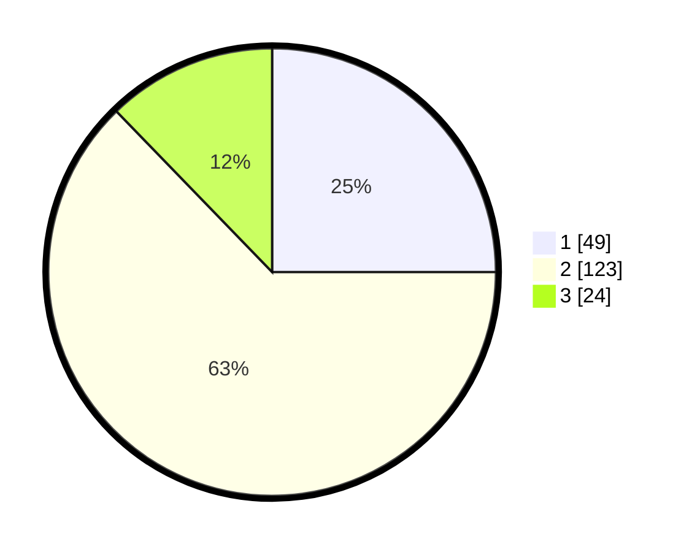

# Hasil

## Grafik

## Tabel

| No. | Nama Paslon    | Suara | Suara (raw) | Persentase |
|:--- |:-------------- | -----:| -----------:| ----------:|
| 1   | ANIES MUHAIMIN | 49    | [49][p-1]   | 25,00      |
| 2   | PRABOWO GIBRAN | 123   | [123][p-2]  | 62,76      |
| 3   | GANJAR MAHFUD  | 24    | [24][p-3]   | 12,24      |

[p-1]: https://github.com/gigit-pemilu/pemilu-2024/blob/main/pilpres/hitung-suara/sub/35-jawa-timur/sub/10-banyuwangi/sub/15-glagah/sub/2010-tamansuruh/sub/001-tps/sub/paslon-1.txt
[p-2]: https://github.com/gigit-pemilu/pemilu-2024/blob/main/pilpres/hitung-suara/sub/35-jawa-timur/sub/10-banyuwangi/sub/15-glagah/sub/2010-tamansuruh/sub/001-tps/sub/paslon-2.txt
[p-3]: https://github.com/gigit-pemilu/pemilu-2024/blob/main/pilpres/hitung-suara/sub/35-jawa-timur/sub/10-banyuwangi/sub/15-glagah/sub/2010-tamansuruh/sub/001-tps/sub/paslon-3.txt

## Foto C Plano

https://sirekap-obj-formc.kpu.go.id/59d3/pemilu/ppwp/35/10/15/20/10/3510152010001-20240218-125157--1a35e588-f1ea-4a49-b2c5-647d173e2ce7.jpg

https://sirekap-obj-formc.kpu.go.id/59d3/pemilu/ppwp/35/10/15/20/10/3510152010001-20240218-130639--78305442-a6ae-41bf-bb68-8430206ba1b3.jpg

https://sirekap-obj-formc.kpu.go.id/59d3/pemilu/ppwp/35/10/15/20/10/3510152010001-20240218-130823--08856a00-510a-49cd-8d67-86a9a4bf90fc.jpg

## Metadata

| Key        | Value               |
| ---------- | ------------------- |
| Time Stamp | 2024-02-24 22:31:28 |

