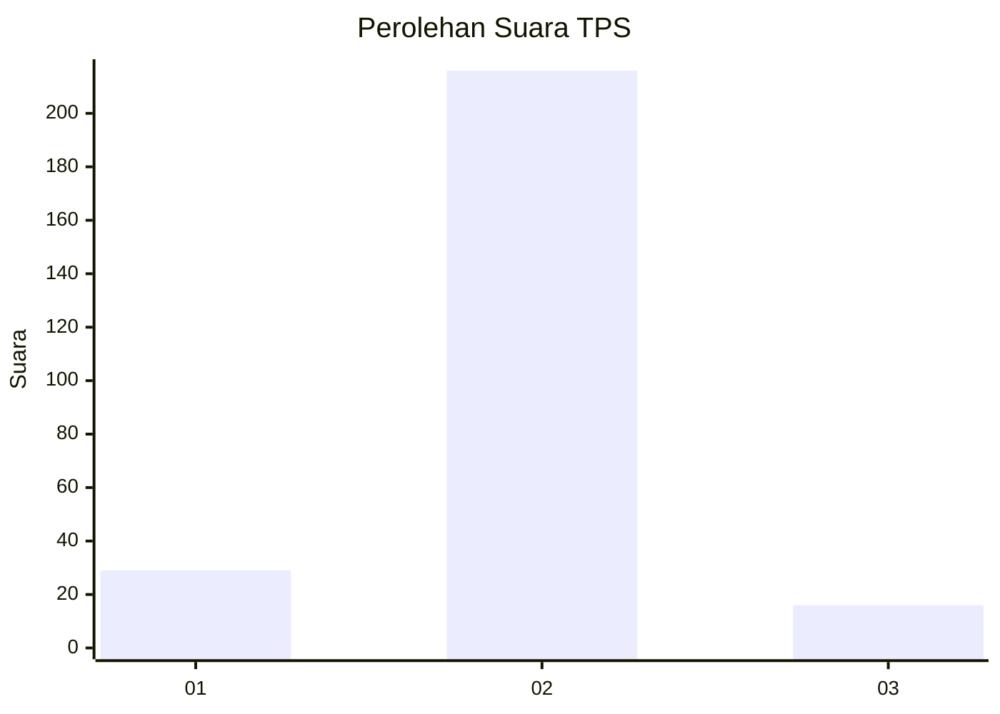
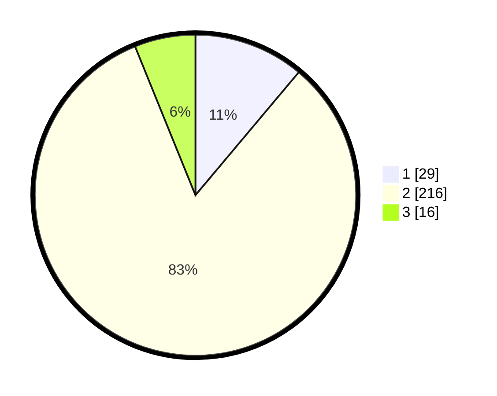

# Hasil

## Grafik

## Tabel

| No. | Nama Paslon    | Suara | Suara (raw) | Persentase |
|:--- |:-------------- | -----:| -----------:| ----------:|
| 1   | ANIES MUHAIMIN | 29    | [29][p-1]   | 11,11      |
| 2   | PRABOWO GIBRAN | 216   | [216][p-2]  | 82,76      |
| 3   | GANJAR MAHFUD  | 16    | [16][p-3]   | 6,13       |

[p-1]: https://github.com/gigit-pemilu/pemilu-2024/blob/main/pilpres/hitung-suara/sub/35-jawa-timur/sub/10-banyuwangi/sub/15-glagah/sub/2012-kampunganyar/sub/013-tps/sub/paslon-1.txt
[p-2]: https://github.com/gigit-pemilu/pemilu-2024/blob/main/pilpres/hitung-suara/sub/35-jawa-timur/sub/10-banyuwangi/sub/15-glagah/sub/2012-kampunganyar/sub/013-tps/sub/paslon-2.txt
[p-3]: https://github.com/gigit-pemilu/pemilu-2024/blob/main/pilpres/hitung-suara/sub/35-jawa-timur/sub/10-banyuwangi/sub/15-glagah/sub/2012-kampunganyar/sub/013-tps/sub/paslon-3.txt

## Foto C Plano

https://sirekap-obj-formc.kpu.go.id/1abd/pemilu/ppwp/35/10/15/20/12/3510152012013-20240217-143852--b863df82-d77c-4f7b-8c15-4122bcd25744.jpg

https://sirekap-obj-formc.kpu.go.id/1abd/pemilu/ppwp/35/10/15/20/12/3510152012013-20240217-144203--c5f2c335-c50c-4dd6-8c4e-70d25f30b868.jpg

https://sirekap-obj-formc.kpu.go.id/1abd/pemilu/ppwp/35/10/15/20/12/3510152012013-20240217-144451--79a401c1-a309-4ac3-b4d2-a26ab51c6aab.jpg

## Metadata

| Key        | Value               |
| ---------- | ------------------- |
| Time Stamp | 2024-02-21 21:00:04 |

## DATA PEMILIH TETAP

Jumlah pemilih dalam DPT: **264**.
 * L: **122**.
 * P: **142**.

## DATA PENGGUNA HAK PILIH

Jumlah pengguna hak pilih dalam DPT: **220**.
 * L: **101**.
 * P: **119**.

Jumlah pengguna hak pilih dalam DPTb: **0**.
 * L: **0**.
 * P: **0**.

Jumlah pengguna hak pilih dalam DPK: **50**.
 * L: **21**.
 * P: **29**.

Jumlah pengguna hak pilih: **270**.
 * L: **122**.
 * P: **148**.

## JUMLAH SUARA SAH DAN TIDAK SAH

JUMLAH SELURUH SUARA SAH: **261**.

JUMLAH SUARA TIDAK SAH: **9**.

JUMLAH SELURUH SUARA SAH DAN SUARA TIDAK SAH: **270**.

