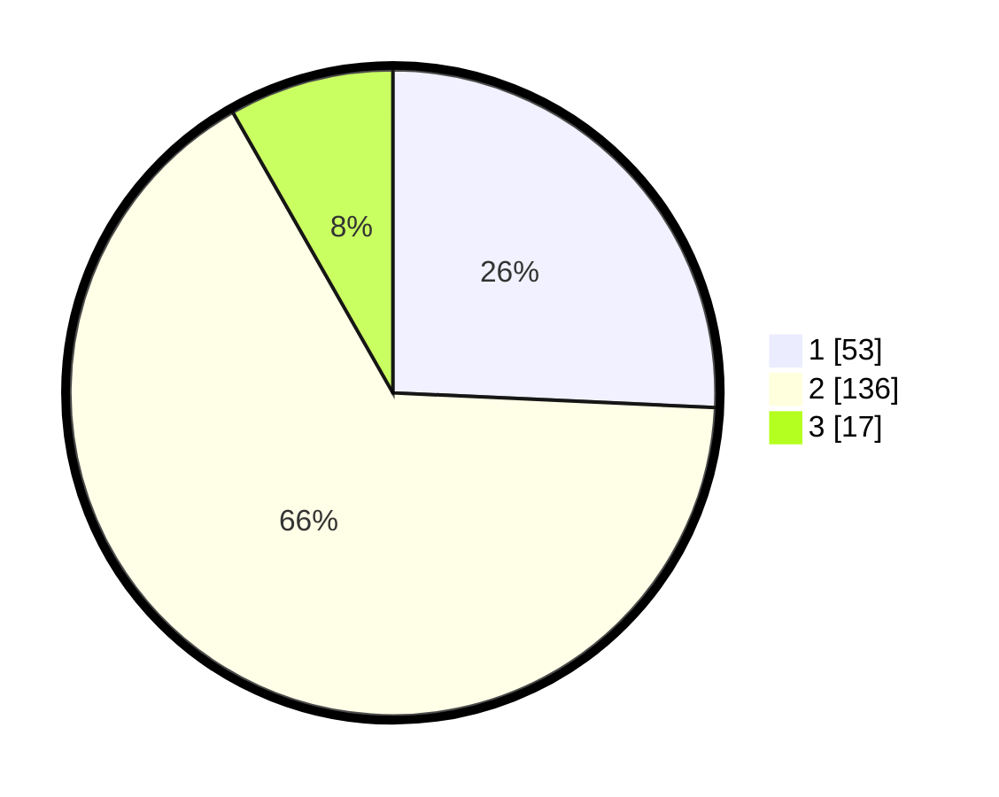

# Hasil

## Grafik

## Tabel

| No. | Nama Paslon    | Suara | Suara (raw) | Persentase |
|:--- |:-------------- | -----:| -----------:| ----------:|
| 1   | ANIES MUHAIMIN | 53    | [53][p-1]   | 25,73      |
| 2   | PRABOWO GIBRAN | 136   | [136][p-2]  | 66,02      |
| 3   | GANJAR MAHFUD  | 17    | [17][p-3]   | 8,25       |

[p-1]: https://github.com/gigit-pemilu/pemilu-2024/blob/main/pilpres/hitung-suara/sub/35-jawa-timur/sub/10-banyuwangi/sub/16-banyuwangi/sub/1001-pakis/sub/001-tps/sub/paslon-1.txt
[p-2]: https://github.com/gigit-pemilu/pemilu-2024/blob/main/pilpres/hitung-suara/sub/35-jawa-timur/sub/10-banyuwangi/sub/16-banyuwangi/sub/1001-pakis/sub/001-tps/sub/paslon-2.txt
[p-3]: https://github.com/gigit-pemilu/pemilu-2024/blob/main/pilpres/hitung-suara/sub/35-jawa-timur/sub/10-banyuwangi/sub/16-banyuwangi/sub/1001-pakis/sub/001-tps/sub/paslon-3.txt

## Foto C Plano

https://sirekap-obj-formc.kpu.go.id/bd85/pemilu/ppwp/35/10/16/10/01/3510161001001-20240219-215544--5a774bd8-0943-4cfa-9a8b-ec382cbdfcce.jpg

https://sirekap-obj-formc.kpu.go.id/bd85/pemilu/ppwp/35/10/16/10/01/3510161001001-20240219-215652--454b5b72-ec9a-4865-b6a6-a734f8ab646f.jpg

https://sirekap-obj-formc.kpu.go.id/bd85/pemilu/ppwp/35/10/16/10/01/3510161001001-20240219-215739--3bd17110-61d3-41b4-a348-327aead7cda3.jpg

## Metadata

| Key        | Value               |
| ---------- | ------------------- |
| Time Stamp | 2024-02-24 22:31:28 |

