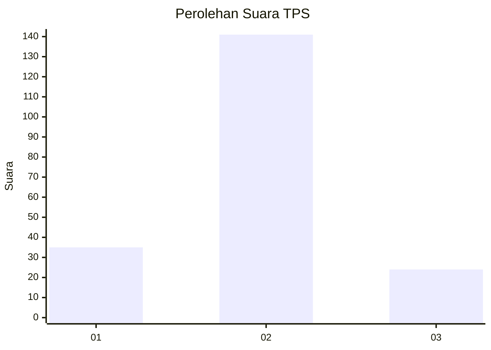
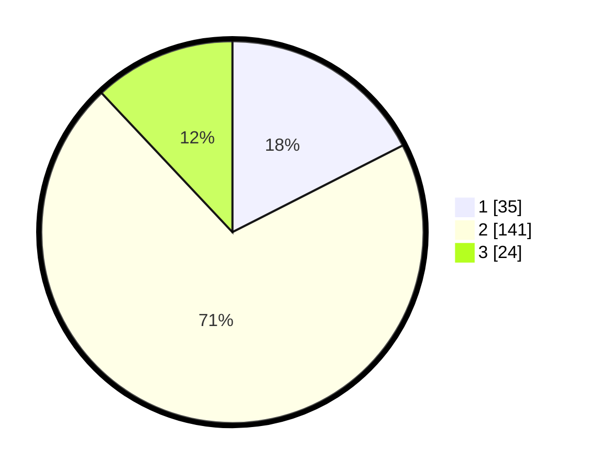

# Hasil

## Grafik

## Tabel

| No. | Nama Paslon    | Suara | Suara (raw) | Persentase |
|:--- |:-------------- | -----:| -----------:| ----------:|
| 1   | ANIES MUHAIMIN | 35    | [35][p-1]   | 17,50      |
| 2   | PRABOWO GIBRAN | 141   | [141][p-2]  | 70,50      |
| 3   | GANJAR MAHFUD  | 24    | [24][p-3]   | 12,00      |

[p-1]: https://github.com/gigit-pemilu/pemilu-2024-35-jawa-timur/blob/main/pilpres/hitung-suara/sub/35-jawa-timur/sub/10-banyuwangi/sub/16-banyuwangi/sub/1001-pakis/sub/002-tps/sub/paslon-1.txt
[p-2]: https://github.com/gigit-pemilu/pemilu-2024-35-jawa-timur/blob/main/pilpres/hitung-suara/sub/35-jawa-timur/sub/10-banyuwangi/sub/16-banyuwangi/sub/1001-pakis/sub/002-tps/sub/paslon-2.txt
[p-3]: https://github.com/gigit-pemilu/pemilu-2024-35-jawa-timur/blob/main/pilpres/hitung-suara/sub/35-jawa-timur/sub/10-banyuwangi/sub/16-banyuwangi/sub/1001-pakis/sub/002-tps/sub/paslon-3.txt

## Foto C Plano

https://sirekap-obj-formc.kpu.go.id/bae7/pemilu/ppwp/35/10/16/10/01/3510161001002-20240219-220039--d8e3f30a-21fa-43db-8fa1-cfbbfbda7c60.jpg

https://sirekap-obj-formc.kpu.go.id/bae7/pemilu/ppwp/35/10/16/10/01/3510161001002-20240219-220302--3d6ad506-24db-486c-923d-c4a1bc2001b8.jpg

https://sirekap-obj-formc.kpu.go.id/bae7/pemilu/ppwp/35/10/16/10/01/3510161001002-20240219-220128--851bf2bd-41a8-48af-b0aa-3c65bb8684c1.jpg

## Metadata

| Key        | Value               |
| ---------- | ------------------- |
| Time Stamp | 2024-02-24 22:31:28 |

