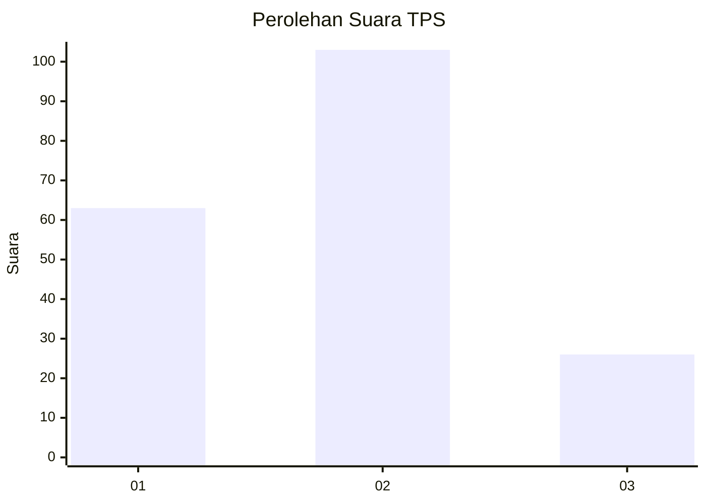
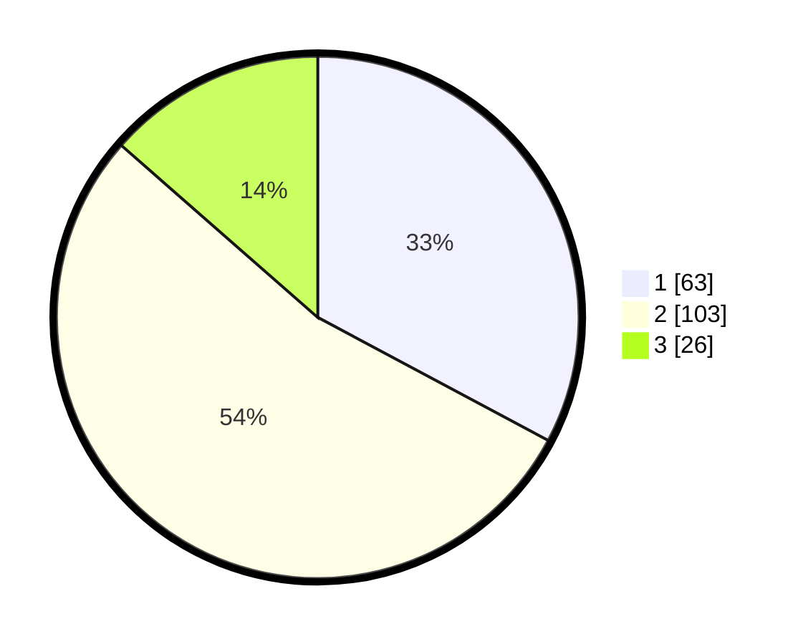

# Hasil

## Grafik

## Tabel

| No. | Nama Paslon    | Suara | Suara (raw) | Persentase |
|:--- |:-------------- | -----:| -----------:| ----------:|
| 1   | ANIES MUHAIMIN | 63    | [63][p-1]   | 32,81      |
| 2   | PRABOWO GIBRAN | 103   | [103][p-2]  | 53,65      |
| 3   | GANJAR MAHFUD  | 26    | [26][p-3]   | 13,54      |

[p-1]: https://github.com/gigit-pemilu/pemilu-2024-35-jawa-timur/blob/main/pilpres/hitung-suara/sub/35-jawa-timur/sub/10-banyuwangi/sub/16-banyuwangi/sub/1001-pakis/sub/003-tps/sub/paslon-1.txt
[p-2]: https://github.com/gigit-pemilu/pemilu-2024-35-jawa-timur/blob/main/pilpres/hitung-suara/sub/35-jawa-timur/sub/10-banyuwangi/sub/16-banyuwangi/sub/1001-pakis/sub/003-tps/sub/paslon-2.txt
[p-3]: https://github.com/gigit-pemilu/pemilu-2024-35-jawa-timur/blob/main/pilpres/hitung-suara/sub/35-jawa-timur/sub/10-banyuwangi/sub/16-banyuwangi/sub/1001-pakis/sub/003-tps/sub/paslon-3.txt

## Foto C Plano

https://sirekap-obj-formc.kpu.go.id/febb/pemilu/ppwp/35/10/16/10/01/3510161001003-20240219-220437--7e51bc02-b572-4d0c-9d3a-9939ae490084.jpg

https://sirekap-obj-formc.kpu.go.id/febb/pemilu/ppwp/35/10/16/10/01/3510161001003-20240219-220518--18791bae-5d0f-4f07-9cda-8d76e9425251.jpg

https://sirekap-obj-formc.kpu.go.id/febb/pemilu/ppwp/35/10/16/10/01/3510161001003-20240219-220557--13d598ed-9eb8-4131-82a9-845bc30a55e8.jpg

## Metadata

| Key        | Value               |
| ---------- | ------------------- |
| Time Stamp | 2024-02-24 22:31:28 |

