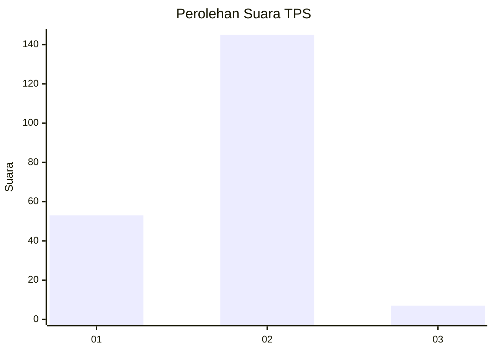
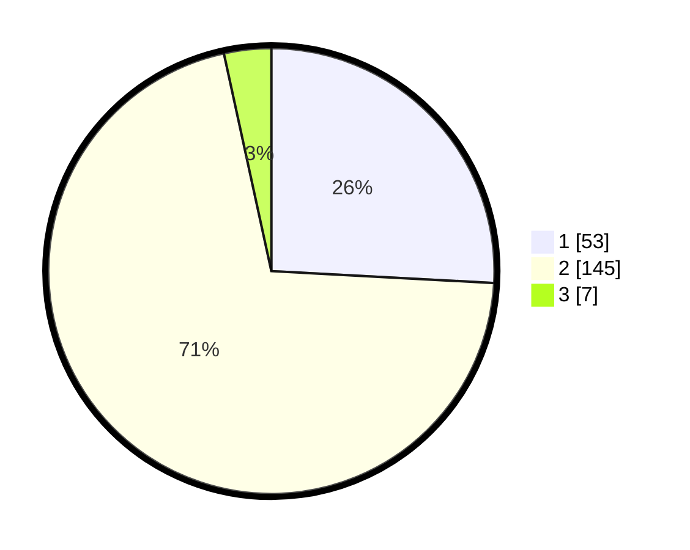

# Hasil

## Grafik

## Tabel

| No. | Nama Paslon    | Suara | Suara (raw) | Persentase |
|:--- |:-------------- | -----:| -----------:| ----------:|
| 1   | ANIES MUHAIMIN | 53    | [53][p-1]   | 25,85      |
| 2   | PRABOWO GIBRAN | 145   | [145][p-2]  | 70,73      |
| 3   | GANJAR MAHFUD  | 7     | [7][p-3]    | 3,41       |

[p-1]: https://github.com/gigit-pemilu/pemilu-2024/blob/main/pilpres/hitung-suara/sub/35-jawa-timur/sub/10-banyuwangi/sub/16-banyuwangi/sub/1001-pakis/sub/005-tps/sub/paslon-1.txt
[p-2]: https://github.com/gigit-pemilu/pemilu-2024/blob/main/pilpres/hitung-suara/sub/35-jawa-timur/sub/10-banyuwangi/sub/16-banyuwangi/sub/1001-pakis/sub/005-tps/sub/paslon-2.txt
[p-3]: https://github.com/gigit-pemilu/pemilu-2024/blob/main/pilpres/hitung-suara/sub/35-jawa-timur/sub/10-banyuwangi/sub/16-banyuwangi/sub/1001-pakis/sub/005-tps/sub/paslon-3.txt

## Foto C Plano

https://sirekap-obj-formc.kpu.go.id/aa26/pemilu/ppwp/35/10/16/10/01/3510161001005-20240219-220713--8e6b8986-4ec3-4cb9-bd23-37b5934fc2c0.jpg

https://sirekap-obj-formc.kpu.go.id/aa26/pemilu/ppwp/35/10/16/10/01/3510161001005-20240219-220753--b93896a7-57a6-49e4-9a45-d6dc82a732e2.jpg

https://sirekap-obj-formc.kpu.go.id/aa26/pemilu/ppwp/35/10/16/10/01/3510161001005-20240219-220831--a55e1a9b-f9ea-4fbd-ac05-1cb003c87933.jpg

## Metadata

| Key        | Value               |
| ---------- | ------------------- |
| Time Stamp | 2024-02-24 22:31:28 |

