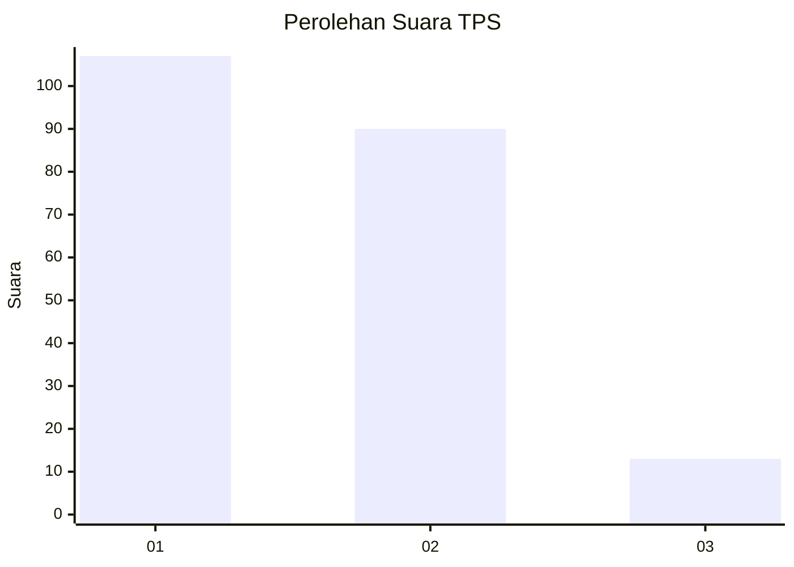
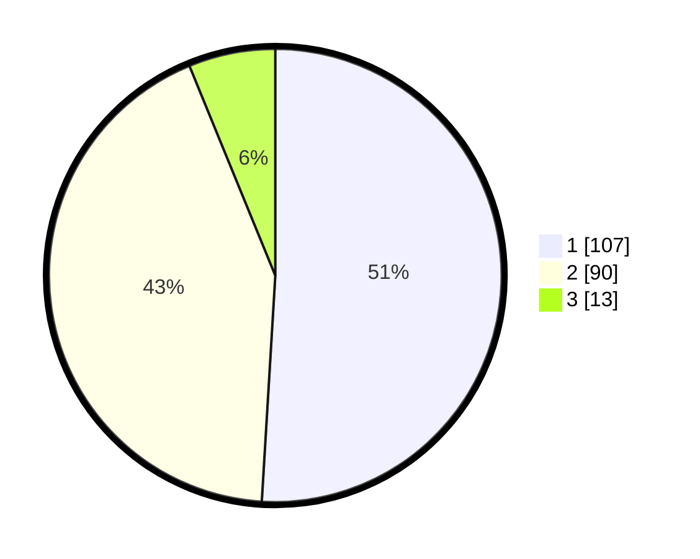

# Hasil

## Grafik

## Tabel

| No. | Nama Paslon    | Suara | Suara (raw) | Persentase |
|:--- |:-------------- | -----:| -----------:| ----------:|
| 1   | ANIES MUHAIMIN | 107   | [107][p-1]  | 50,95      |
| 2   | PRABOWO GIBRAN | 90    | [90][p-2]   | 42,86      |
| 3   | GANJAR MAHFUD  | 13    | [13][p-3]   | 6,19       |

[p-1]: https://github.com/gigit-pemilu/pemilu-2024/blob/main/pilpres/hitung-suara/sub/35-jawa-timur/sub/10-banyuwangi/sub/16-banyuwangi/sub/1001-pakis/sub/007-tps/sub/paslon-1.txt
[p-2]: https://github.com/gigit-pemilu/pemilu-2024/blob/main/pilpres/hitung-suara/sub/35-jawa-timur/sub/10-banyuwangi/sub/16-banyuwangi/sub/1001-pakis/sub/007-tps/sub/paslon-2.txt
[p-3]: https://github.com/gigit-pemilu/pemilu-2024/blob/main/pilpres/hitung-suara/sub/35-jawa-timur/sub/10-banyuwangi/sub/16-banyuwangi/sub/1001-pakis/sub/007-tps/sub/paslon-3.txt

## Foto C Plano

https://sirekap-obj-formc.kpu.go.id/5533/pemilu/ppwp/35/10/16/10/01/3510161001007-20240215-022105--f22d6b0f-01c3-4424-88f3-70d5e200c539.jpg

https://sirekap-obj-formc.kpu.go.id/5533/pemilu/ppwp/35/10/16/10/01/3510161001007-20240215-022112--3765aa76-151a-4738-bb52-0d54f9650be5.jpg

https://sirekap-obj-formc.kpu.go.id/5533/pemilu/ppwp/35/10/16/10/01/3510161001007-20240215-022123--c2580f51-334e-4a5a-a4cd-7487d2f036ad.jpg

## Metadata

| Key        | Value               |
| ---------- | ------------------- |
| Time Stamp | 2024-02-24 22:31:28 |

