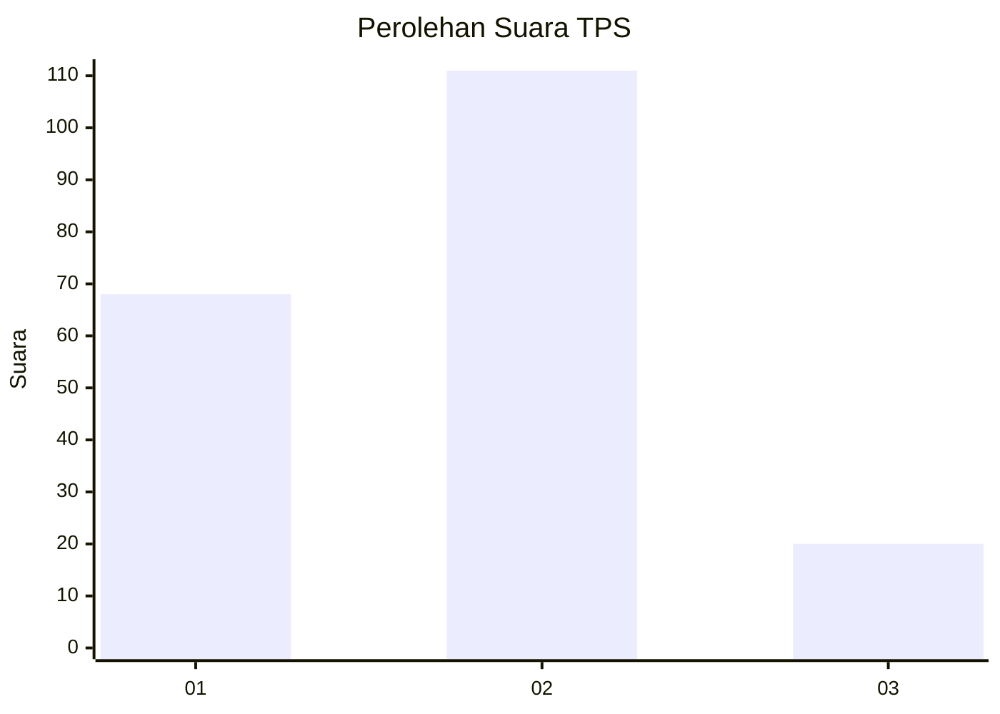
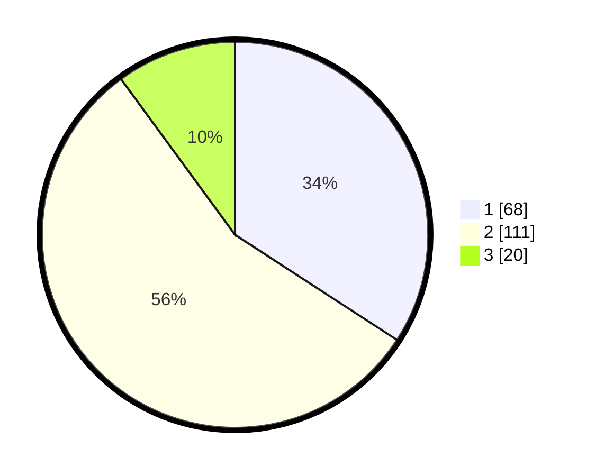

# Hasil

## Grafik

## Tabel

| No. | Nama Paslon    | Suara | Suara (raw) | Persentase |
|:--- |:-------------- | -----:| -----------:| ----------:|
| 1   | ANIES MUHAIMIN | 68    | [68][p-1]   | 34,17      |
| 2   | PRABOWO GIBRAN | 111   | [111][p-2]  | 55,78      |
| 3   | GANJAR MAHFUD  | 20    | [20][p-3]   | 10,05      |

[p-1]: https://github.com/gigit-pemilu/pemilu-2024-35-jawa-timur/blob/main/pilpres/hitung-suara/sub/35-jawa-timur/sub/10-banyuwangi/sub/16-banyuwangi/sub/1001-pakis/sub/011-tps/sub/paslon-1.txt
[p-2]: https://github.com/gigit-pemilu/pemilu-2024-35-jawa-timur/blob/main/pilpres/hitung-suara/sub/35-jawa-timur/sub/10-banyuwangi/sub/16-banyuwangi/sub/1001-pakis/sub/011-tps/sub/paslon-2.txt
[p-3]: https://github.com/gigit-pemilu/pemilu-2024-35-jawa-timur/blob/main/pilpres/hitung-suara/sub/35-jawa-timur/sub/10-banyuwangi/sub/16-banyuwangi/sub/1001-pakis/sub/011-tps/sub/paslon-3.txt

## Foto C Plano

https://sirekap-obj-formc.kpu.go.id/57e9/pemilu/ppwp/35/10/16/10/01/3510161001011-20240214-223516--1315f9dc-eceb-4f88-a729-8ea1a1490992.jpg

https://sirekap-obj-formc.kpu.go.id/57e9/pemilu/ppwp/35/10/16/10/01/3510161001011-20240214-155754--a6219a7a-f431-4459-b4b9-fe479317ef72.jpg

https://sirekap-obj-formc.kpu.go.id/57e9/pemilu/ppwp/35/10/16/10/01/3510161001011-20240214-155902--99e6351d-f989-4e26-a7ca-a8f53a79330f.jpg

## Metadata

| Key        | Value               |
| ---------- | ------------------- |
| Time Stamp | 2024-02-24 22:31:28 |

