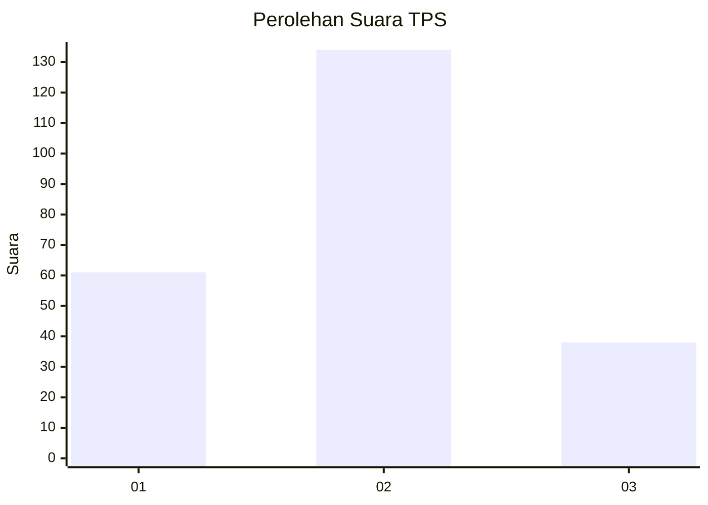

# Hasil

## Grafik

## Tabel

| No. | Nama Paslon    | Suara | Suara (raw) | Persentase |
|:--- |:-------------- | -----:| -----------:| ----------:|
| 1   | ANIES MUHAIMIN | 61    | [61][p-1]   | 26,18      |
| 2   | PRABOWO GIBRAN | 134   | [134][p-2]  | 57,51      |
| 3   | GANJAR MAHFUD  | 38    | [38][p-3]   | 16,31      |

[p-1]: https://github.com/gigit-pemilu/pemilu-2024-35-jawa-timur/blob/main/pilpres/hitung-suara/sub/35-jawa-timur/sub/10-banyuwangi/sub/16-banyuwangi/sub/1003-kebalenan/sub/008-tps/sub/paslon-1.txt
[p-2]: https://github.com/gigit-pemilu/pemilu-2024-35-jawa-timur/blob/main/pilpres/hitung-suara/sub/35-jawa-timur/sub/10-banyuwangi/sub/16-banyuwangi/sub/1003-kebalenan/sub/008-tps/sub/paslon-2.txt
[p-3]: https://github.com/gigit-pemilu/pemilu-2024-35-jawa-timur/blob/main/pilpres/hitung-suara/sub/35-jawa-timur/sub/10-banyuwangi/sub/16-banyuwangi/sub/1003-kebalenan/sub/008-tps/sub/paslon-3.txt

## Foto C Plano

https://sirekap-obj-formc.kpu.go.id/577e/pemilu/ppwp/35/10/16/10/03/3510161003008-20240215-194319--4b6e132e-ad16-443f-b11d-9190cc0649cc.jpg

https://sirekap-obj-formc.kpu.go.id/577e/pemilu/ppwp/35/10/16/10/03/3510161003008-20240215-194348--d115bff5-37ef-47cc-9bb5-e00a17c54b01.jpg

https://sirekap-obj-formc.kpu.go.id/577e/pemilu/ppwp/35/10/16/10/03/3510161003008-20240215-194413--6fa2c58c-d863-42d0-a22b-87e2eedc85f4.jpg

## Metadata

| Key        | Value               |
| ---------- | ------------------- |
| Time Stamp | 2024-02-21 17:00:00 |

