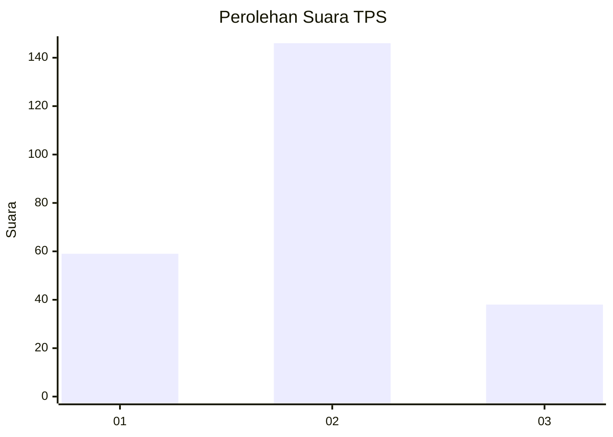

# Hasil

## Grafik

## Tabel

| No. | Nama Paslon    | Suara | Suara (raw) | Persentase |
|:--- |:-------------- | -----:| -----------:| ----------:|
| 1   | ANIES MUHAIMIN | 59    | [59][p-1]   | 24,28      |
| 2   | PRABOWO GIBRAN | 146   | [146][p-2]  | 60,08      |
| 3   | GANJAR MAHFUD  | 38    | [38][p-3]   | 15,64      |

[p-1]: https://github.com/gigit-pemilu/pemilu-2024-35-jawa-timur/blob/main/pilpres/hitung-suara/sub/35-jawa-timur/sub/10-banyuwangi/sub/16-banyuwangi/sub/1003-kebalenan/sub/018-tps/sub/paslon-1.txt
[p-2]: https://github.com/gigit-pemilu/pemilu-2024-35-jawa-timur/blob/main/pilpres/hitung-suara/sub/35-jawa-timur/sub/10-banyuwangi/sub/16-banyuwangi/sub/1003-kebalenan/sub/018-tps/sub/paslon-2.txt
[p-3]: https://github.com/gigit-pemilu/pemilu-2024-35-jawa-timur/blob/main/pilpres/hitung-suara/sub/35-jawa-timur/sub/10-banyuwangi/sub/16-banyuwangi/sub/1003-kebalenan/sub/018-tps/sub/paslon-3.txt

## Foto C Plano

https://sirekap-obj-formc.kpu.go.id/e770/pemilu/ppwp/35/10/16/10/03/3510161003018-20240215-001833--bb588e7d-c1bb-4897-91b9-71033854627e.jpg

https://sirekap-obj-formc.kpu.go.id/e770/pemilu/ppwp/35/10/16/10/03/3510161003018-20240215-001928--246848a9-28a8-49c4-8f76-b29fdf258b6d.jpg

https://sirekap-obj-formc.kpu.go.id/e770/pemilu/ppwp/35/10/16/10/03/3510161003018-20240215-002015--2019ca30-f009-4ab9-a75e-016333076da4.jpg

## Metadata

| Key        | Value               |
| ---------- | ------------------- |
| Time Stamp | 2024-02-24 22:31:28 |

