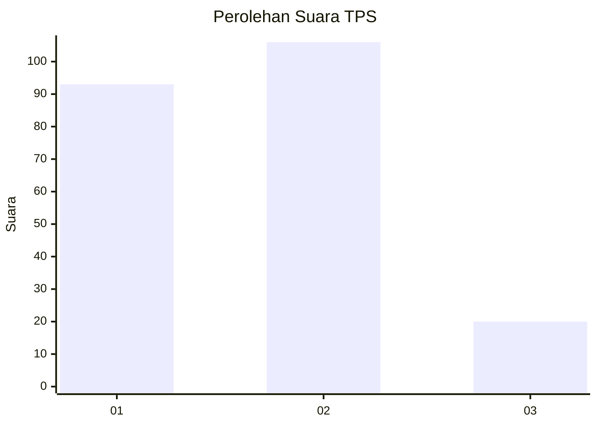
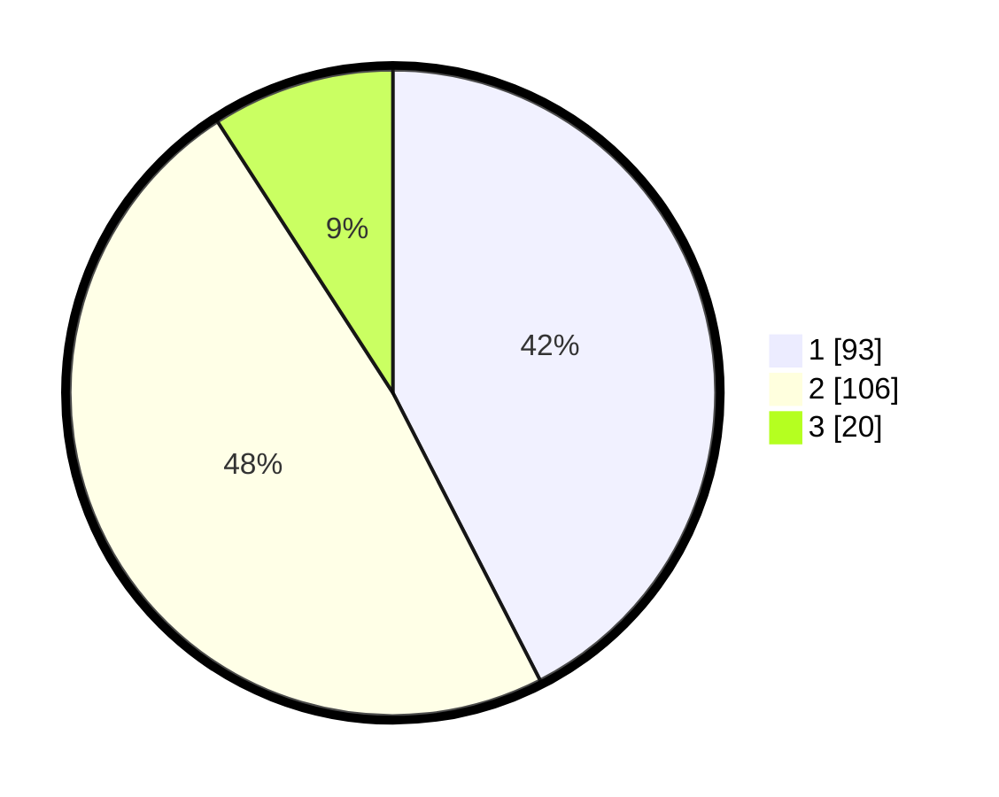

# Hasil

## Grafik

## Tabel

| No. | Nama Paslon    | Suara | Suara (raw) | Persentase |
|:--- |:-------------- | -----:| -----------:| ----------:|
| 1   | ANIES MUHAIMIN | 93    | [93][p-1]   | 42,47      |
| 2   | PRABOWO GIBRAN | 106   | [106][p-2]  | 48,40      |
| 3   | GANJAR MAHFUD  | 20    | [20][p-3]   | 9,13       |

[p-1]: https://github.com/gigit-pemilu/pemilu-2024/blob/main/pilpres/hitung-suara/sub/35-jawa-timur/sub/10-banyuwangi/sub/16-banyuwangi/sub/1003-kebalenan/sub/019-tps/sub/paslon-1.txt
[p-2]: https://github.com/gigit-pemilu/pemilu-2024/blob/main/pilpres/hitung-suara/sub/35-jawa-timur/sub/10-banyuwangi/sub/16-banyuwangi/sub/1003-kebalenan/sub/019-tps/sub/paslon-2.txt
[p-3]: https://github.com/gigit-pemilu/pemilu-2024/blob/main/pilpres/hitung-suara/sub/35-jawa-timur/sub/10-banyuwangi/sub/16-banyuwangi/sub/1003-kebalenan/sub/019-tps/sub/paslon-3.txt

## Foto C Plano

https://sirekap-obj-formc.kpu.go.id/ea5b/pemilu/ppwp/35/10/16/10/03/3510161003019-20240214-230906--26dc3043-920c-4a8c-8ca5-dc845cea430b.jpg

https://sirekap-obj-formc.kpu.go.id/ea5b/pemilu/ppwp/35/10/16/10/03/3510161003019-20240216-134434--ce96b388-61cc-4dc6-8e88-3b883595be4b.jpg

https://sirekap-obj-formc.kpu.go.id/ea5b/pemilu/ppwp/35/10/16/10/03/3510161003019-20240214-230922--a4530c02-7baa-43bf-ba70-a21ac55e8c12.jpg

## Metadata

| Key        | Value               |
| ---------- | ------------------- |
| Time Stamp | 2024-02-21 15:00:00 |

