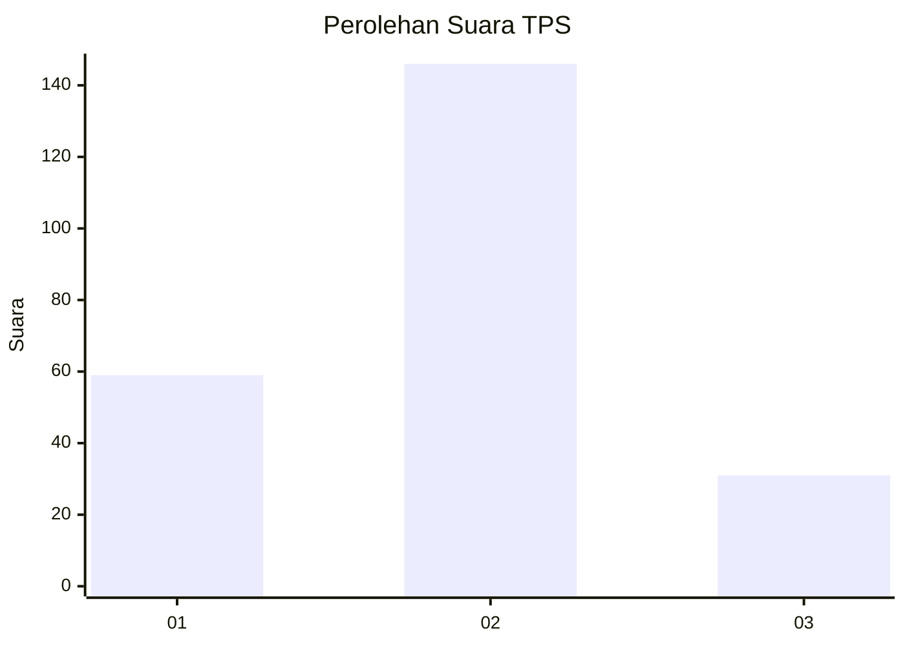
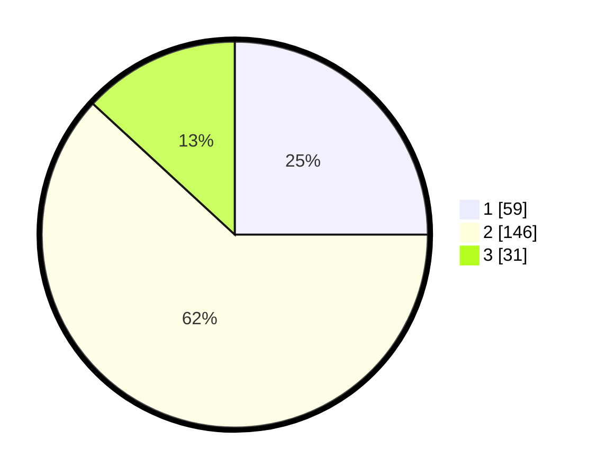

# Hasil

## Grafik

## Tabel

| No. | Nama Paslon    | Suara | Suara (raw) | Persentase |
|:--- |:-------------- | -----:| -----------:| ----------:|
| 1   | ANIES MUHAIMIN | 59    | [59][p-1]   | 25,00      |
| 2   | PRABOWO GIBRAN | 146   | [146][p-2]  | 61,86      |
| 3   | GANJAR MAHFUD  | 31    | [31][p-3]   | 13,14      |

[p-1]: https://github.com/gigit-pemilu/pemilu-2024-35-jawa-timur/blob/main/pilpres/hitung-suara/sub/35-jawa-timur/sub/10-banyuwangi/sub/16-banyuwangi/sub/1003-kebalenan/sub/025-tps/sub/paslon-1.txt
[p-2]: https://github.com/gigit-pemilu/pemilu-2024-35-jawa-timur/blob/main/pilpres/hitung-suara/sub/35-jawa-timur/sub/10-banyuwangi/sub/16-banyuwangi/sub/1003-kebalenan/sub/025-tps/sub/paslon-2.txt
[p-3]: https://github.com/gigit-pemilu/pemilu-2024-35-jawa-timur/blob/main/pilpres/hitung-suara/sub/35-jawa-timur/sub/10-banyuwangi/sub/16-banyuwangi/sub/1003-kebalenan/sub/025-tps/sub/paslon-3.txt

## Foto C Plano

https://sirekap-obj-formc.kpu.go.id/5eaa/pemilu/ppwp/35/10/16/10/03/3510161003025-20240214-232025--bc74e0a9-eaf2-4ca6-9751-1b4b78e60566.jpg

https://sirekap-obj-formc.kpu.go.id/5eaa/pemilu/ppwp/35/10/16/10/03/3510161003025-20240214-232258--6d5e9a69-faa6-43c4-9dfb-a97575059d9d.jpg

https://sirekap-obj-formc.kpu.go.id/5eaa/pemilu/ppwp/35/10/16/10/03/3510161003025-20240214-232928--5a722b6d-5ecf-4d11-8223-ee9a6ebd943a.jpg

## Metadata

| Key        | Value               |
| ---------- | ------------------- |
| Time Stamp | 2024-02-24 22:31:28 |

