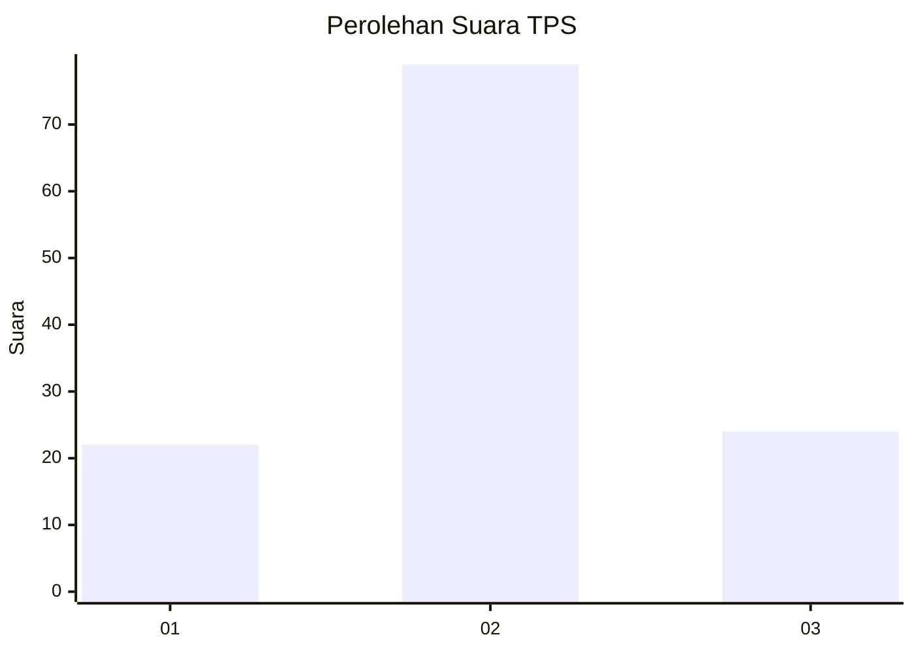
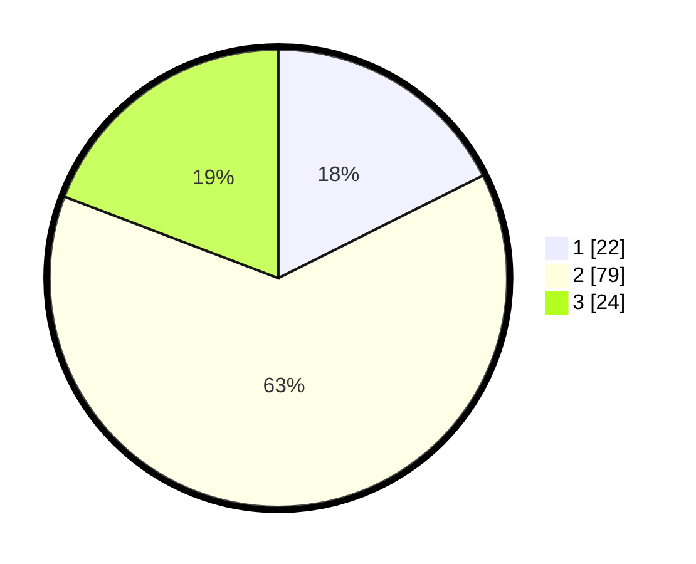

# Hasil

## Grafik

## Tabel

| No. | Nama Paslon    | Suara | Suara (raw) | Persentase |
|:--- |:-------------- | -----:| -----------:| ----------:|
| 1   | ANIES MUHAIMIN | 22    | [22][p-1]   | 17,60      |
| 2   | PRABOWO GIBRAN | 79    | [79][p-2]   | 63,20      |
| 3   | GANJAR MAHFUD  | 24    | [24][p-3]   | 19,20      |

[p-1]: https://github.com/gigit-pemilu/pemilu-2024/blob/main/pilpres/hitung-suara/sub/35-jawa-timur/sub/10-banyuwangi/sub/16-banyuwangi/sub/1003-kebalenan/sub/028-tps/sub/paslon-1.txt
[p-2]: https://github.com/gigit-pemilu/pemilu-2024/blob/main/pilpres/hitung-suara/sub/35-jawa-timur/sub/10-banyuwangi/sub/16-banyuwangi/sub/1003-kebalenan/sub/028-tps/sub/paslon-2.txt
[p-3]: https://github.com/gigit-pemilu/pemilu-2024/blob/main/pilpres/hitung-suara/sub/35-jawa-timur/sub/10-banyuwangi/sub/16-banyuwangi/sub/1003-kebalenan/sub/028-tps/sub/paslon-3.txt

## Foto C Plano

https://sirekap-obj-formc.kpu.go.id/4538/pemilu/ppwp/35/10/16/10/03/3510161003028-20240219-174517--b68a5e11-da3f-4da3-85bc-01ae9d75f0b4.jpg

https://sirekap-obj-formc.kpu.go.id/4538/pemilu/ppwp/35/10/16/10/03/3510161003028-20240219-174402--99a48945-7df3-49f5-80b6-4a94442b4e41.jpg

https://sirekap-obj-formc.kpu.go.id/4538/pemilu/ppwp/35/10/16/10/03/3510161003028-20240219-174632--443e7906-5dac-4219-a22f-09b83ec8cd85.jpg

## Metadata

| Key        | Value               |
| ---------- | ------------------- |
| Time Stamp | 2024-02-24 22:31:28 |

