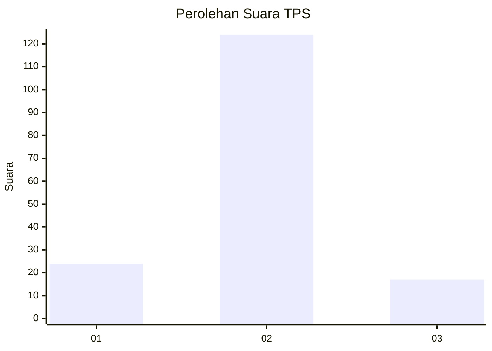
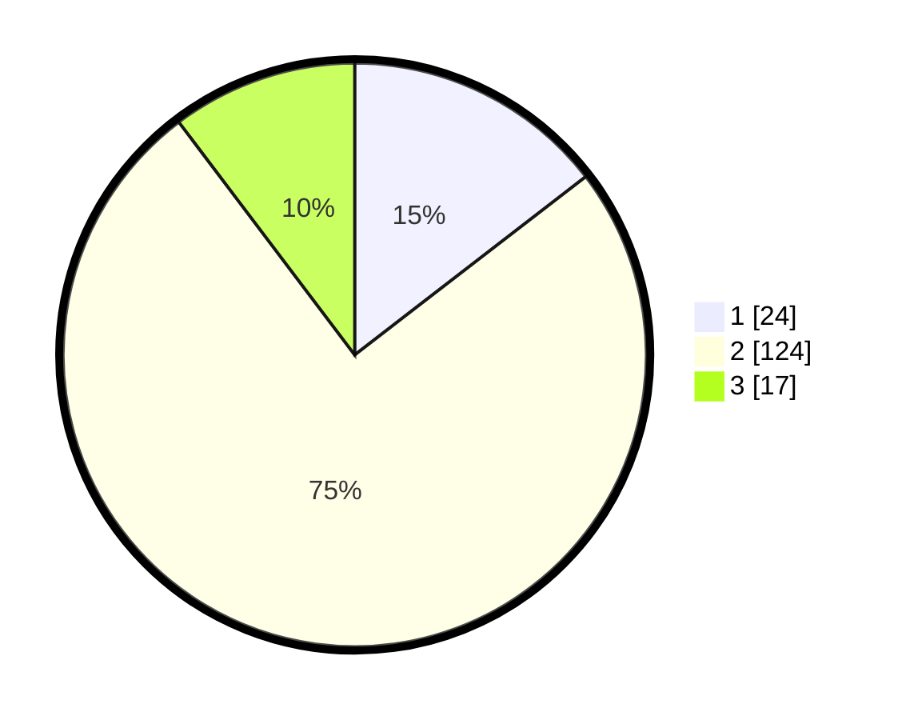

# Hasil

## Grafik

## Tabel

| No. | Nama Paslon    | Suara | Suara (raw) | Persentase |
|:--- |:-------------- | -----:| -----------:| ----------:|
| 1   | ANIES MUHAIMIN | 24    | [24][p-1]   | 14,55      |
| 2   | PRABOWO GIBRAN | 124   | [124][p-2]  | 75,15      |
| 3   | GANJAR MAHFUD  | 17    | [17][p-3]   | 10,30      |

[p-1]: https://github.com/gigit-pemilu/pemilu-2024/blob/main/pilpres/hitung-suara/sub/35-jawa-timur/sub/10-banyuwangi/sub/16-banyuwangi/sub/1010-singonegaran/sub/002-tps/sub/paslon-1.txt
[p-2]: https://github.com/gigit-pemilu/pemilu-2024/blob/main/pilpres/hitung-suara/sub/35-jawa-timur/sub/10-banyuwangi/sub/16-banyuwangi/sub/1010-singonegaran/sub/002-tps/sub/paslon-2.txt
[p-3]: https://github.com/gigit-pemilu/pemilu-2024/blob/main/pilpres/hitung-suara/sub/35-jawa-timur/sub/10-banyuwangi/sub/16-banyuwangi/sub/1010-singonegaran/sub/002-tps/sub/paslon-3.txt

## Foto C Plano

https://sirekap-obj-formc.kpu.go.id/4430/pemilu/ppwp/35/10/16/10/10/3510161010002-20240215-054453--10f1ceca-7eb1-472d-b53f-410447df6c2e.jpg

https://sirekap-obj-formc.kpu.go.id/4430/pemilu/ppwp/35/10/16/10/10/3510161010002-20240215-055026--1f85f063-8eee-466e-9393-7911a57df85e.jpg

https://sirekap-obj-formc.kpu.go.id/4430/pemilu/ppwp/35/10/16/10/10/3510161010002-20240215-055139--6466a424-48b9-4e49-a211-9385c68cb771.jpg

## Metadata

| Key        | Value               |
| ---------- | ------------------- |
| Time Stamp | 2024-02-21 17:00:00 |

