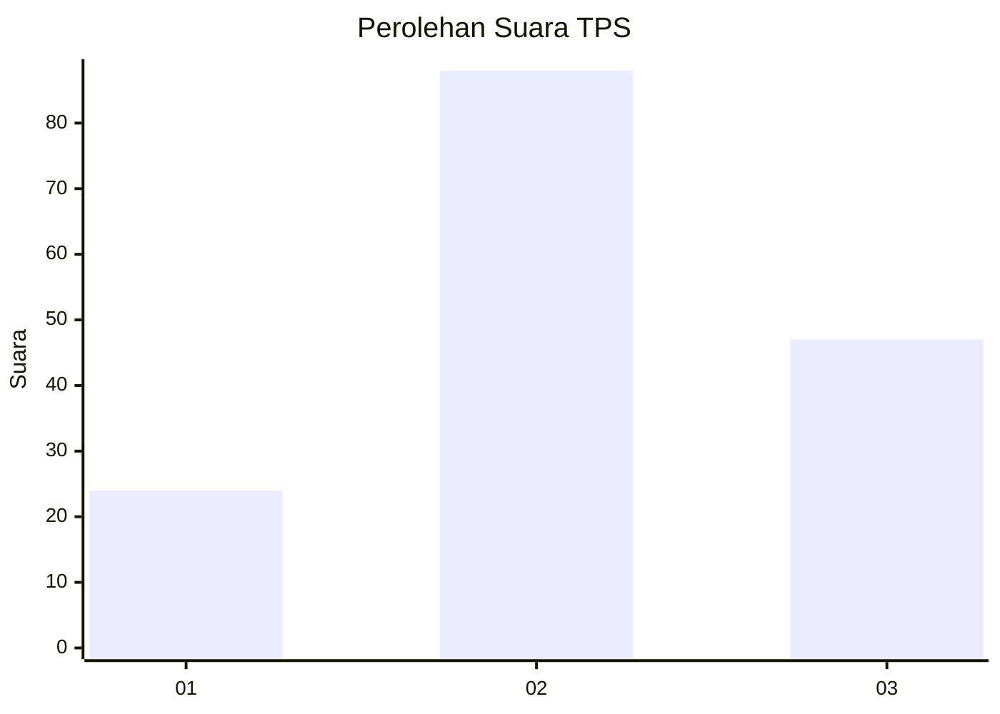
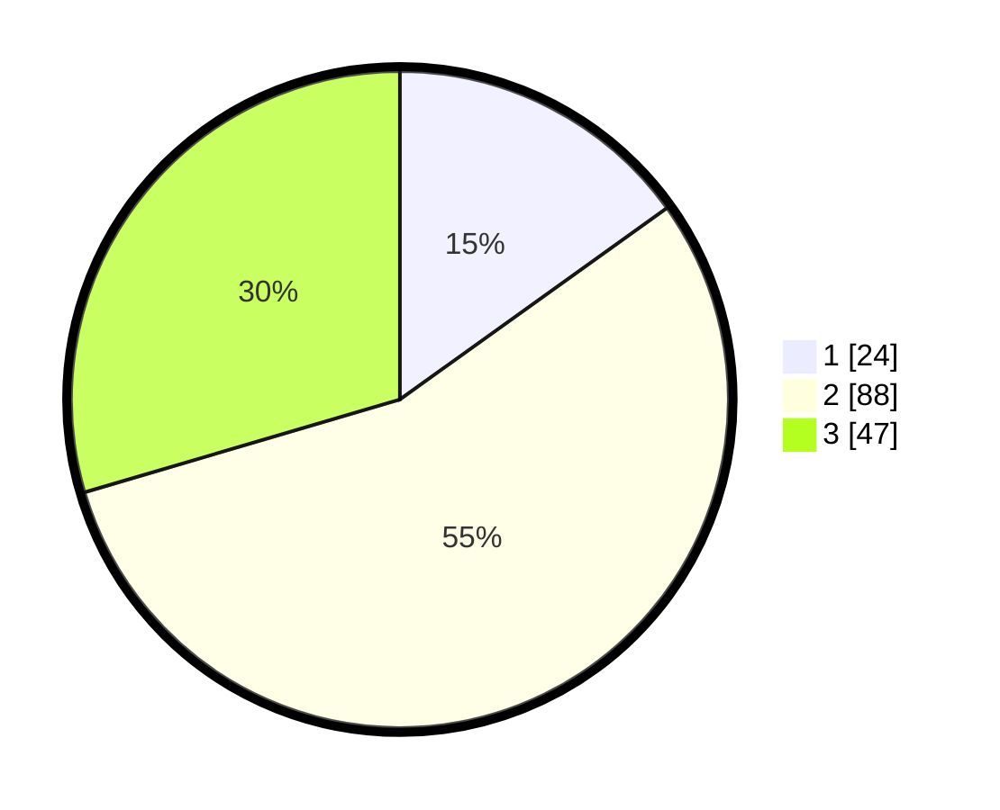

# Hasil

## Grafik

## Tabel

| No. | Nama Paslon    | Suara | Suara (raw) | Persentase |
|:--- |:-------------- | -----:| -----------:| ----------:|
| 1   | ANIES MUHAIMIN | 24    | [24][p-1]   | 15,09      |
| 2   | PRABOWO GIBRAN | 88    | [88][p-2]   | 55,35      |
| 3   | GANJAR MAHFUD  | 47    | [47][p-3]   | 29,56      |

[p-1]: https://github.com/gigit-pemilu/pemilu-2024/blob/main/pilpres/hitung-suara/sub/35-jawa-timur/sub/10-banyuwangi/sub/16-banyuwangi/sub/1011-temenggungan/sub/003-tps/sub/paslon-1.txt
[p-2]: https://github.com/gigit-pemilu/pemilu-2024/blob/main/pilpres/hitung-suara/sub/35-jawa-timur/sub/10-banyuwangi/sub/16-banyuwangi/sub/1011-temenggungan/sub/003-tps/sub/paslon-2.txt
[p-3]: https://github.com/gigit-pemilu/pemilu-2024/blob/main/pilpres/hitung-suara/sub/35-jawa-timur/sub/10-banyuwangi/sub/16-banyuwangi/sub/1011-temenggungan/sub/003-tps/sub/paslon-3.txt

## Foto C Plano

https://sirekap-obj-formc.kpu.go.id/6b6e/pemilu/ppwp/35/10/16/10/11/3510161011003-20240215-012210--4a1d630b-f878-4f6a-b551-94217044b156.jpg

https://sirekap-obj-formc.kpu.go.id/6b6e/pemilu/ppwp/35/10/16/10/11/3510161011003-20240215-012516--c254a535-cbef-4bb0-b5d9-2c6eeb4f7f44.jpg

https://sirekap-obj-formc.kpu.go.id/6b6e/pemilu/ppwp/35/10/16/10/11/3510161011003-20240215-012736--d4e2212b-bf28-4a2b-b138-06e2cc7406d3.jpg

## Metadata

| Key        | Value               |
| ---------- | ------------------- |
| Time Stamp | 2024-02-24 22:31:28 |

