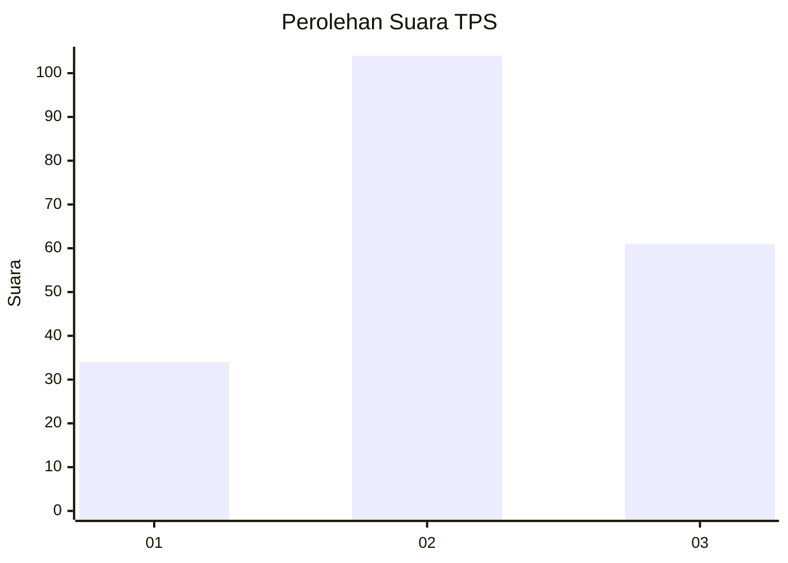
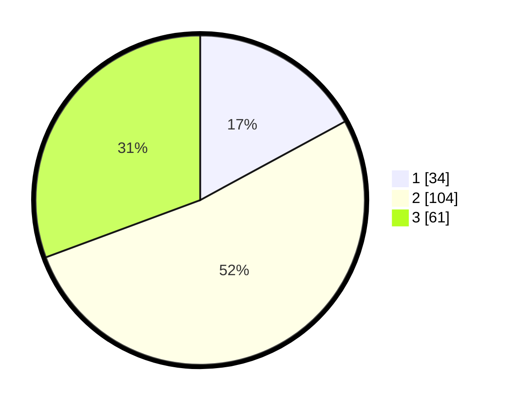

# Hasil

## Grafik

## Tabel

| No. | Nama Paslon    | Suara | Suara (raw) | Persentase |
|:--- |:-------------- | -----:| -----------:| ----------:|
| 1   | ANIES MUHAIMIN | 34    | [34][p-1]   | 17,09      |
| 2   | PRABOWO GIBRAN | 104   | [104][p-2]  | 52,26      |
| 3   | GANJAR MAHFUD  | 61    | [61][p-3]   | 30,65      |

[p-1]: https://github.com/gigit-pemilu/pemilu-2024/blob/main/pilpres/hitung-suara/sub/35-jawa-timur/sub/10-banyuwangi/sub/16-banyuwangi/sub/1011-temenggungan/sub/004-tps/sub/paslon-1.txt
[p-2]: https://github.com/gigit-pemilu/pemilu-2024/blob/main/pilpres/hitung-suara/sub/35-jawa-timur/sub/10-banyuwangi/sub/16-banyuwangi/sub/1011-temenggungan/sub/004-tps/sub/paslon-2.txt
[p-3]: https://github.com/gigit-pemilu/pemilu-2024/blob/main/pilpres/hitung-suara/sub/35-jawa-timur/sub/10-banyuwangi/sub/16-banyuwangi/sub/1011-temenggungan/sub/004-tps/sub/paslon-3.txt

## Foto C Plano

https://sirekap-obj-formc.kpu.go.id/9746/pemilu/ppwp/35/10/16/10/11/3510161011004-20240219-192151--9da17da7-b1b9-4318-b444-497321aeebb5.jpg

https://sirekap-obj-formc.kpu.go.id/9746/pemilu/ppwp/35/10/16/10/11/3510161011004-20240219-192247--786b319d-4b92-4c4d-ada6-cc450e29f63e.jpg

https://sirekap-obj-formc.kpu.go.id/9746/pemilu/ppwp/35/10/16/10/11/3510161011004-20240219-192325--ae0cb17d-8af6-4c62-ad22-bdf4236d6270.jpg

## Metadata

| Key        | Value               |
| ---------- | ------------------- |
| Time Stamp | 2024-02-24 22:31:28 |

