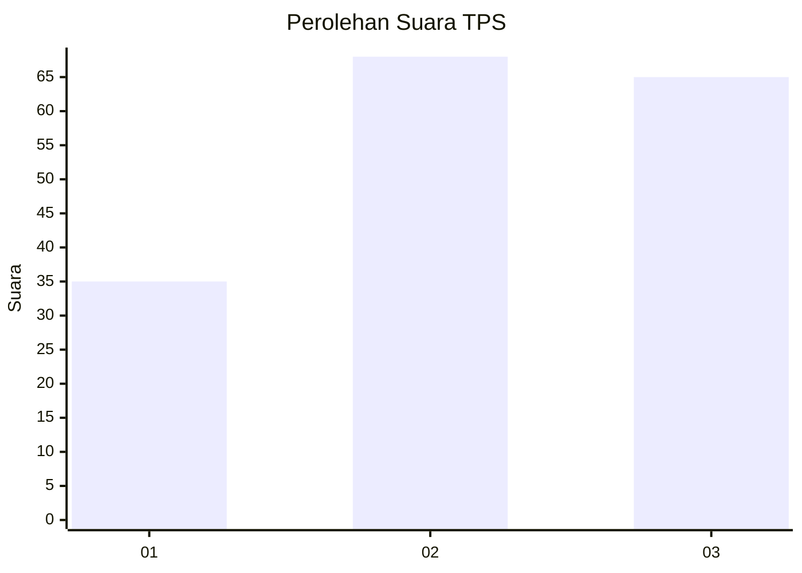
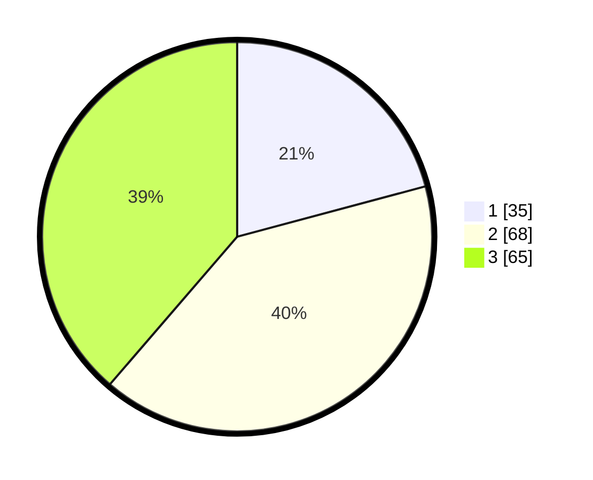

# Hasil

## Grafik

## Tabel

| No. | Nama Paslon    | Suara | Suara (raw) | Persentase |
|:--- |:-------------- | -----:| -----------:| ----------:|
| 1   | ANIES MUHAIMIN | 35    | [35][p-1]   | 20,83      |
| 2   | PRABOWO GIBRAN | 68    | [68][p-2]   | 40,48      |
| 3   | GANJAR MAHFUD  | 65    | [65][p-3]   | 38,69      |

[p-1]: https://github.com/gigit-pemilu/pemilu-2024-35-jawa-timur/blob/main/pilpres/hitung-suara/sub/35-jawa-timur/sub/10-banyuwangi/sub/16-banyuwangi/sub/1011-temenggungan/sub/005-tps/sub/paslon-1.txt
[p-2]: https://github.com/gigit-pemilu/pemilu-2024-35-jawa-timur/blob/main/pilpres/hitung-suara/sub/35-jawa-timur/sub/10-banyuwangi/sub/16-banyuwangi/sub/1011-temenggungan/sub/005-tps/sub/paslon-2.txt
[p-3]: https://github.com/gigit-pemilu/pemilu-2024-35-jawa-timur/blob/main/pilpres/hitung-suara/sub/35-jawa-timur/sub/10-banyuwangi/sub/16-banyuwangi/sub/1011-temenggungan/sub/005-tps/sub/paslon-3.txt

## Foto C Plano

https://sirekap-obj-formc.kpu.go.id/ae74/pemilu/ppwp/35/10/16/10/11/3510161011005-20240214-221551--492a904b-5cc0-4b0b-aa30-37aa04fb96ec.jpg

https://sirekap-obj-formc.kpu.go.id/ae74/pemilu/ppwp/35/10/16/10/11/3510161011005-20240214-221606--b5153547-d291-4da3-8ff2-6cc4889a4c3c.jpg

https://sirekap-obj-formc.kpu.go.id/ae74/pemilu/ppwp/35/10/16/10/11/3510161011005-20240214-221612--b015cff0-37fc-4bbb-820a-2ce25735b071.jpg

## Metadata

| Key        | Value               |
| ---------- | ------------------- |
| Time Stamp | 2024-02-24 22:31:28 |

