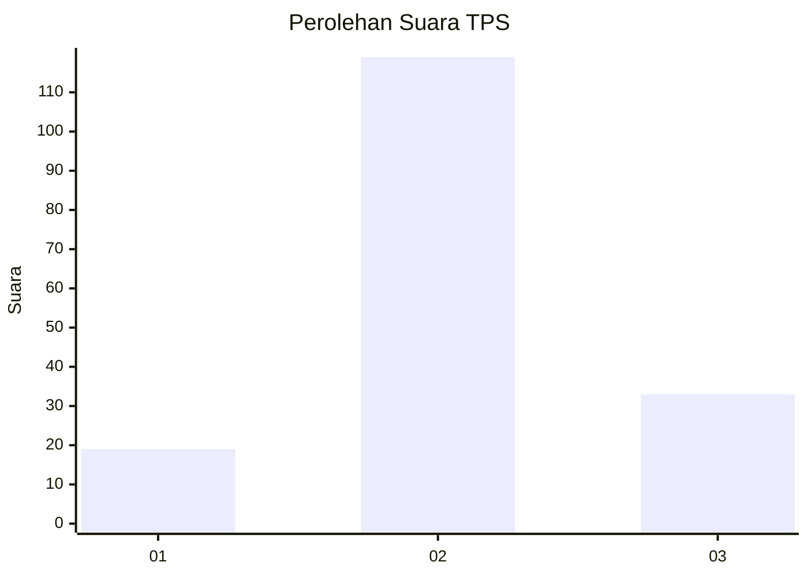
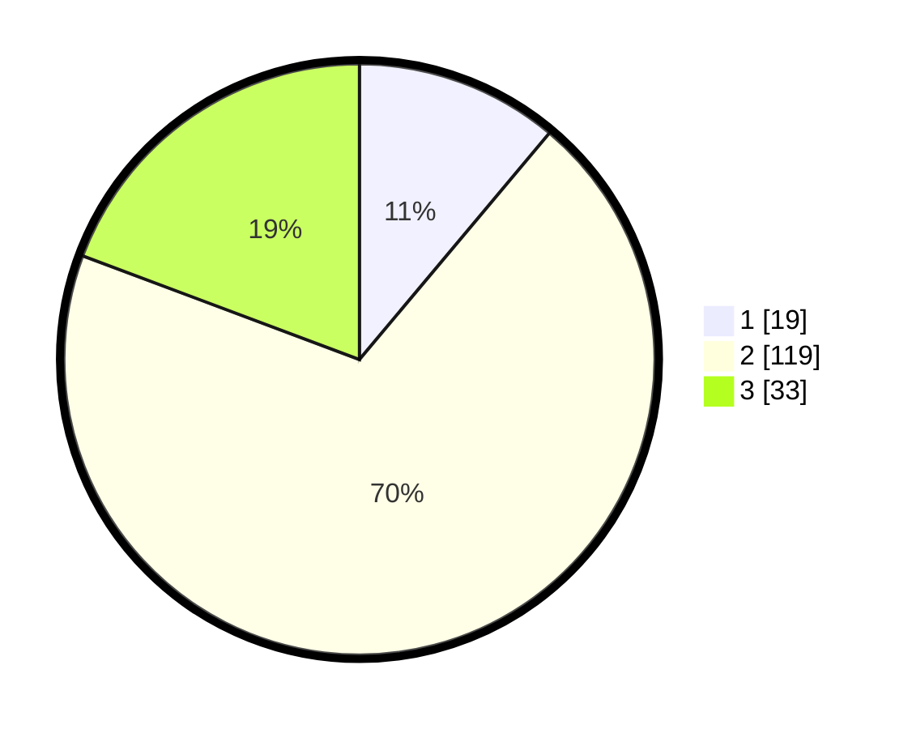

# Hasil

## Grafik

## Tabel

| No. | Nama Paslon    | Suara | Suara (raw) | Persentase |
|:--- |:-------------- | -----:| -----------:| ----------:|
| 1   | ANIES MUHAIMIN | 19    | [19][p-1]   | 11,11      |
| 2   | PRABOWO GIBRAN | 119   | [119][p-2]  | 69,59      |
| 3   | GANJAR MAHFUD  | 33    | [33][p-3]   | 19,30      |

[p-1]: https://github.com/gigit-pemilu/pemilu-2024/blob/main/pilpres/hitung-suara/sub/35-jawa-timur/sub/10-banyuwangi/sub/16-banyuwangi/sub/1011-temenggungan/sub/006-tps/sub/paslon-1.txt
[p-2]: https://github.com/gigit-pemilu/pemilu-2024/blob/main/pilpres/hitung-suara/sub/35-jawa-timur/sub/10-banyuwangi/sub/16-banyuwangi/sub/1011-temenggungan/sub/006-tps/sub/paslon-2.txt
[p-3]: https://github.com/gigit-pemilu/pemilu-2024/blob/main/pilpres/hitung-suara/sub/35-jawa-timur/sub/10-banyuwangi/sub/16-banyuwangi/sub/1011-temenggungan/sub/006-tps/sub/paslon-3.txt

## Foto C Plano

https://sirekap-obj-formc.kpu.go.id/1fb1/pemilu/ppwp/35/10/16/10/11/3510161011006-20240215-003642--10dbc3d6-c633-4c69-88c1-b2d97d20bbdd.jpg

https://sirekap-obj-formc.kpu.go.id/1fb1/pemilu/ppwp/35/10/16/10/11/3510161011006-20240215-003209--1adaf66d-dc86-4e65-ae7e-e27d754fb027.jpg

https://sirekap-obj-formc.kpu.go.id/1fb1/pemilu/ppwp/35/10/16/10/11/3510161011006-20240215-003340--2883bff5-758f-4995-a4d0-8a0767912dd5.jpg

## Metadata

| Key        | Value               |
| ---------- | ------------------- |
| Time Stamp | 2024-02-15 04:00:24 |

