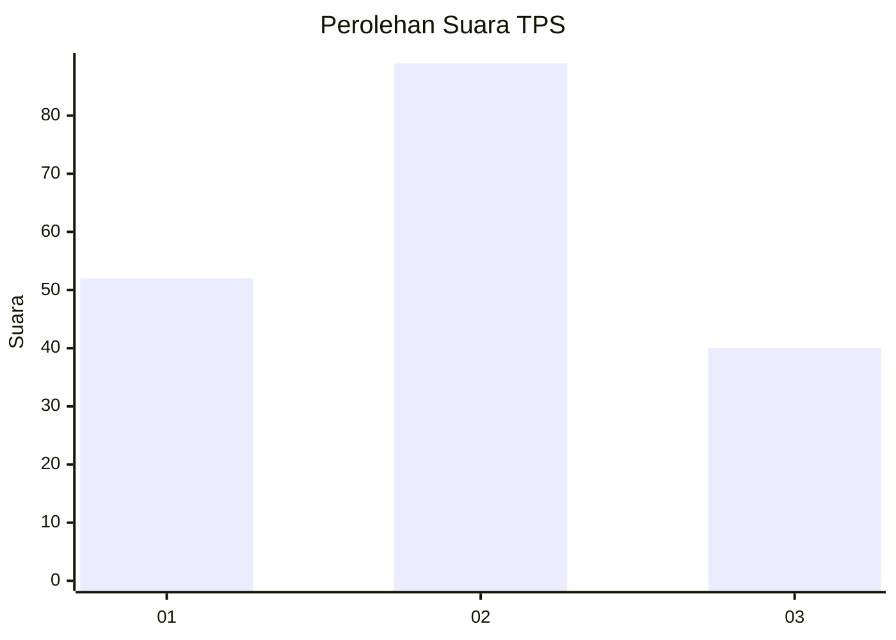
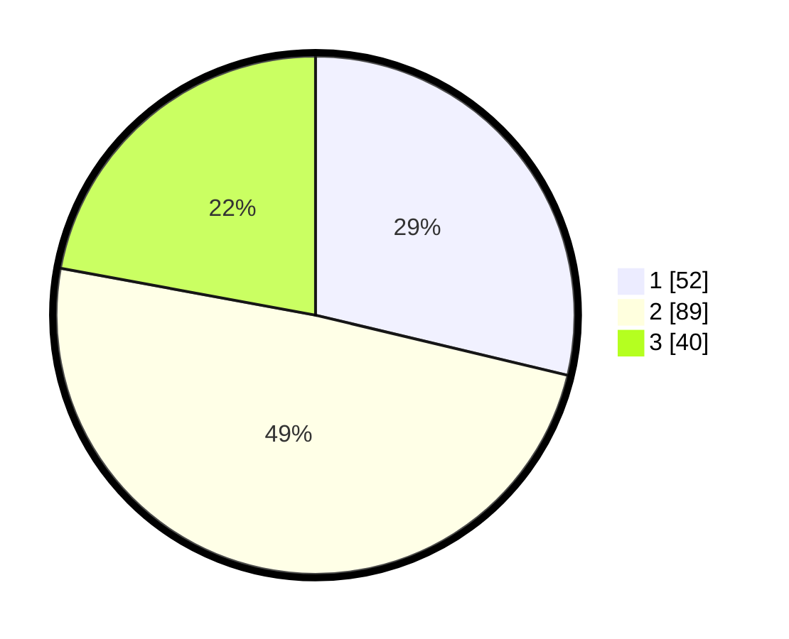

# Hasil

## Grafik

## Tabel

| No. | Nama Paslon    | Suara | Suara (raw) | Persentase |
|:--- |:-------------- | -----:| -----------:| ----------:|
| 1   | ANIES MUHAIMIN | 52    | [52][p-1]   | 28,73      |
| 2   | PRABOWO GIBRAN | 89    | [89][p-2]   | 49,17      |
| 3   | GANJAR MAHFUD  | 40    | [40][p-3]   | 22,10      |

[p-1]: https://github.com/gigit-pemilu/pemilu-2024-35-jawa-timur/blob/main/pilpres/hitung-suara/sub/35-jawa-timur/sub/10-banyuwangi/sub/16-banyuwangi/sub/1014-lateng/sub/007-tps/sub/paslon-1.txt
[p-2]: https://github.com/gigit-pemilu/pemilu-2024-35-jawa-timur/blob/main/pilpres/hitung-suara/sub/35-jawa-timur/sub/10-banyuwangi/sub/16-banyuwangi/sub/1014-lateng/sub/007-tps/sub/paslon-2.txt
[p-3]: https://github.com/gigit-pemilu/pemilu-2024-35-jawa-timur/blob/main/pilpres/hitung-suara/sub/35-jawa-timur/sub/10-banyuwangi/sub/16-banyuwangi/sub/1014-lateng/sub/007-tps/sub/paslon-3.txt

## Foto C Plano

https://sirekap-obj-formc.kpu.go.id/3045/pemilu/ppwp/35/10/16/10/14/3510161014007-20240219-160152--dbad4ddd-4cd5-41ff-b3ad-1da1d8077fc7.jpg

https://sirekap-obj-formc.kpu.go.id/3045/pemilu/ppwp/35/10/16/10/14/3510161014007-20240219-160248--26069f63-78d8-437d-acae-ea7e014b86fc.jpg

https://sirekap-obj-formc.kpu.go.id/3045/pemilu/ppwp/35/10/16/10/14/3510161014007-20240219-160332--d3d34121-59f0-4a16-85d7-59b97824e655.jpg

## Metadata

| Key        | Value               |
| ---------- | ------------------- |
| Time Stamp | 2024-02-24 22:31:28 |

