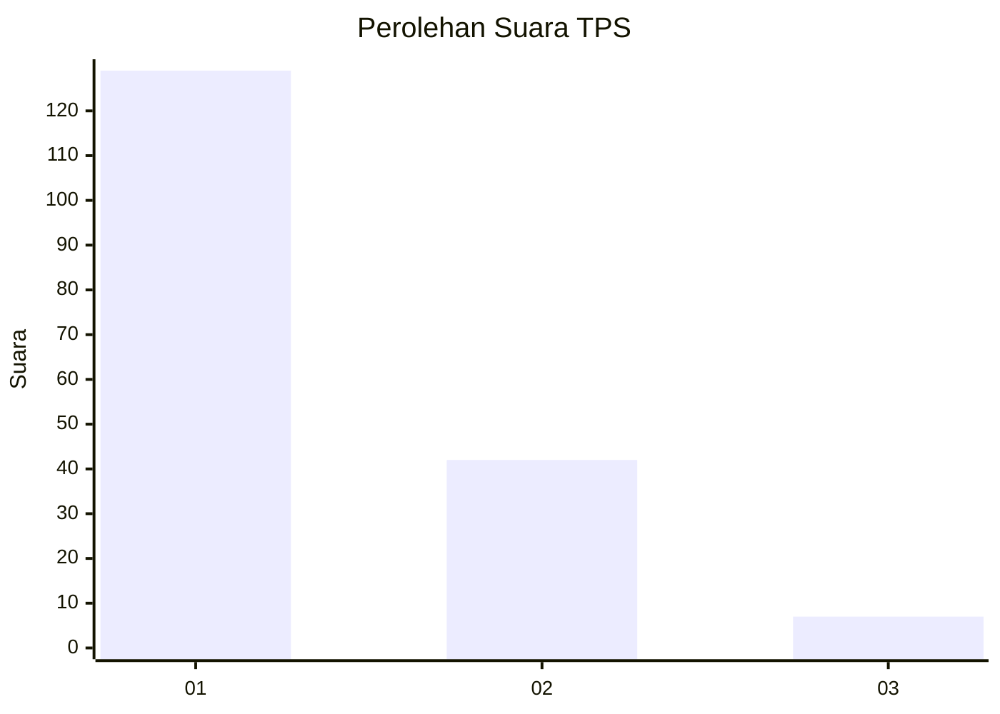
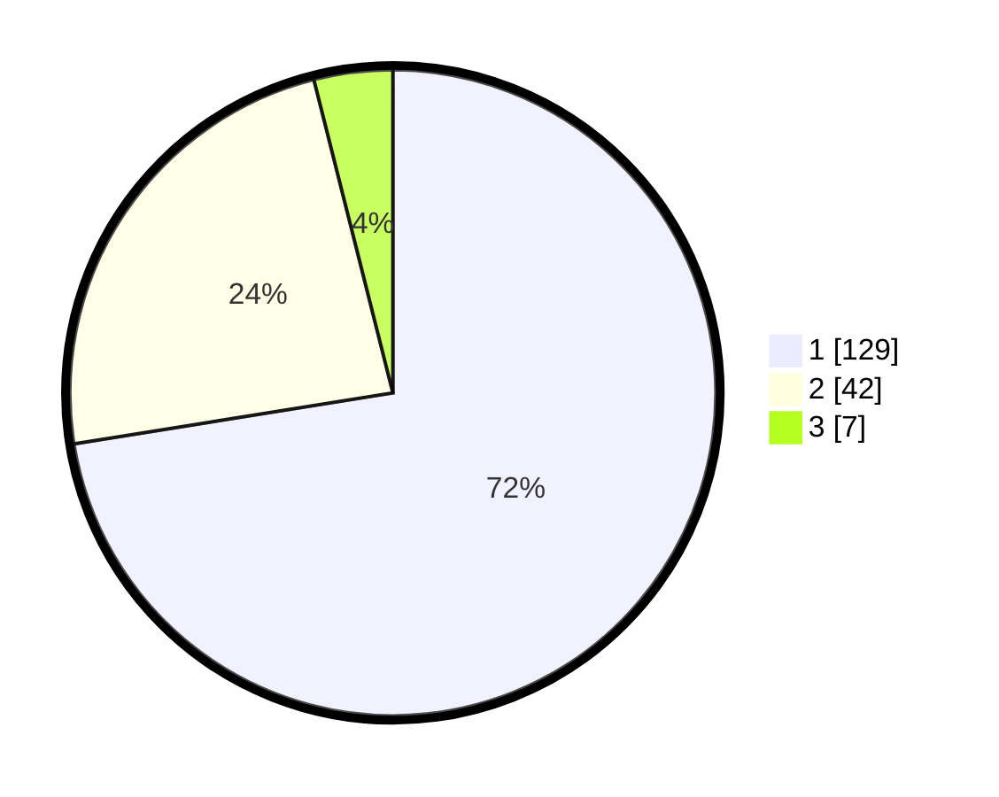

# Hasil

## Grafik

## Tabel

| No. | Nama Paslon    | Suara | Suara (raw) | Persentase |
|:--- |:-------------- | -----:| -----------:| ----------:|
| 1   | ANIES MUHAIMIN | 129   | [129][p-1]  | 72,47      |
| 2   | PRABOWO GIBRAN | 42    | [42][p-2]   | 23,60      |
| 3   | GANJAR MAHFUD  | 7     | [7][p-3]    | 3,93       |

[p-1]: https://github.com/gigit-pemilu/pemilu-2024-35-jawa-timur/blob/main/pilpres/hitung-suara/sub/35-jawa-timur/sub/10-banyuwangi/sub/16-banyuwangi/sub/1014-lateng/sub/010-tps/sub/paslon-1.txt
[p-2]: https://github.com/gigit-pemilu/pemilu-2024-35-jawa-timur/blob/main/pilpres/hitung-suara/sub/35-jawa-timur/sub/10-banyuwangi/sub/16-banyuwangi/sub/1014-lateng/sub/010-tps/sub/paslon-2.txt
[p-3]: https://github.com/gigit-pemilu/pemilu-2024-35-jawa-timur/blob/main/pilpres/hitung-suara/sub/35-jawa-timur/sub/10-banyuwangi/sub/16-banyuwangi/sub/1014-lateng/sub/010-tps/sub/paslon-3.txt

## Foto C Plano

https://sirekap-obj-formc.kpu.go.id/507c/pemilu/ppwp/35/10/16/10/14/3510161014010-20240219-161504--f2642317-d97d-423f-8562-78c1025c7a31.jpg

https://sirekap-obj-formc.kpu.go.id/507c/pemilu/ppwp/35/10/16/10/14/3510161014010-20240218-122912--5182cec9-2c7d-4383-bea6-09b4926673b5.jpg

https://sirekap-obj-formc.kpu.go.id/507c/pemilu/ppwp/35/10/16/10/14/3510161014010-20240219-161718--cd1c7820-fa2d-4f5b-8205-d9bd9725346d.jpg

## Metadata

| Key        | Value               |
| ---------- | ------------------- |
| Time Stamp | 2024-02-21 15:00:00 |

