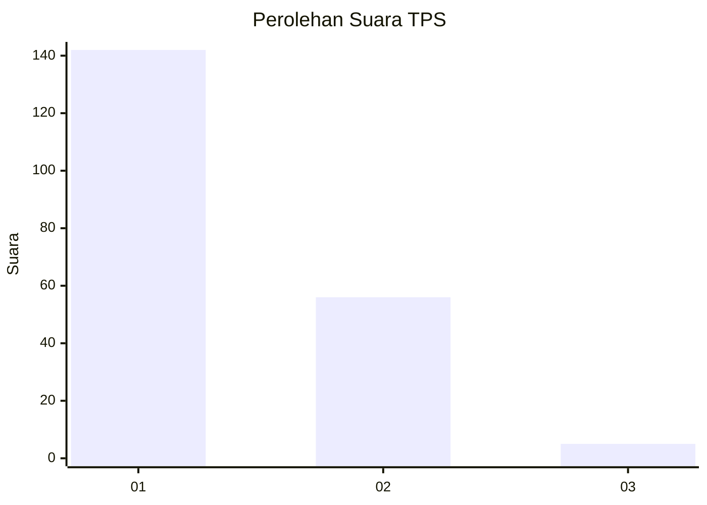
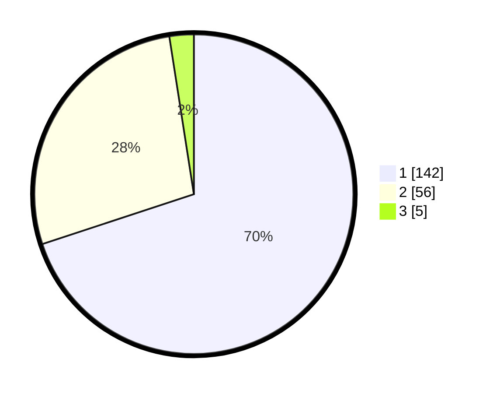

# Hasil

## Grafik

## Tabel

| No. | Nama Paslon    | Suara | Suara (raw) | Persentase |
|:--- |:-------------- | -----:| -----------:| ----------:|
| 1   | ANIES MUHAIMIN | 142   | [142][p-1]  | 69,95      |
| 2   | PRABOWO GIBRAN | 56    | [56][p-2]   | 27,59      |
| 3   | GANJAR MAHFUD  | 5     | [5][p-3]    | 2,46       |

[p-1]: https://github.com/gigit-pemilu/pemilu-2024-35-jawa-timur/blob/main/pilpres/hitung-suara/sub/35-jawa-timur/sub/10-banyuwangi/sub/16-banyuwangi/sub/1014-lateng/sub/011-tps/sub/paslon-1.txt
[p-2]: https://github.com/gigit-pemilu/pemilu-2024-35-jawa-timur/blob/main/pilpres/hitung-suara/sub/35-jawa-timur/sub/10-banyuwangi/sub/16-banyuwangi/sub/1014-lateng/sub/011-tps/sub/paslon-2.txt
[p-3]: https://github.com/gigit-pemilu/pemilu-2024-35-jawa-timur/blob/main/pilpres/hitung-suara/sub/35-jawa-timur/sub/10-banyuwangi/sub/16-banyuwangi/sub/1014-lateng/sub/011-tps/sub/paslon-3.txt

## Foto C Plano

https://sirekap-obj-formc.kpu.go.id/18c8/pemilu/ppwp/35/10/16/10/14/3510161014011-20240219-162228--412dd9d2-c57e-487f-b3af-5d9e25ced7d0.jpg

https://sirekap-obj-formc.kpu.go.id/18c8/pemilu/ppwp/35/10/16/10/14/3510161014011-20240219-162338--16af499c-2c7c-4fe5-aac8-3cc8e5058ef2.jpg

https://sirekap-obj-formc.kpu.go.id/18c8/pemilu/ppwp/35/10/16/10/14/3510161014011-20240219-162443--163fc542-5dd1-4fa9-965f-1ea2ab053a9b.jpg

## Metadata

| Key        | Value               |
| ---------- | ------------------- |
| Time Stamp | 2024-02-24 22:31:28 |

