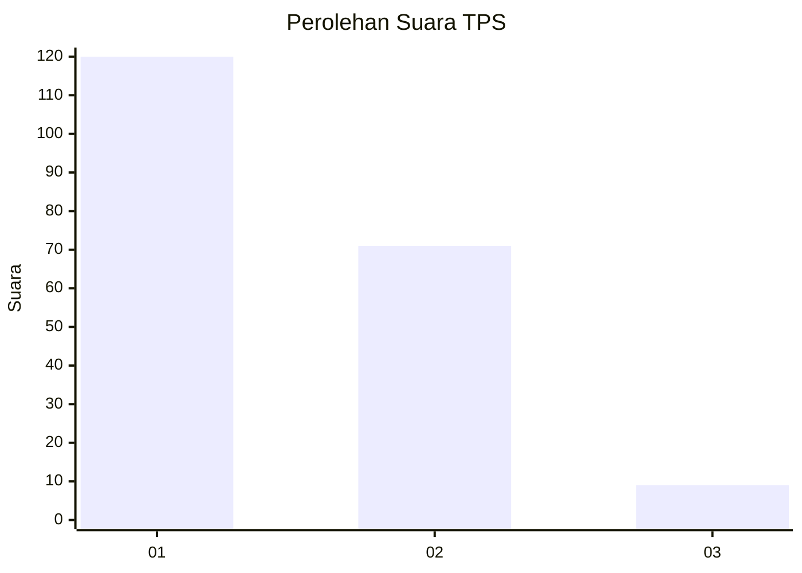
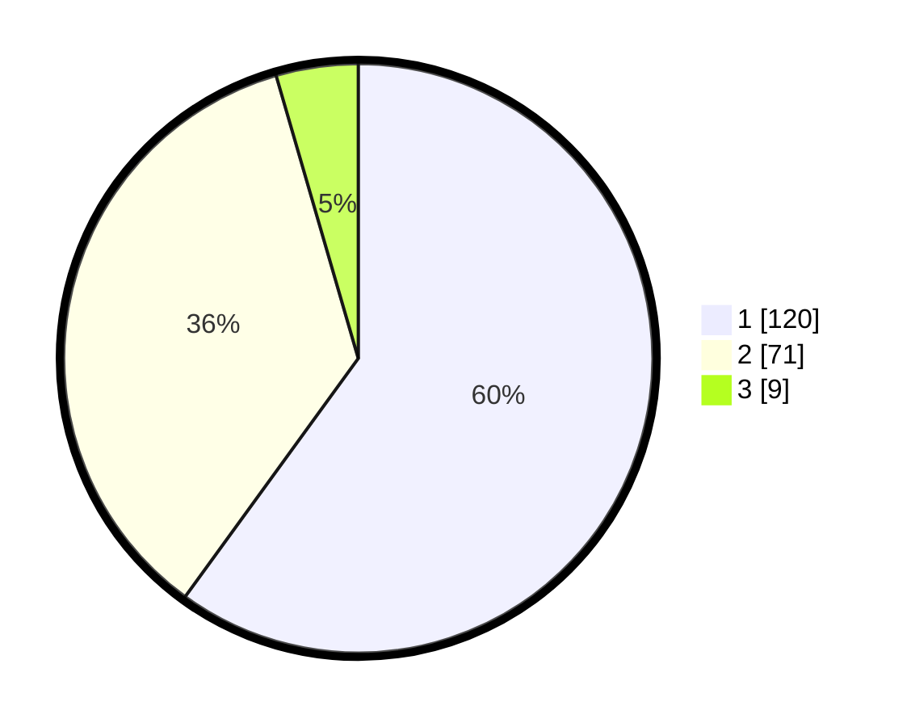

# Hasil

## Grafik

## Tabel

| No. | Nama Paslon    | Suara | Suara (raw) | Persentase |
|:--- |:-------------- | -----:| -----------:| ----------:|
| 1   | ANIES MUHAIMIN | 120   | [120][p-1]  | 60,00      |
| 2   | PRABOWO GIBRAN | 71    | [71][p-2]   | 35,50      |
| 3   | GANJAR MAHFUD  | 9     | [9][p-3]    | 4,50       |

[p-1]: https://github.com/gigit-pemilu/pemilu-2024-35-jawa-timur/blob/main/pilpres/hitung-suara/sub/35-jawa-timur/sub/10-banyuwangi/sub/16-banyuwangi/sub/1014-lateng/sub/016-tps/sub/paslon-1.txt
[p-2]: https://github.com/gigit-pemilu/pemilu-2024-35-jawa-timur/blob/main/pilpres/hitung-suara/sub/35-jawa-timur/sub/10-banyuwangi/sub/16-banyuwangi/sub/1014-lateng/sub/016-tps/sub/paslon-2.txt
[p-3]: https://github.com/gigit-pemilu/pemilu-2024-35-jawa-timur/blob/main/pilpres/hitung-suara/sub/35-jawa-timur/sub/10-banyuwangi/sub/16-banyuwangi/sub/1014-lateng/sub/016-tps/sub/paslon-3.txt

## Foto C Plano

https://sirekap-obj-formc.kpu.go.id/dcc4/pemilu/ppwp/35/10/16/10/14/3510161014016-20240219-164839--ac9fa3c3-ce13-482d-9750-dfc6a7737bd2.jpg

https://sirekap-obj-formc.kpu.go.id/dcc4/pemilu/ppwp/35/10/16/10/14/3510161014016-20240219-164944--a954573b-e6c8-47b3-845b-2e0b8afce706.jpg

https://sirekap-obj-formc.kpu.go.id/dcc4/pemilu/ppwp/35/10/16/10/14/3510161014016-20240219-165206--f6bbba39-3e1d-4495-8dd0-17a8599e7b80.jpg

## Metadata

| Key        | Value               |
| ---------- | ------------------- |
| Time Stamp | 2024-02-24 22:31:28 |

