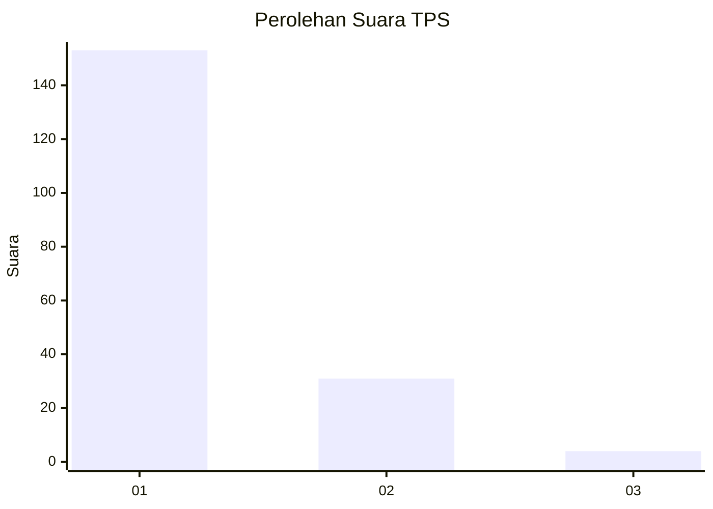
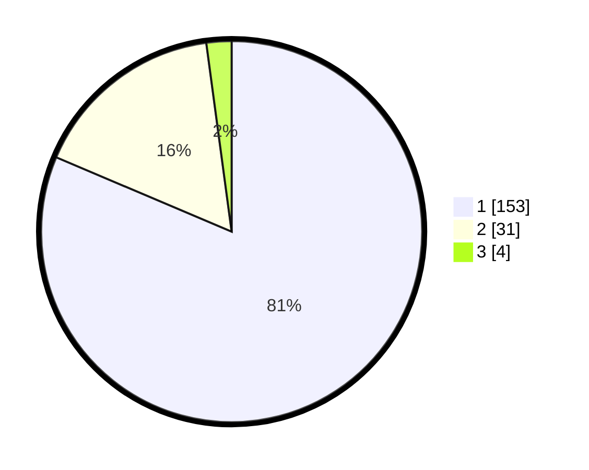

# Hasil

## Grafik

## Tabel

| No. | Nama Paslon    | Suara | Suara (raw) | Persentase |
|:--- |:-------------- | -----:| -----------:| ----------:|
| 1   | ANIES MUHAIMIN | 153   | [153][p-1]  | 81,38      |
| 2   | PRABOWO GIBRAN | 31    | [31][p-2]   | 16,49      |
| 3   | GANJAR MAHFUD  | 4     | [4][p-3]    | 2,13       |

[p-1]: https://github.com/gigit-pemilu/pemilu-2024-35-jawa-timur/blob/main/pilpres/hitung-suara/sub/35-jawa-timur/sub/10-banyuwangi/sub/16-banyuwangi/sub/1014-lateng/sub/017-tps/sub/paslon-1.txt
[p-2]: https://github.com/gigit-pemilu/pemilu-2024-35-jawa-timur/blob/main/pilpres/hitung-suara/sub/35-jawa-timur/sub/10-banyuwangi/sub/16-banyuwangi/sub/1014-lateng/sub/017-tps/sub/paslon-2.txt
[p-3]: https://github.com/gigit-pemilu/pemilu-2024-35-jawa-timur/blob/main/pilpres/hitung-suara/sub/35-jawa-timur/sub/10-banyuwangi/sub/16-banyuwangi/sub/1014-lateng/sub/017-tps/sub/paslon-3.txt

## Foto C Plano

https://sirekap-obj-formc.kpu.go.id/a9b8/pemilu/ppwp/35/10/16/10/14/3510161014017-20240219-165333--f458bc46-7470-4554-82ee-5e38996e98b9.jpg

https://sirekap-obj-formc.kpu.go.id/a9b8/pemilu/ppwp/35/10/16/10/14/3510161014017-20240218-200017--df2023e1-b7f5-41a9-8e57-c8f3786eac8b.jpg

https://sirekap-obj-formc.kpu.go.id/a9b8/pemilu/ppwp/35/10/16/10/14/3510161014017-20240219-165553--1cd692ab-aaff-4bee-8402-cb17a8b32d18.jpg

## Metadata

| Key        | Value               |
| ---------- | ------------------- |
| Time Stamp | 2024-02-24 22:31:28 |

