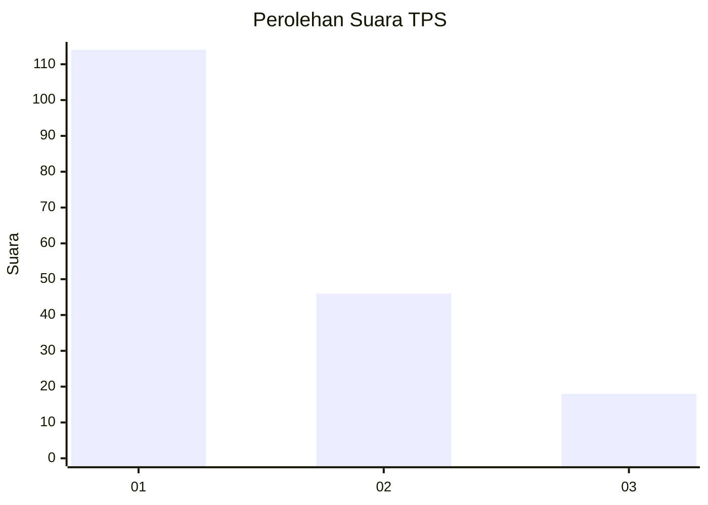
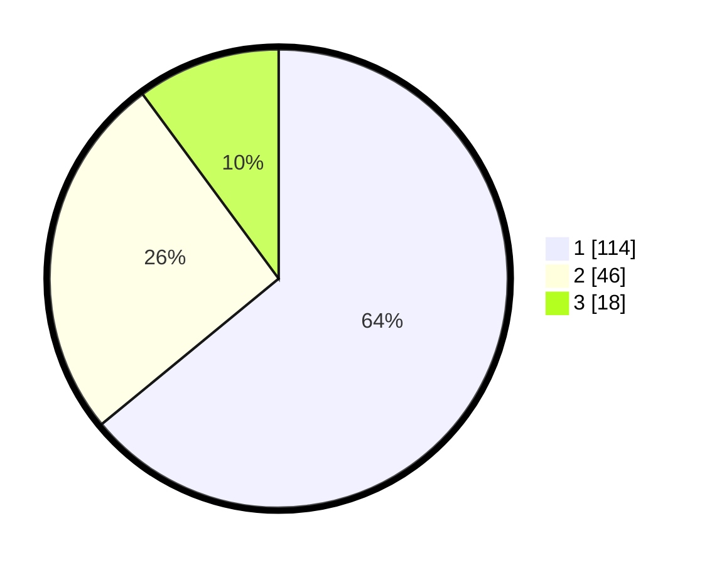

# Hasil

## Grafik

## Tabel

| No. | Nama Paslon    | Suara | Suara (raw) | Persentase |
|:--- |:-------------- | -----:| -----------:| ----------:|
| 1   | ANIES MUHAIMIN | 114   | [114][p-1]  | 64,04      |
| 2   | PRABOWO GIBRAN | 46    | [46][p-2]   | 25,84      |
| 3   | GANJAR MAHFUD  | 18    | [18][p-3]   | 10,11      |

[p-1]: https://github.com/gigit-pemilu/pemilu-2024-35-jawa-timur/blob/main/pilpres/hitung-suara/sub/35-jawa-timur/sub/10-banyuwangi/sub/16-banyuwangi/sub/1014-lateng/sub/018-tps/sub/paslon-1.txt
[p-2]: https://github.com/gigit-pemilu/pemilu-2024-35-jawa-timur/blob/main/pilpres/hitung-suara/sub/35-jawa-timur/sub/10-banyuwangi/sub/16-banyuwangi/sub/1014-lateng/sub/018-tps/sub/paslon-2.txt
[p-3]: https://github.com/gigit-pemilu/pemilu-2024-35-jawa-timur/blob/main/pilpres/hitung-suara/sub/35-jawa-timur/sub/10-banyuwangi/sub/16-banyuwangi/sub/1014-lateng/sub/018-tps/sub/paslon-3.txt

## Foto C Plano

https://sirekap-obj-formc.kpu.go.id/18f7/pemilu/ppwp/35/10/16/10/14/3510161014018-20240219-170031--ac63f8ec-500e-4a0b-9185-f9143aaa5206.jpg

https://sirekap-obj-formc.kpu.go.id/18f7/pemilu/ppwp/35/10/16/10/14/3510161014018-20240219-170514--7be56940-e15d-4c55-b344-fab9a173d5aa.jpg

https://sirekap-obj-formc.kpu.go.id/18f7/pemilu/ppwp/35/10/16/10/14/3510161014018-20240219-170259--7e049414-5e40-403d-9c3a-9825a3fe6026.jpg

## Metadata

| Key        | Value               |
| ---------- | ------------------- |
| Time Stamp | 2024-02-24 22:31:28 |

