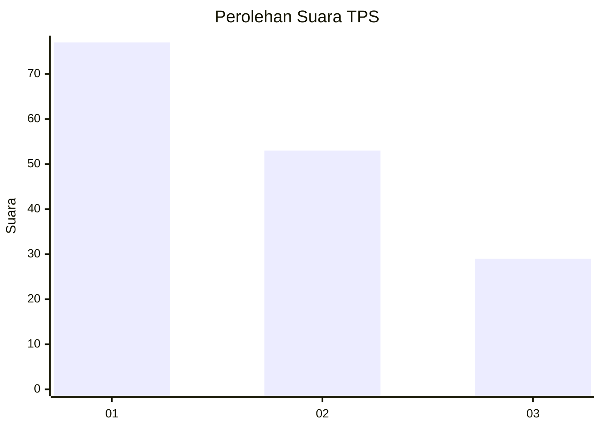
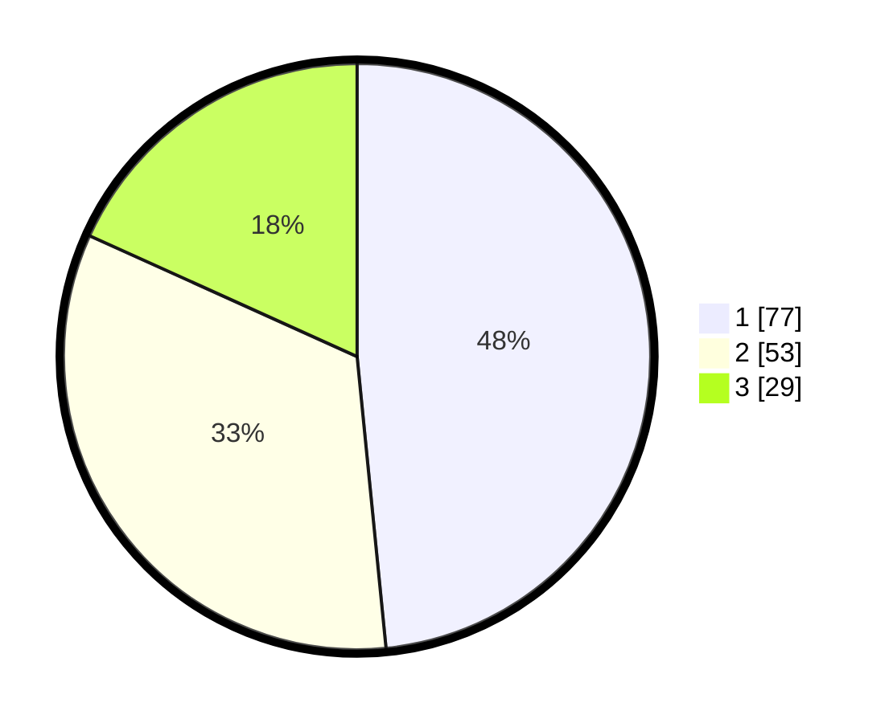

# Hasil

## Grafik

## Tabel

| No. | Nama Paslon    | Suara | Suara (raw) | Persentase |
|:--- |:-------------- | -----:| -----------:| ----------:|
| 1   | ANIES MUHAIMIN | 77    | [77][p-1]   | 48,43      |
| 2   | PRABOWO GIBRAN | 53    | [53][p-2]   | 33,33      |
| 3   | GANJAR MAHFUD  | 29    | [29][p-3]   | 18,24      |

[p-1]: https://github.com/gigit-pemilu/pemilu-2024-35-jawa-timur/blob/main/pilpres/hitung-suara/sub/35-jawa-timur/sub/10-banyuwangi/sub/16-banyuwangi/sub/1015-singotrunan/sub/005-tps/sub/paslon-1.txt
[p-2]: https://github.com/gigit-pemilu/pemilu-2024-35-jawa-timur/blob/main/pilpres/hitung-suara/sub/35-jawa-timur/sub/10-banyuwangi/sub/16-banyuwangi/sub/1015-singotrunan/sub/005-tps/sub/paslon-2.txt
[p-3]: https://github.com/gigit-pemilu/pemilu-2024-35-jawa-timur/blob/main/pilpres/hitung-suara/sub/35-jawa-timur/sub/10-banyuwangi/sub/16-banyuwangi/sub/1015-singotrunan/sub/005-tps/sub/paslon-3.txt

## Foto C Plano

https://sirekap-obj-formc.kpu.go.id/84bf/pemilu/ppwp/35/10/16/10/15/3510161015005-20240215-023135--9874ab3c-5b7a-4c52-8511-9b4e20bbf0ec.jpg

https://sirekap-obj-formc.kpu.go.id/84bf/pemilu/ppwp/35/10/16/10/15/3510161015005-20240215-023303--f47498cd-3d04-475a-81fb-c8cf9550753d.jpg

https://sirekap-obj-formc.kpu.go.id/84bf/pemilu/ppwp/35/10/16/10/15/3510161015005-20240215-023427--0975a870-3187-4a49-af5c-70056eba309d.jpg

## Metadata

| Key        | Value               |
| ---------- | ------------------- |
| Time Stamp | 2024-02-24 22:31:28 |

