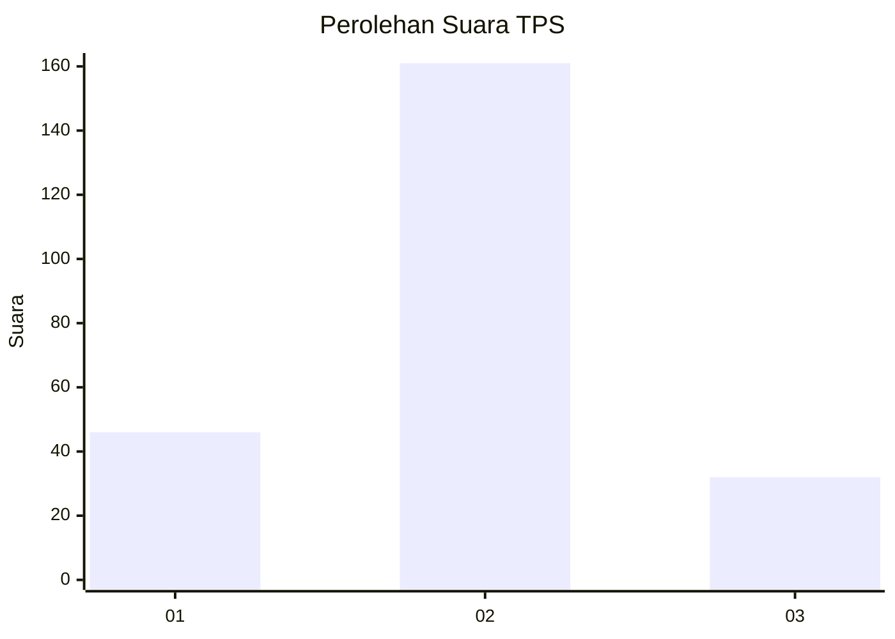
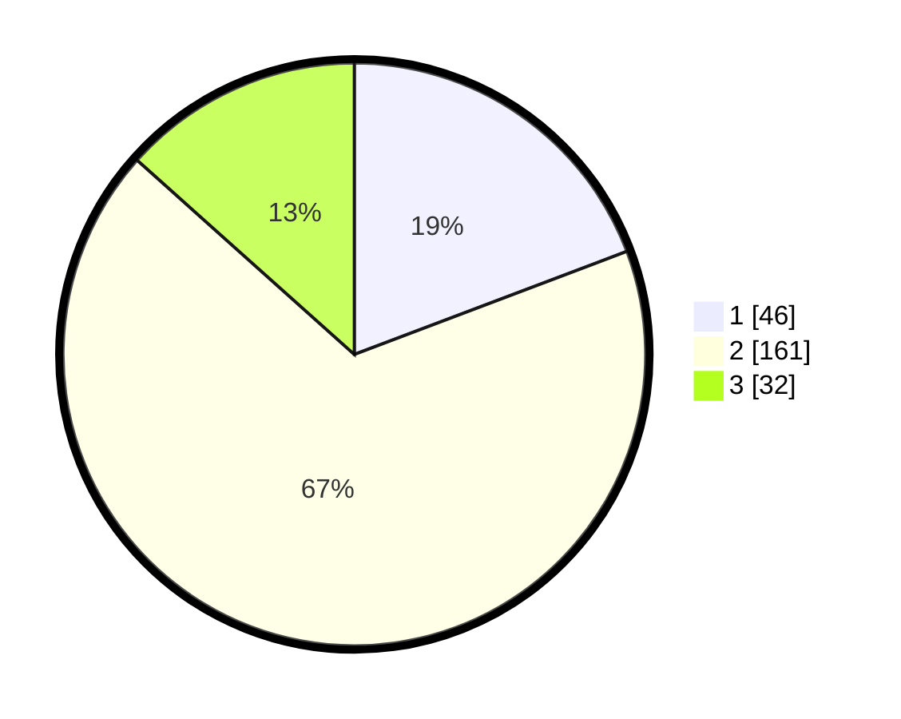

# Hasil

## Grafik

## Tabel

| No. | Nama Paslon    | Suara | Suara (raw) | Persentase |
|:--- |:-------------- | -----:| -----------:| ----------:|
| 1   | ANIES MUHAIMIN | 46    | [46][p-1]   | 19,25      |
| 2   | PRABOWO GIBRAN | 161   | [161][p-2]  | 67,36      |
| 3   | GANJAR MAHFUD  | 32    | [32][p-3]   | 13,39      |

[p-1]: https://github.com/gigit-pemilu/pemilu-2024/blob/main/pilpres/hitung-suara/sub/35-jawa-timur/sub/10-banyuwangi/sub/16-banyuwangi/sub/1015-singotrunan/sub/007-tps/sub/paslon-1.txt
[p-2]: https://github.com/gigit-pemilu/pemilu-2024/blob/main/pilpres/hitung-suara/sub/35-jawa-timur/sub/10-banyuwangi/sub/16-banyuwangi/sub/1015-singotrunan/sub/007-tps/sub/paslon-2.txt
[p-3]: https://github.com/gigit-pemilu/pemilu-2024/blob/main/pilpres/hitung-suara/sub/35-jawa-timur/sub/10-banyuwangi/sub/16-banyuwangi/sub/1015-singotrunan/sub/007-tps/sub/paslon-3.txt

## Foto C Plano

https://sirekap-obj-formc.kpu.go.id/5a2f/pemilu/ppwp/35/10/16/10/15/3510161015007-20240215-031146--f7bda396-4539-41d5-b7b5-06265bea4704.jpg

https://sirekap-obj-formc.kpu.go.id/5a2f/pemilu/ppwp/35/10/16/10/15/3510161015007-20240215-031255--c2a9f623-5c1f-4ea1-8f83-372dd2217886.jpg

https://sirekap-obj-formc.kpu.go.id/5a2f/pemilu/ppwp/35/10/16/10/15/3510161015007-20240215-031329--30e3ef61-37de-47c5-8510-c6f0e3c79cab.jpg

## Metadata

| Key        | Value               |
| ---------- | ------------------- |
| Time Stamp | 2024-02-24 22:31:28 |

