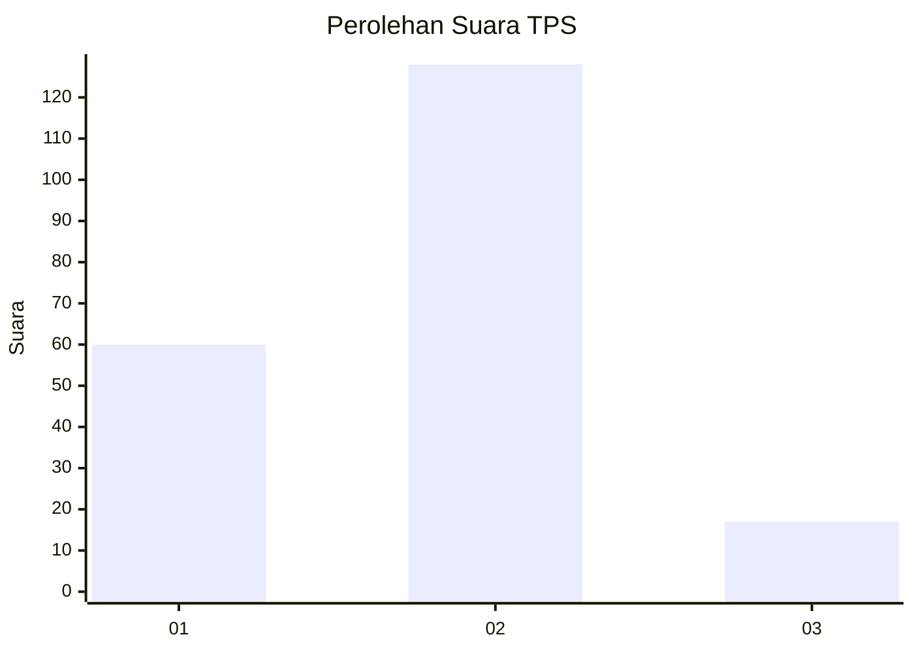
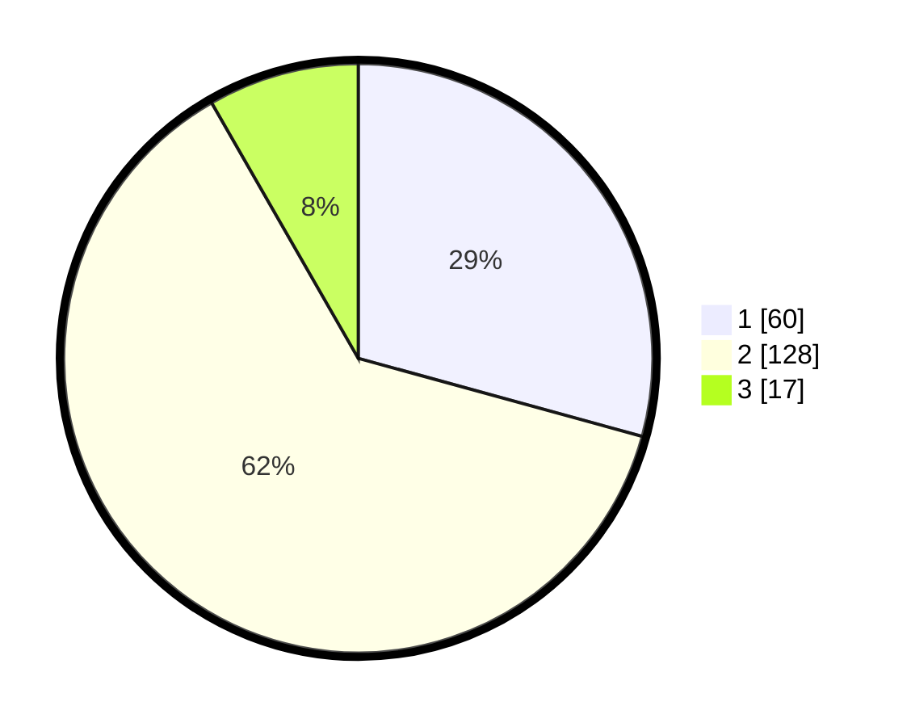

# Hasil

## Grafik

## Tabel

| No. | Nama Paslon    | Suara | Suara (raw) | Persentase |
|:--- |:-------------- | -----:| -----------:| ----------:|
| 1   | ANIES MUHAIMIN | 60    | [60][p-1]   | 29,27      |
| 2   | PRABOWO GIBRAN | 128   | [128][p-2]  | 62,44      |
| 3   | GANJAR MAHFUD  | 17    | [17][p-3]   | 8,29       |

[p-1]: https://github.com/gigit-pemilu/pemilu-2024-35-jawa-timur/blob/main/pilpres/hitung-suara/sub/35-jawa-timur/sub/10-banyuwangi/sub/16-banyuwangi/sub/1015-singotrunan/sub/011-tps/sub/paslon-1.txt
[p-2]: https://github.com/gigit-pemilu/pemilu-2024-35-jawa-timur/blob/main/pilpres/hitung-suara/sub/35-jawa-timur/sub/10-banyuwangi/sub/16-banyuwangi/sub/1015-singotrunan/sub/011-tps/sub/paslon-2.txt
[p-3]: https://github.com/gigit-pemilu/pemilu-2024-35-jawa-timur/blob/main/pilpres/hitung-suara/sub/35-jawa-timur/sub/10-banyuwangi/sub/16-banyuwangi/sub/1015-singotrunan/sub/011-tps/sub/paslon-3.txt

## Foto C Plano

https://sirekap-obj-formc.kpu.go.id/6614/pemilu/ppwp/35/10/16/10/15/3510161015011-20240215-053044--664ab38c-b2e4-48ec-a960-d2bf8242b336.jpg

https://sirekap-obj-formc.kpu.go.id/6614/pemilu/ppwp/35/10/16/10/15/3510161015011-20240215-195546--f2f0401f-969c-4a8f-9db4-a21fa0fb5623.jpg

https://sirekap-obj-formc.kpu.go.id/6614/pemilu/ppwp/35/10/16/10/15/3510161015011-20240215-053137--a5b84238-af71-4b45-8385-0010d83b32a5.jpg

## Metadata

| Key        | Value               |
| ---------- | ------------------- |
| Time Stamp | 2024-02-24 22:31:28 |

