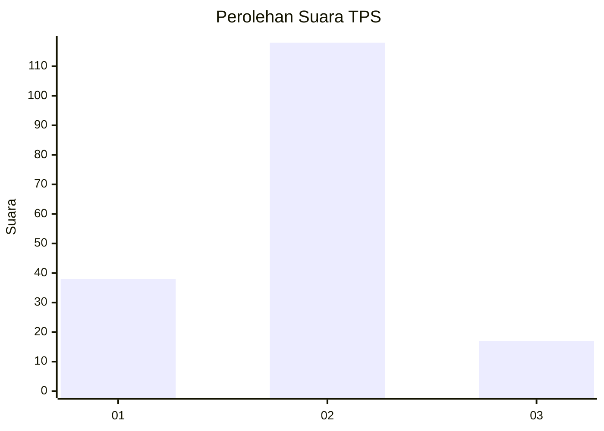

# Hasil

## Grafik

## Tabel

| No. | Nama Paslon    | Suara | Suara (raw) | Persentase |
|:--- |:-------------- | -----:| -----------:| ----------:|
| 1   | ANIES MUHAIMIN | 38    | [38][p-1]   | 21,97      |
| 2   | PRABOWO GIBRAN | 118   | [118][p-2]  | 68,21      |
| 3   | GANJAR MAHFUD  | 17    | [17][p-3]   | 9,83       |

[p-1]: https://github.com/gigit-pemilu/pemilu-2024-35-jawa-timur/blob/main/pilpres/hitung-suara/sub/35-jawa-timur/sub/10-banyuwangi/sub/16-banyuwangi/sub/1015-singotrunan/sub/016-tps/sub/paslon-1.txt
[p-2]: https://github.com/gigit-pemilu/pemilu-2024-35-jawa-timur/blob/main/pilpres/hitung-suara/sub/35-jawa-timur/sub/10-banyuwangi/sub/16-banyuwangi/sub/1015-singotrunan/sub/016-tps/sub/paslon-2.txt
[p-3]: https://github.com/gigit-pemilu/pemilu-2024-35-jawa-timur/blob/main/pilpres/hitung-suara/sub/35-jawa-timur/sub/10-banyuwangi/sub/16-banyuwangi/sub/1015-singotrunan/sub/016-tps/sub/paslon-3.txt

## Foto C Plano

https://sirekap-obj-formc.kpu.go.id/31aa/pemilu/ppwp/35/10/16/10/15/3510161015016-20240215-101926--d6cf5884-162a-4ee9-b910-a0c8308b3650.jpg

https://sirekap-obj-formc.kpu.go.id/31aa/pemilu/ppwp/35/10/16/10/15/3510161015016-20240215-101948--c0781405-46c8-451f-9b0d-5f291fb8ac76.jpg

https://sirekap-obj-formc.kpu.go.id/31aa/pemilu/ppwp/35/10/16/10/15/3510161015016-20240215-102012--90e2b9b4-a28d-4a0b-b0d9-4419e15aa064.jpg

## Metadata

| Key        | Value               |
| ---------- | ------------------- |
| Time Stamp | 2024-02-24 22:31:28 |

