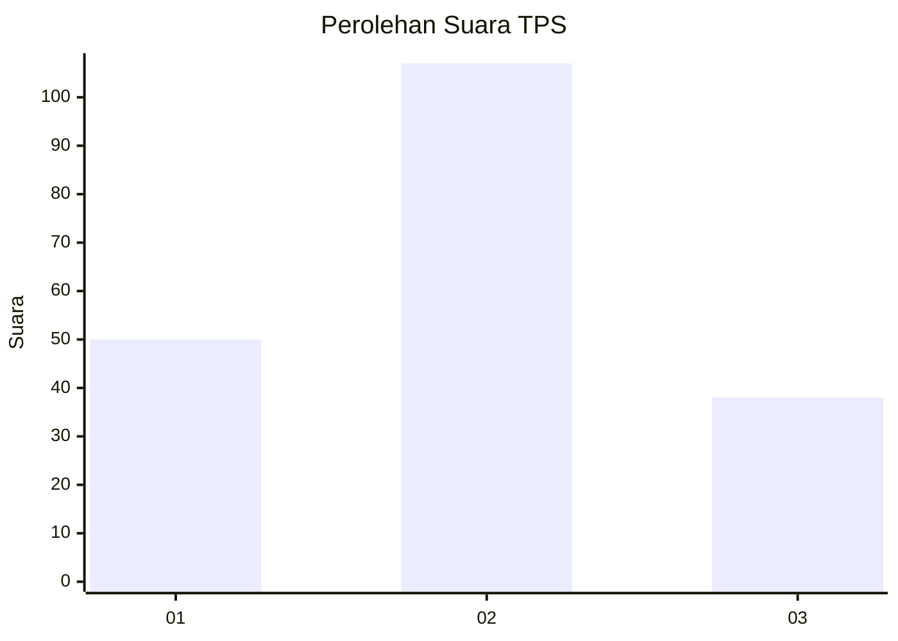
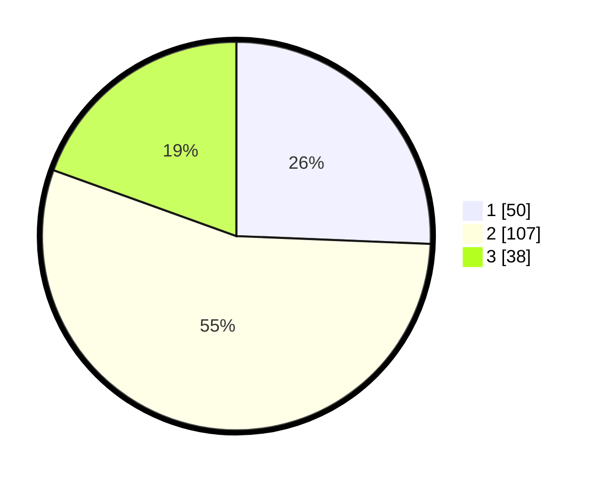

# Hasil

## Grafik

## Tabel

| No. | Nama Paslon    | Suara | Suara (raw) | Persentase |
|:--- |:-------------- | -----:| -----------:| ----------:|
| 1   | ANIES MUHAIMIN | 50    | [50][p-1]   | 25,64      |
| 2   | PRABOWO GIBRAN | 107   | [107][p-2]  | 54,87      |
| 3   | GANJAR MAHFUD  | 38    | [38][p-3]   | 19,49      |

[p-1]: https://github.com/gigit-pemilu/pemilu-2024-35-jawa-timur/blob/main/pilpres/hitung-suara/sub/35-jawa-timur/sub/10-banyuwangi/sub/16-banyuwangi/sub/1015-singotrunan/sub/018-tps/sub/paslon-1.txt
[p-2]: https://github.com/gigit-pemilu/pemilu-2024-35-jawa-timur/blob/main/pilpres/hitung-suara/sub/35-jawa-timur/sub/10-banyuwangi/sub/16-banyuwangi/sub/1015-singotrunan/sub/018-tps/sub/paslon-2.txt
[p-3]: https://github.com/gigit-pemilu/pemilu-2024-35-jawa-timur/blob/main/pilpres/hitung-suara/sub/35-jawa-timur/sub/10-banyuwangi/sub/16-banyuwangi/sub/1015-singotrunan/sub/018-tps/sub/paslon-3.txt

## Foto C Plano

https://sirekap-obj-formc.kpu.go.id/dd29/pemilu/ppwp/35/10/16/10/15/3510161015018-20240215-011107--d2c9277b-692f-4ccc-8e7d-ba5c05bb368f.jpg

https://sirekap-obj-formc.kpu.go.id/dd29/pemilu/ppwp/35/10/16/10/15/3510161015018-20240215-011205--dafc1f58-7e16-4f4f-91c8-d83fcf9edde9.jpg

https://sirekap-obj-formc.kpu.go.id/dd29/pemilu/ppwp/35/10/16/10/15/3510161015018-20240215-011149--9c7293dc-32df-482d-b53a-48bfd9f4368f.jpg

## Metadata

| Key        | Value               |
| ---------- | ------------------- |
| Time Stamp | 2024-02-24 22:31:28 |

