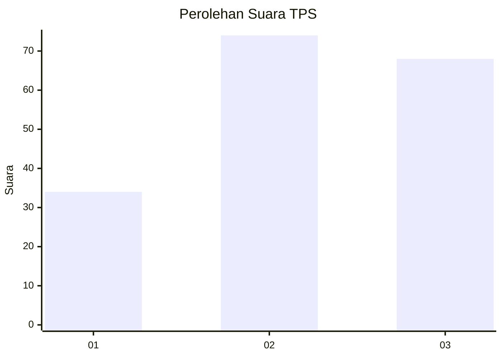
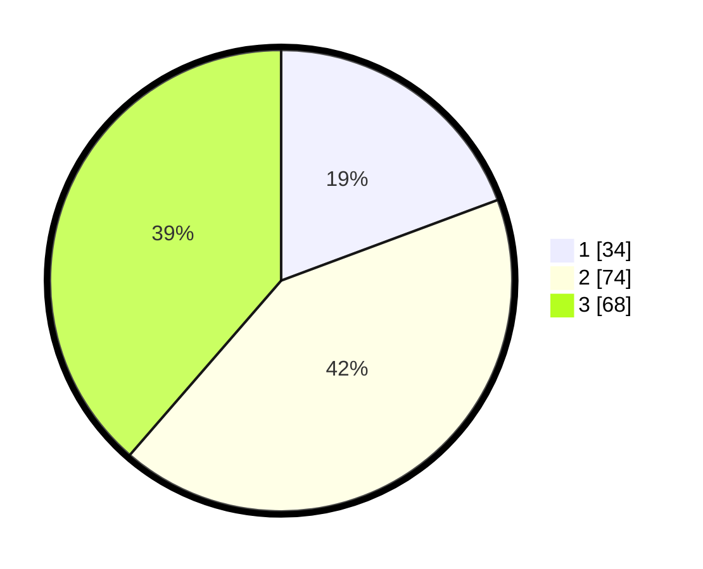

# Hasil

## Grafik

## Tabel

| No. | Nama Paslon    | Suara | Suara (raw) | Persentase |
|:--- |:-------------- | -----:| -----------:| ----------:|
| 1   | ANIES MUHAIMIN | 34    | [34][p-1]   | 19,32      |
| 2   | PRABOWO GIBRAN | 74    | [74][p-2]   | 42,05      |
| 3   | GANJAR MAHFUD  | 68    | [68][p-3]   | 38,64      |

[p-1]: https://github.com/gigit-pemilu/pemilu-2024/blob/main/pilpres/hitung-suara/sub/35-jawa-timur/sub/10-banyuwangi/sub/16-banyuwangi/sub/1015-singotrunan/sub/023-tps/sub/paslon-1.txt
[p-2]: https://github.com/gigit-pemilu/pemilu-2024/blob/main/pilpres/hitung-suara/sub/35-jawa-timur/sub/10-banyuwangi/sub/16-banyuwangi/sub/1015-singotrunan/sub/023-tps/sub/paslon-2.txt
[p-3]: https://github.com/gigit-pemilu/pemilu-2024/blob/main/pilpres/hitung-suara/sub/35-jawa-timur/sub/10-banyuwangi/sub/16-banyuwangi/sub/1015-singotrunan/sub/023-tps/sub/paslon-3.txt

## Foto C Plano

https://sirekap-obj-formc.kpu.go.id/2490/pemilu/ppwp/35/10/16/10/15/3510161015023-20240215-024309--ea5a27ed-fff0-4164-a3d4-85e17fd83b47.jpg

https://sirekap-obj-formc.kpu.go.id/2490/pemilu/ppwp/35/10/16/10/15/3510161015023-20240215-034543--20f6c5ee-23f0-41cd-a966-3d6c8df42dfe.jpg

https://sirekap-obj-formc.kpu.go.id/2490/pemilu/ppwp/35/10/16/10/15/3510161015023-20240215-031000--64ee0895-23dd-4c77-b51a-3d18f3a9a4d3.jpg

## Metadata

| Key        | Value               |
| ---------- | ------------------- |
| Time Stamp | 2024-02-24 22:31:28 |

