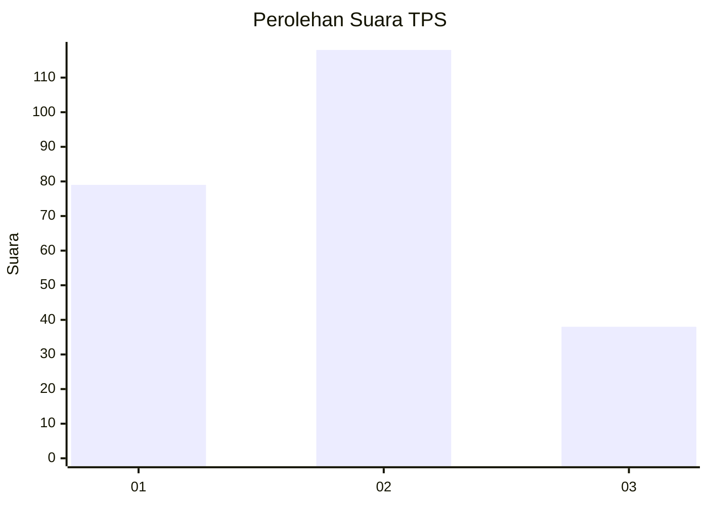
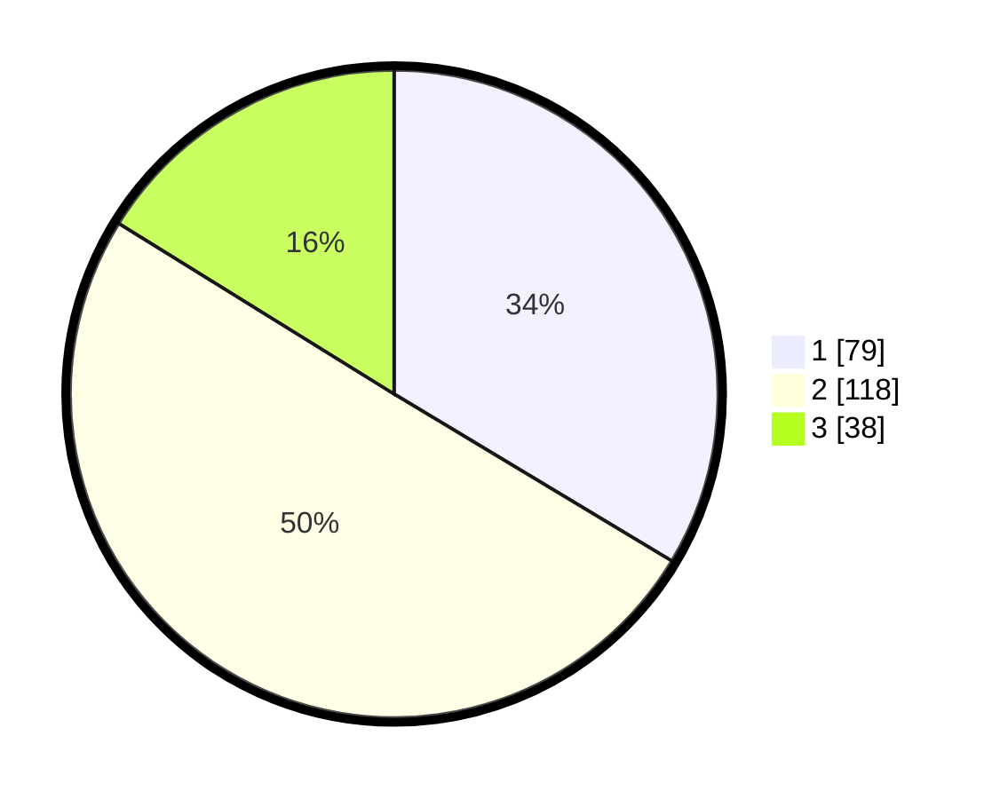

# Hasil

## Grafik

## Tabel

| No. | Nama Paslon    | Suara | Suara (raw) | Persentase |
|:--- |:-------------- | -----:| -----------:| ----------:|
| 1   | ANIES MUHAIMIN | 79    | [79][p-1]   | 33,62      |
| 2   | PRABOWO GIBRAN | 118   | [118][p-2]  | 50,21      |
| 3   | GANJAR MAHFUD  | 38    | [38][p-3]   | 16,17      |

[p-1]: https://github.com/gigit-pemilu/pemilu-2024-35-jawa-timur/blob/main/pilpres/hitung-suara/sub/35-jawa-timur/sub/10-banyuwangi/sub/16-banyuwangi/sub/1017-tamanbaru/sub/011-tps/sub/paslon-1.txt
[p-2]: https://github.com/gigit-pemilu/pemilu-2024-35-jawa-timur/blob/main/pilpres/hitung-suara/sub/35-jawa-timur/sub/10-banyuwangi/sub/16-banyuwangi/sub/1017-tamanbaru/sub/011-tps/sub/paslon-2.txt
[p-3]: https://github.com/gigit-pemilu/pemilu-2024-35-jawa-timur/blob/main/pilpres/hitung-suara/sub/35-jawa-timur/sub/10-banyuwangi/sub/16-banyuwangi/sub/1017-tamanbaru/sub/011-tps/sub/paslon-3.txt

## Foto C Plano

https://sirekap-obj-formc.kpu.go.id/85a7/pemilu/ppwp/35/10/16/10/17/3510161017011-20240220-002228--ab1c1845-b0ac-4ec5-a286-c96821c5b70d.jpg

https://sirekap-obj-formc.kpu.go.id/85a7/pemilu/ppwp/35/10/16/10/17/3510161017011-20240220-002313--cd2daddd-13da-4b8a-bb0b-31261ef6e9d1.jpg

https://sirekap-obj-formc.kpu.go.id/85a7/pemilu/ppwp/35/10/16/10/17/3510161017011-20240220-002358--a251198f-3dce-42fa-995d-f52f07e8348a.jpg

## Metadata

| Key        | Value               |
| ---------- | ------------------- |
| Time Stamp | 2024-02-24 22:31:28 |

