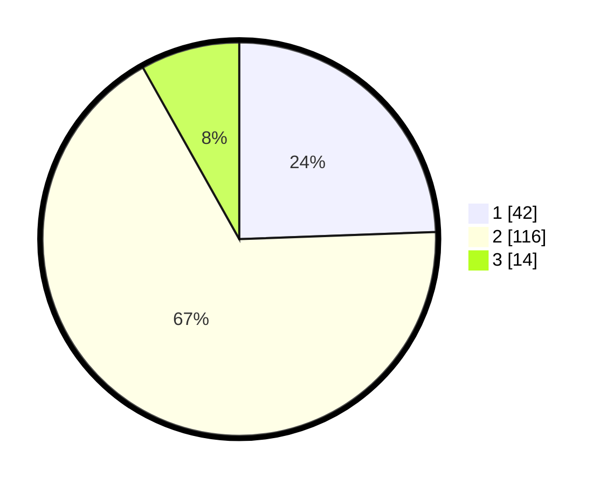

# Hasil

## Grafik

## Tabel

| No. | Nama Paslon    | Suara | Suara (raw) | Persentase |
|:--- |:-------------- | -----:| -----------:| ----------:|
| 1   | ANIES MUHAIMIN | 42    | [42][p-1]   | 24,42      |
| 2   | PRABOWO GIBRAN | 116   | [116][p-2]  | 67,44      |
| 3   | GANJAR MAHFUD  | 14    | [14][p-3]   | 8,14       |

[p-1]: https://github.com/gigit-pemilu/pemilu-2024-35-jawa-timur/blob/main/pilpres/hitung-suara/sub/35-jawa-timur/sub/10-banyuwangi/sub/16-banyuwangi/sub/1018-sumberrejo/sub/003-tps/sub/paslon-1.txt
[p-2]: https://github.com/gigit-pemilu/pemilu-2024-35-jawa-timur/blob/main/pilpres/hitung-suara/sub/35-jawa-timur/sub/10-banyuwangi/sub/16-banyuwangi/sub/1018-sumberrejo/sub/003-tps/sub/paslon-2.txt
[p-3]: https://github.com/gigit-pemilu/pemilu-2024-35-jawa-timur/blob/main/pilpres/hitung-suara/sub/35-jawa-timur/sub/10-banyuwangi/sub/16-banyuwangi/sub/1018-sumberrejo/sub/003-tps/sub/paslon-3.txt

## Foto C Plano

https://sirekap-obj-formc.kpu.go.id/ea59/pemilu/ppwp/35/10/16/10/18/3510161018003-20240219-195212--63032e59-f217-42e3-93d8-d9454e182cec.jpg

https://sirekap-obj-formc.kpu.go.id/ea59/pemilu/ppwp/35/10/16/10/18/3510161018003-20240219-195311--980b7067-573a-4e8e-850a-12689848eac9.jpg

https://sirekap-obj-formc.kpu.go.id/ea59/pemilu/ppwp/35/10/16/10/18/3510161018003-20240219-195508--167804a5-201e-46cc-b213-a27abd6b0220.jpg

## Metadata

| Key        | Value               |
| ---------- | ------------------- |
| Time Stamp | 2024-02-24 22:31:28 |

