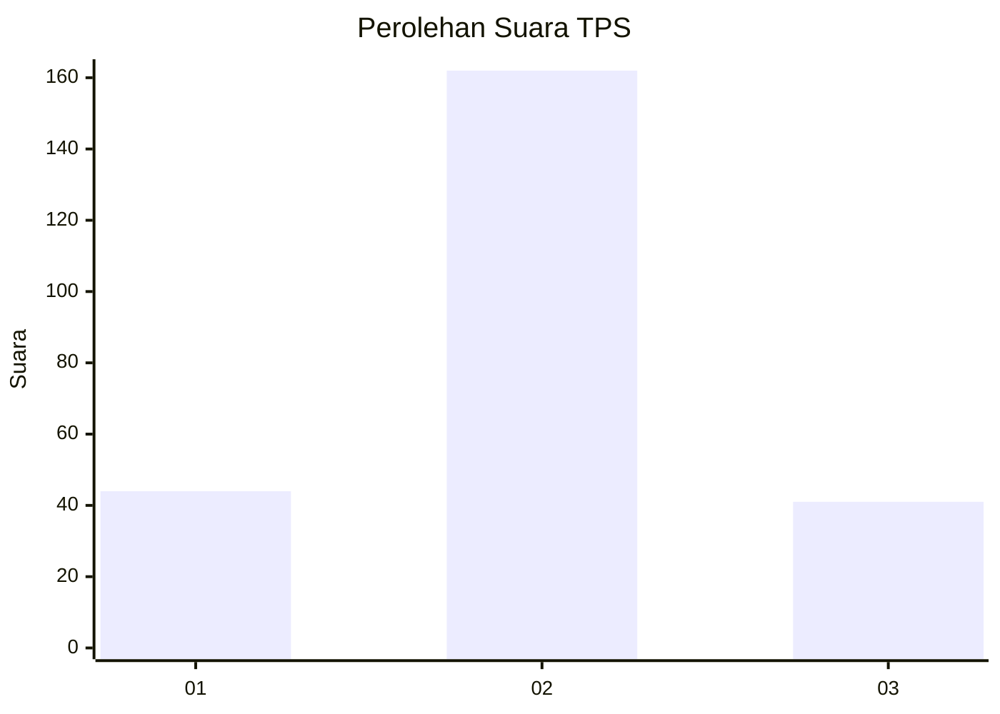
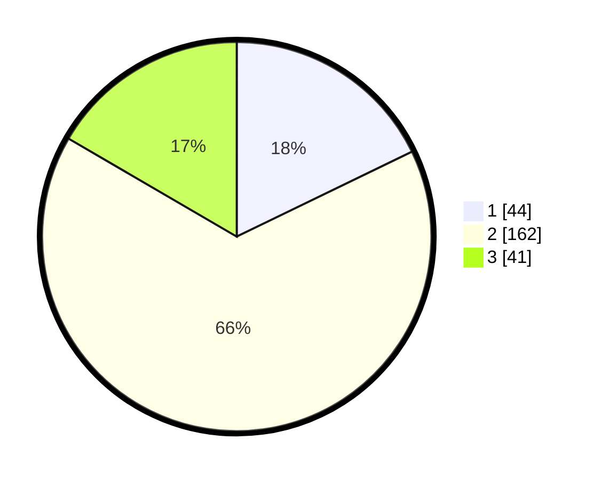

# Hasil

## Grafik

## Tabel

| No. | Nama Paslon    | Suara | Suara (raw) | Persentase |
|:--- |:-------------- | -----:| -----------:| ----------:|
| 1   | ANIES MUHAIMIN | 44    | [44][p-1]   | 17,81      |
| 2   | PRABOWO GIBRAN | 162   | [162][p-2]  | 65,59      |
| 3   | GANJAR MAHFUD  | 41    | [41][p-3]   | 16,60      |

[p-1]: https://github.com/gigit-pemilu/pemilu-2024/blob/main/pilpres/hitung-suara/sub/35-jawa-timur/sub/10-banyuwangi/sub/16-banyuwangi/sub/1018-sumberrejo/sub/010-tps/sub/paslon-1.txt
[p-2]: https://github.com/gigit-pemilu/pemilu-2024/blob/main/pilpres/hitung-suara/sub/35-jawa-timur/sub/10-banyuwangi/sub/16-banyuwangi/sub/1018-sumberrejo/sub/010-tps/sub/paslon-2.txt
[p-3]: https://github.com/gigit-pemilu/pemilu-2024/blob/main/pilpres/hitung-suara/sub/35-jawa-timur/sub/10-banyuwangi/sub/16-banyuwangi/sub/1018-sumberrejo/sub/010-tps/sub/paslon-3.txt

## Foto C Plano

https://sirekap-obj-formc.kpu.go.id/6c85/pemilu/ppwp/35/10/16/10/18/3510161018010-20240215-005209--fdb7ae7c-558c-4ae3-8074-62bd61a90ebe.jpg

https://sirekap-obj-formc.kpu.go.id/6c85/pemilu/ppwp/35/10/16/10/18/3510161018010-20240215-005300--d9d961e7-f0c6-4c0b-8a11-79e5bbde7465.jpg

https://sirekap-obj-formc.kpu.go.id/6c85/pemilu/ppwp/35/10/16/10/18/3510161018010-20240215-005332--950a74f2-02f5-445c-a6bb-a078d476ee86.jpg

## Metadata

| Key        | Value               |
| ---------- | ------------------- |
| Time Stamp | 2024-02-24 22:31:28 |

