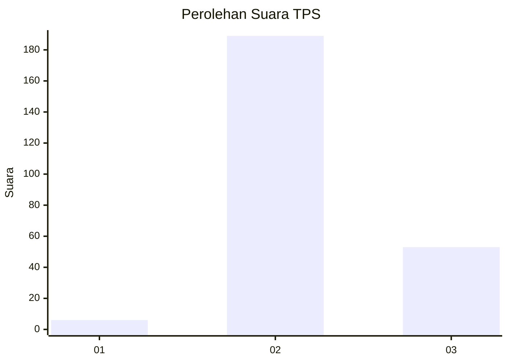

# Hasil

## Grafik

## Tabel

| No. | Nama Paslon    | Suara | Suara (raw) | Persentase |
|:--- |:-------------- | -----:| -----------:| ----------:|
| 1   | ANIES MUHAIMIN | 6     | [6][p-1]    | 2,42       |
| 2   | PRABOWO GIBRAN | 189   | [189][p-2]  | 76,21      |
| 3   | GANJAR MAHFUD  | 53    | [53][p-3]   | 21,37      |

[p-1]: https://github.com/gigit-pemilu/pemilu-2024-35-jawa-timur/blob/main/pilpres/hitung-suara/sub/35-jawa-timur/sub/10-banyuwangi/sub/17-giri/sub/1004-penataban/sub/901-tps/sub/paslon-1.txt
[p-2]: https://github.com/gigit-pemilu/pemilu-2024-35-jawa-timur/blob/main/pilpres/hitung-suara/sub/35-jawa-timur/sub/10-banyuwangi/sub/17-giri/sub/1004-penataban/sub/901-tps/sub/paslon-2.txt
[p-3]: https://github.com/gigit-pemilu/pemilu-2024-35-jawa-timur/blob/main/pilpres/hitung-suara/sub/35-jawa-timur/sub/10-banyuwangi/sub/17-giri/sub/1004-penataban/sub/901-tps/sub/paslon-3.txt

## Foto C Plano

https://sirekap-obj-formc.kpu.go.id/b957/pemilu/ppwp/35/10/17/10/04/3510171004901-20240214-155242--c4e53e0b-1418-44ee-965a-d665188dbb26.jpg

https://sirekap-obj-formc.kpu.go.id/b957/pemilu/ppwp/35/10/17/10/04/3510171004901-20240214-155304--7175b961-ab9b-4d55-8520-802a3ba98775.jpg

https://sirekap-obj-formc.kpu.go.id/b957/pemilu/ppwp/35/10/17/10/04/3510171004901-20240214-155324--e7f7659b-d4d6-4d6f-9ae0-b5307ffcbf84.jpg

## Metadata

| Key        | Value               |
| ---------- | ------------------- |
| Time Stamp | 2024-02-14 21:46:01 |

## DATA PEMILIH TETAP

Jumlah pemilih dalam DPT: **258**.
 * L: **249**.
 * P: **9**.

## DATA PENGGUNA HAK PILIH

Jumlah pengguna hak pilih dalam DPT: **157**.
 * L: **151**.
 * P: **6**.

Jumlah pengguna hak pilih dalam DPTb: **92**.
 * L: **89**.
 * P: **3**.

Jumlah pengguna hak pilih dalam DPK: **0**.
 * L: **0**.
 * P: **0**.

Jumlah pengguna hak pilih: **249**.
 * L: **240**.
 * P: **9**.

## JUMLAH SUARA SAH DAN TIDAK SAH

JUMLAH SELURUH SUARA SAH: **248**.

JUMLAH SUARA TIDAK SAH: **1**.

JUMLAH SELURUH SUARA SAH DAN SUARA TIDAK SAH: **249**.

