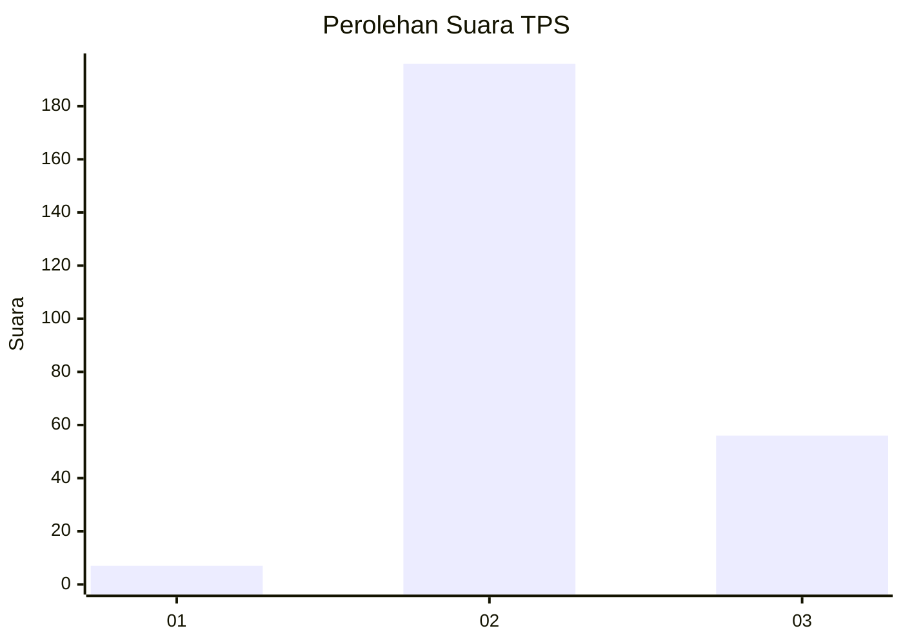

# Hasil

## Grafik

## Tabel

| No. | Nama Paslon    | Suara | Suara (raw) | Persentase |
|:--- |:-------------- | -----:| -----------:| ----------:|
| 1   | ANIES MUHAIMIN | 7     | [7][p-1]    | 2,70       |
| 2   | PRABOWO GIBRAN | 196   | [196][p-2]  | 75,68      |
| 3   | GANJAR MAHFUD  | 56    | [56][p-3]   | 21,62      |

[p-1]: https://github.com/gigit-pemilu/pemilu-2024-35-jawa-timur/blob/main/pilpres/hitung-suara/sub/35-jawa-timur/sub/10-banyuwangi/sub/17-giri/sub/1004-penataban/sub/902-tps/sub/paslon-1.txt
[p-2]: https://github.com/gigit-pemilu/pemilu-2024-35-jawa-timur/blob/main/pilpres/hitung-suara/sub/35-jawa-timur/sub/10-banyuwangi/sub/17-giri/sub/1004-penataban/sub/902-tps/sub/paslon-2.txt
[p-3]: https://github.com/gigit-pemilu/pemilu-2024-35-jawa-timur/blob/main/pilpres/hitung-suara/sub/35-jawa-timur/sub/10-banyuwangi/sub/17-giri/sub/1004-penataban/sub/902-tps/sub/paslon-3.txt

## Foto C Plano

https://sirekap-obj-formc.kpu.go.id/04cc/pemilu/ppwp/35/10/17/10/04/3510171004902-20240216-124616--fc9c885b-0f8f-4c86-ad67-ff1fb9f4f6de.jpg

https://sirekap-obj-formc.kpu.go.id/04cc/pemilu/ppwp/35/10/17/10/04/3510171004902-20240216-115042--9d6a5fd6-ba4a-4021-adb5-0f3a2723ccfb.jpg

https://sirekap-obj-formc.kpu.go.id/04cc/pemilu/ppwp/35/10/17/10/04/3510171004902-20240216-123109--3ff8c680-e7a8-4483-a99e-615ade7ae45b.jpg

## Metadata

| Key        | Value               |
| ---------- | ------------------- |
| Time Stamp | 2024-02-21 21:00:04 |

## DATA PEMILIH TETAP

Jumlah pemilih dalam DPT: **259**.
 * L: **252**.
 * P: **7**.

## DATA PENGGUNA HAK PILIH

Jumlah pengguna hak pilih dalam DPT: **180**.
 * L: **174**.
 * P: **6**.

Jumlah pengguna hak pilih dalam DPTb: **82**.
 * L: **80**.
 * P: **2**.

Jumlah pengguna hak pilih dalam DPK: **0**.
 * L: **0**.
 * P: **0**.

Jumlah pengguna hak pilih: **262**.
 * L: **254**.
 * P: **8**.

## JUMLAH SUARA SAH DAN TIDAK SAH

JUMLAH SELURUH SUARA SAH: **259**.

JUMLAH SUARA TIDAK SAH: **3**.

JUMLAH SELURUH SUARA SAH DAN SUARA TIDAK SAH: **262**.

