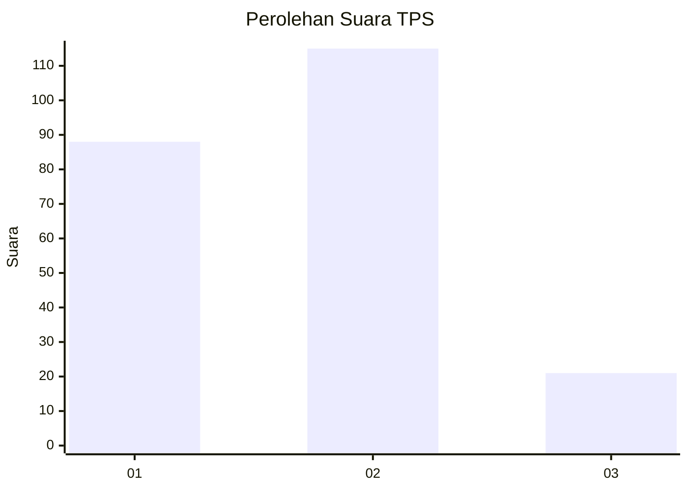
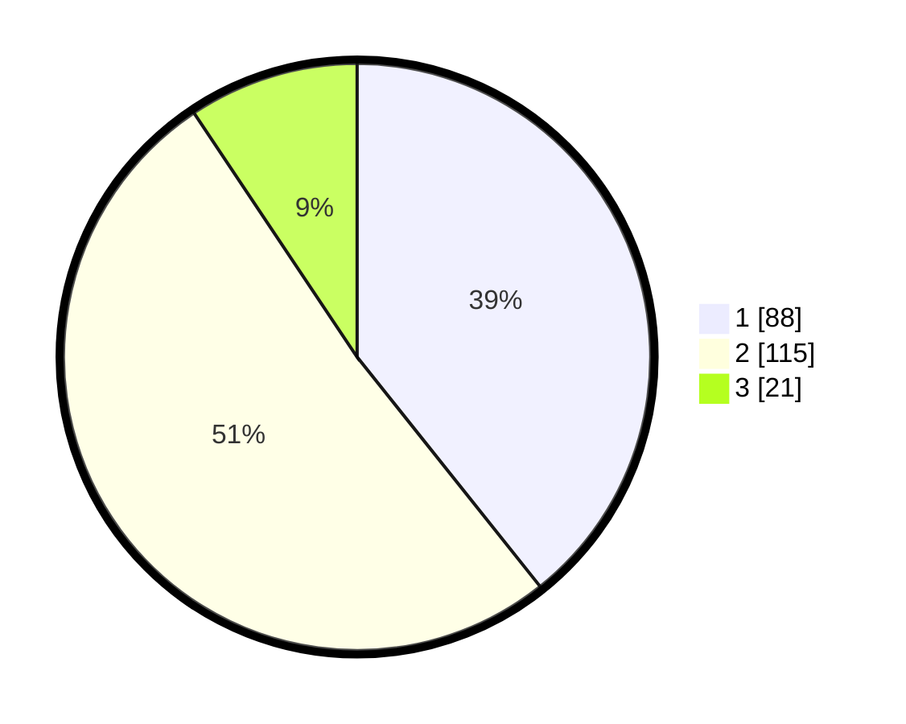

# Hasil

## Grafik

## Tabel

| No. | Nama Paslon    | Suara | Suara (raw) | Persentase |
|:--- |:-------------- | -----:| -----------:| ----------:|
| 1   | ANIES MUHAIMIN | 88    | [88][p-1]   | 39,29      |
| 2   | PRABOWO GIBRAN | 115   | [115][p-2]  | 51,34      |
| 3   | GANJAR MAHFUD  | 21    | [21][p-3]   | 9,38       |

[p-1]: https://github.com/gigit-pemilu/pemilu-2024/blob/main/pilpres/hitung-suara/sub/35-jawa-timur/sub/10-banyuwangi/sub/18-wongsorejo/sub/2001-bangsring/sub/003-tps/sub/paslon-1.txt
[p-2]: https://github.com/gigit-pemilu/pemilu-2024/blob/main/pilpres/hitung-suara/sub/35-jawa-timur/sub/10-banyuwangi/sub/18-wongsorejo/sub/2001-bangsring/sub/003-tps/sub/paslon-2.txt
[p-3]: https://github.com/gigit-pemilu/pemilu-2024/blob/main/pilpres/hitung-suara/sub/35-jawa-timur/sub/10-banyuwangi/sub/18-wongsorejo/sub/2001-bangsring/sub/003-tps/sub/paslon-3.txt

## Foto C Plano

https://sirekap-obj-formc.kpu.go.id/7df6/pemilu/ppwp/35/10/18/20/01/3510182001003-20240218-145551--c1184cc8-ef0d-4c01-8bb2-0afd5a10b467.jpg

https://sirekap-obj-formc.kpu.go.id/7df6/pemilu/ppwp/35/10/18/20/01/3510182001003-20240218-145553--446467d9-3bba-4f54-a53a-405d9e0d4c32.jpg

https://sirekap-obj-formc.kpu.go.id/7df6/pemilu/ppwp/35/10/18/20/01/3510182001003-20240218-145552--18eff4be-e5e2-4d87-945e-57f5e8fe4966.jpg

## Metadata

| Key        | Value               |
| ---------- | ------------------- |
| Time Stamp | 2024-02-24 22:31:28 |

## DATA PEMILIH TETAP

Jumlah pemilih dalam DPT: **282**.
 * L: **133**.
 * P: **149**.

## DATA PENGGUNA HAK PILIH

Jumlah pengguna hak pilih dalam DPT: **226**.
 * L: **93**.
 * P: **133**.

Jumlah pengguna hak pilih dalam DPTb: **3**.
 * L: **3**.
 * P: **0**.

Jumlah pengguna hak pilih dalam DPK: **1**.
 * L: **0**.
 * P: **1**.

Jumlah pengguna hak pilih: **230**.
 * L: **96**.
 * P: **134**.

## JUMLAH SUARA SAH DAN TIDAK SAH

JUMLAH SELURUH SUARA SAH: **224**.

JUMLAH SUARA TIDAK SAH: **6**.

JUMLAH SELURUH SUARA SAH DAN SUARA TIDAK SAH: **230**.

