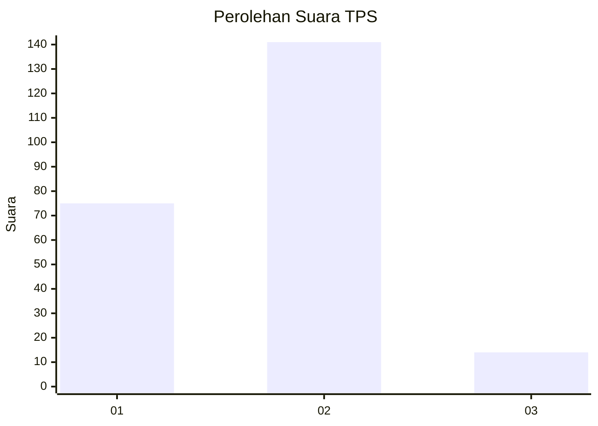
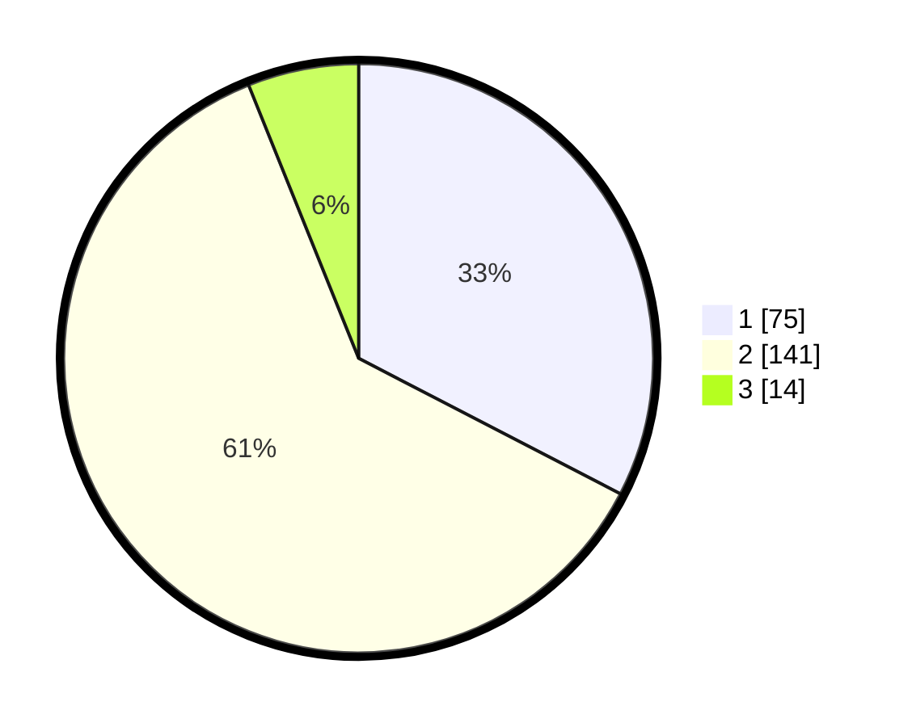

# Hasil

## Grafik

## Tabel

| No. | Nama Paslon    | Suara | Suara (raw) | Persentase |
|:--- |:-------------- | -----:| -----------:| ----------:|
| 1   | ANIES MUHAIMIN | 75    | [75][p-1]   | 32,61      |
| 2   | PRABOWO GIBRAN | 141   | [141][p-2]  | 61,30      |
| 3   | GANJAR MAHFUD  | 14    | [14][p-3]   | 6,09       |

[p-1]: https://github.com/gigit-pemilu/pemilu-2024/blob/main/pilpres/hitung-suara/sub/35-jawa-timur/sub/10-banyuwangi/sub/18-wongsorejo/sub/2001-bangsring/sub/006-tps/sub/paslon-1.txt
[p-2]: https://github.com/gigit-pemilu/pemilu-2024/blob/main/pilpres/hitung-suara/sub/35-jawa-timur/sub/10-banyuwangi/sub/18-wongsorejo/sub/2001-bangsring/sub/006-tps/sub/paslon-2.txt
[p-3]: https://github.com/gigit-pemilu/pemilu-2024/blob/main/pilpres/hitung-suara/sub/35-jawa-timur/sub/10-banyuwangi/sub/18-wongsorejo/sub/2001-bangsring/sub/006-tps/sub/paslon-3.txt

## Foto C Plano

https://sirekap-obj-formc.kpu.go.id/2f02/pemilu/ppwp/35/10/18/20/01/3510182001006-20240214-234534--c3b49754-8a7f-4e0f-885f-22575f014981.jpg

https://sirekap-obj-formc.kpu.go.id/2f02/pemilu/ppwp/35/10/18/20/01/3510182001006-20240214-234348--6dd2424b-e8ba-42f7-b340-8b7674dc590c.jpg

https://sirekap-obj-formc.kpu.go.id/2f02/pemilu/ppwp/35/10/18/20/01/3510182001006-20240214-234436--865e98d2-2952-4ef1-876d-af80d619aa43.jpg

## Metadata

| Key        | Value               |
| ---------- | ------------------- |
| Time Stamp | 2024-02-24 22:31:28 |

