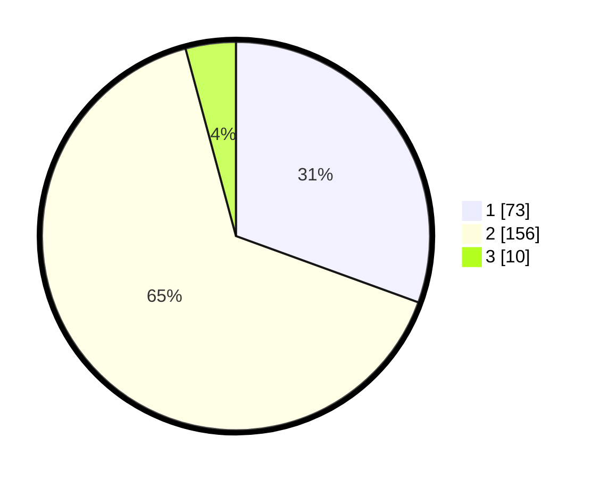

# Hasil

## Grafik

## Tabel

| No. | Nama Paslon    | Suara | Suara (raw) | Persentase |
|:--- |:-------------- | -----:| -----------:| ----------:|
| 1   | ANIES MUHAIMIN | 73    | [73][p-1]   | 30,54      |
| 2   | PRABOWO GIBRAN | 156   | [156][p-2]  | 65,27      |
| 3   | GANJAR MAHFUD  | 10    | [10][p-3]   | 4,18       |

[p-1]: https://github.com/gigit-pemilu/pemilu-2024/blob/main/pilpres/hitung-suara/sub/35-jawa-timur/sub/10-banyuwangi/sub/18-wongsorejo/sub/2002-bengkak/sub/006-tps/sub/paslon-1.txt
[p-2]: https://github.com/gigit-pemilu/pemilu-2024/blob/main/pilpres/hitung-suara/sub/35-jawa-timur/sub/10-banyuwangi/sub/18-wongsorejo/sub/2002-bengkak/sub/006-tps/sub/paslon-2.txt
[p-3]: https://github.com/gigit-pemilu/pemilu-2024/blob/main/pilpres/hitung-suara/sub/35-jawa-timur/sub/10-banyuwangi/sub/18-wongsorejo/sub/2002-bengkak/sub/006-tps/sub/paslon-3.txt

## Foto C Plano

https://sirekap-obj-formc.kpu.go.id/beb3/pemilu/ppwp/35/10/18/20/02/3510182002006-20240215-131518--1a917855-eccd-439c-9f65-04d333b77807.jpg

https://sirekap-obj-formc.kpu.go.id/beb3/pemilu/ppwp/35/10/18/20/02/3510182002006-20240215-204735--634a4272-3c33-4fdb-97f0-56011495c007.jpg

https://sirekap-obj-formc.kpu.go.id/beb3/pemilu/ppwp/35/10/18/20/02/3510182002006-20240217-154320--aa4bea57-f98d-4ff3-b33c-23a74372aa61.jpg

## Metadata

| Key        | Value               |
| ---------- | ------------------- |
| Time Stamp | 2024-02-17 16:00:02 |

