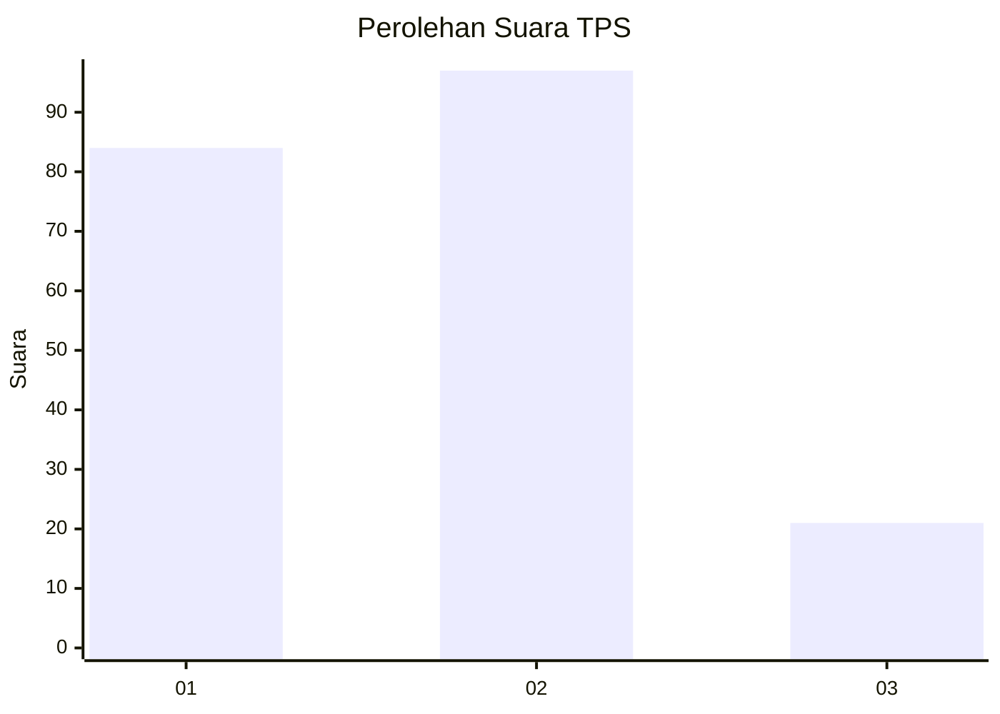
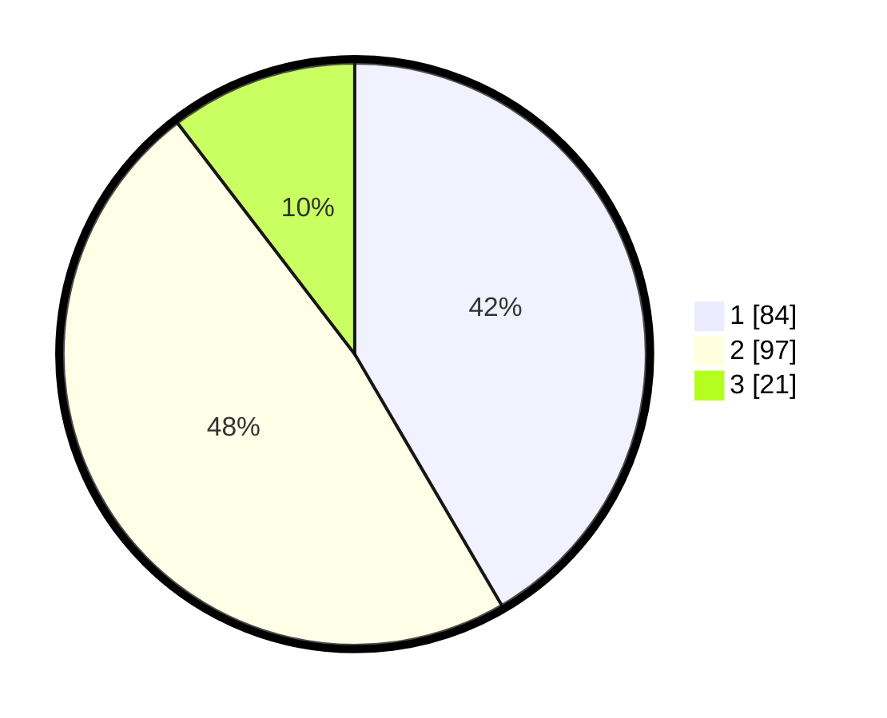

# Hasil

## Grafik

## Tabel

| No. | Nama Paslon    | Suara | Suara (raw) | Persentase |
|:--- |:-------------- | -----:| -----------:| ----------:|
| 1   | ANIES MUHAIMIN | 84    | [84][p-1]   | 41,58      |
| 2   | PRABOWO GIBRAN | 97    | [97][p-2]   | 48,02      |
| 3   | GANJAR MAHFUD  | 21    | [21][p-3]   | 10,40      |

[p-1]: https://github.com/gigit-pemilu/pemilu-2024/blob/main/pilpres/hitung-suara/sub/35-jawa-timur/sub/10-banyuwangi/sub/18-wongsorejo/sub/2002-bengkak/sub/011-tps/sub/paslon-1.txt
[p-2]: https://github.com/gigit-pemilu/pemilu-2024/blob/main/pilpres/hitung-suara/sub/35-jawa-timur/sub/10-banyuwangi/sub/18-wongsorejo/sub/2002-bengkak/sub/011-tps/sub/paslon-2.txt
[p-3]: https://github.com/gigit-pemilu/pemilu-2024/blob/main/pilpres/hitung-suara/sub/35-jawa-timur/sub/10-banyuwangi/sub/18-wongsorejo/sub/2002-bengkak/sub/011-tps/sub/paslon-3.txt

## Foto C Plano

https://sirekap-obj-formc.kpu.go.id/2451/pemilu/ppwp/35/10/18/20/02/3510182002011-20240215-115516--f938f99b-5691-422f-83dc-36f26400e4d5.jpg

https://sirekap-obj-formc.kpu.go.id/2451/pemilu/ppwp/35/10/18/20/02/3510182002011-20240215-115617--530f0b89-4e33-41de-a01b-d75612dadf83.jpg

https://sirekap-obj-formc.kpu.go.id/2451/pemilu/ppwp/35/10/18/20/02/3510182002011-20240215-103639--adc20d81-3019-4b3f-89d8-3f447ccb542b.jpg

## Metadata

| Key        | Value               |
| ---------- | ------------------- |
| Time Stamp | 2024-02-24 22:31:28 |

