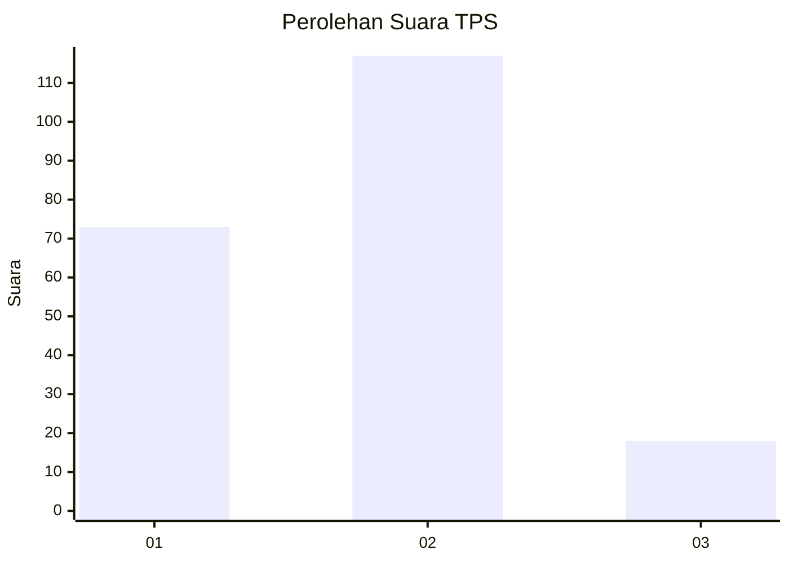
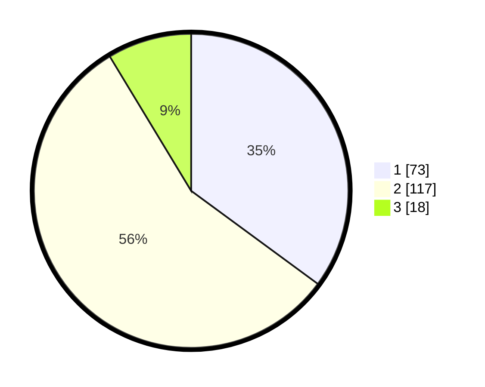

# Hasil

## Grafik

## Tabel

| No. | Nama Paslon    | Suara | Suara (raw) | Persentase |
|:--- |:-------------- | -----:| -----------:| ----------:|
| 1   | ANIES MUHAIMIN | 73    | [73][p-1]   | 35,10      |
| 2   | PRABOWO GIBRAN | 117   | [117][p-2]  | 56,25      |
| 3   | GANJAR MAHFUD  | 18    | [18][p-3]   | 8,65       |

[p-1]: https://github.com/gigit-pemilu/pemilu-2024/blob/main/pilpres/hitung-suara/sub/35-jawa-timur/sub/10-banyuwangi/sub/18-wongsorejo/sub/2003-alasbuluh/sub/001-tps/sub/paslon-1.txt
[p-2]: https://github.com/gigit-pemilu/pemilu-2024/blob/main/pilpres/hitung-suara/sub/35-jawa-timur/sub/10-banyuwangi/sub/18-wongsorejo/sub/2003-alasbuluh/sub/001-tps/sub/paslon-2.txt
[p-3]: https://github.com/gigit-pemilu/pemilu-2024/blob/main/pilpres/hitung-suara/sub/35-jawa-timur/sub/10-banyuwangi/sub/18-wongsorejo/sub/2003-alasbuluh/sub/001-tps/sub/paslon-3.txt

## Foto C Plano

https://sirekap-obj-formc.kpu.go.id/2bbd/pemilu/ppwp/35/10/18/20/03/3510182003001-20240217-232918--0bfbbadb-a906-4151-83aa-da86ef99328e.jpg

https://sirekap-obj-formc.kpu.go.id/2bbd/pemilu/ppwp/35/10/18/20/03/3510182003001-20240217-230343--c3a88355-bc5f-4c56-bb1c-60177b1e3fc3.jpg

https://sirekap-obj-formc.kpu.go.id/2bbd/pemilu/ppwp/35/10/18/20/03/3510182003001-20240217-230444--9cbfa4ec-d958-480a-884f-918cc3fb6fdb.jpg

## Metadata

| Key        | Value               |
| ---------- | ------------------- |
| Time Stamp | 2024-02-24 22:31:28 |

