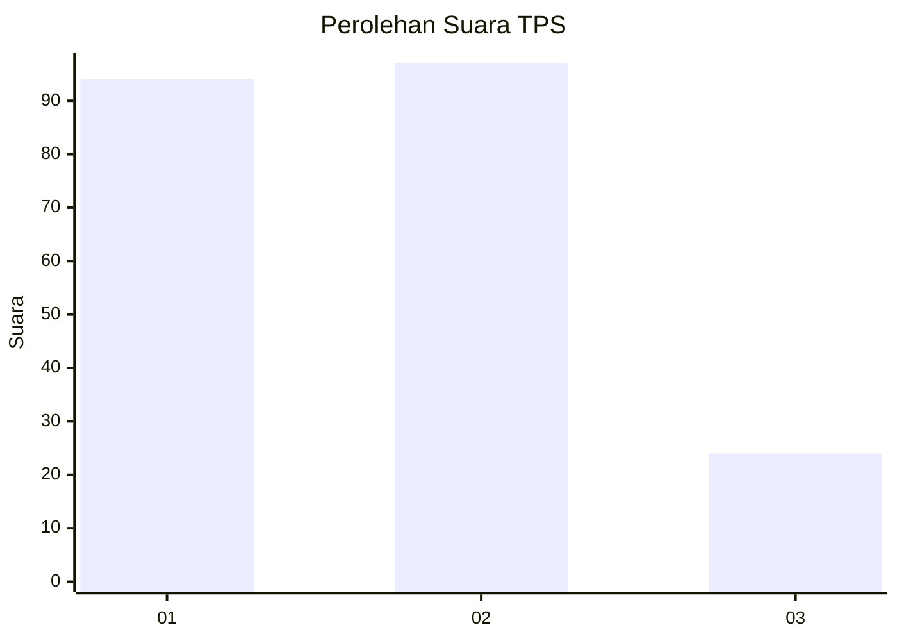
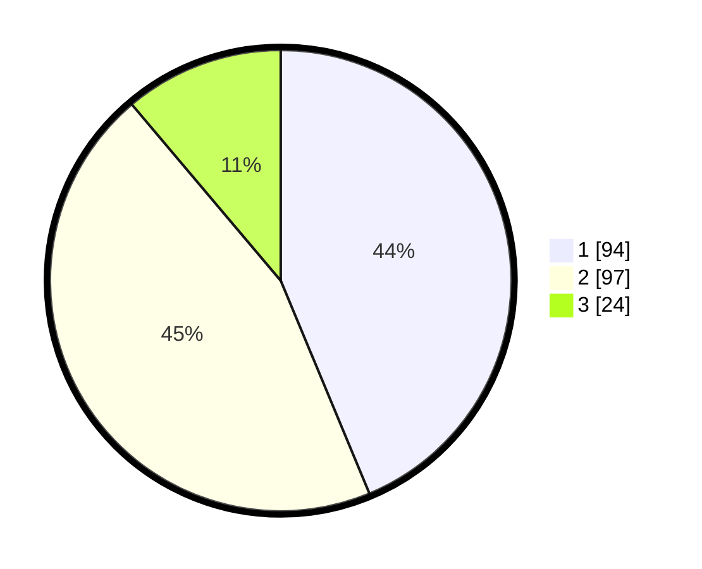

# Hasil

## Grafik

## Tabel

| No. | Nama Paslon    | Suara | Suara (raw) | Persentase |
|:--- |:-------------- | -----:| -----------:| ----------:|
| 1   | ANIES MUHAIMIN | 94    | [94][p-1]   | 43,72      |
| 2   | PRABOWO GIBRAN | 97    | [97][p-2]   | 45,12      |
| 3   | GANJAR MAHFUD  | 24    | [24][p-3]   | 11,16      |

[p-1]: https://github.com/gigit-pemilu/pemilu-2024/blob/main/pilpres/hitung-suara/sub/35-jawa-timur/sub/10-banyuwangi/sub/18-wongsorejo/sub/2003-alasbuluh/sub/006-tps/sub/paslon-1.txt
[p-2]: https://github.com/gigit-pemilu/pemilu-2024/blob/main/pilpres/hitung-suara/sub/35-jawa-timur/sub/10-banyuwangi/sub/18-wongsorejo/sub/2003-alasbuluh/sub/006-tps/sub/paslon-2.txt
[p-3]: https://github.com/gigit-pemilu/pemilu-2024/blob/main/pilpres/hitung-suara/sub/35-jawa-timur/sub/10-banyuwangi/sub/18-wongsorejo/sub/2003-alasbuluh/sub/006-tps/sub/paslon-3.txt

## Foto C Plano

https://sirekap-obj-formc.kpu.go.id/5a98/pemilu/ppwp/35/10/18/20/03/3510182003006-20240216-105423--bd1eaa13-a6a6-4758-a8e2-2c6fbe1b500a.jpg

https://sirekap-obj-formc.kpu.go.id/5a98/pemilu/ppwp/35/10/18/20/03/3510182003006-20240216-105517--64f8004c-993b-4ae8-ad57-d64bb75d3bfd.jpg

https://sirekap-obj-formc.kpu.go.id/5a98/pemilu/ppwp/35/10/18/20/03/3510182003006-20240216-105624--93e71997-4e7f-4b75-a63c-b86fffc91f18.jpg

## Metadata

| Key        | Value               |
| ---------- | ------------------- |
| Time Stamp | 2024-02-24 22:31:28 |

