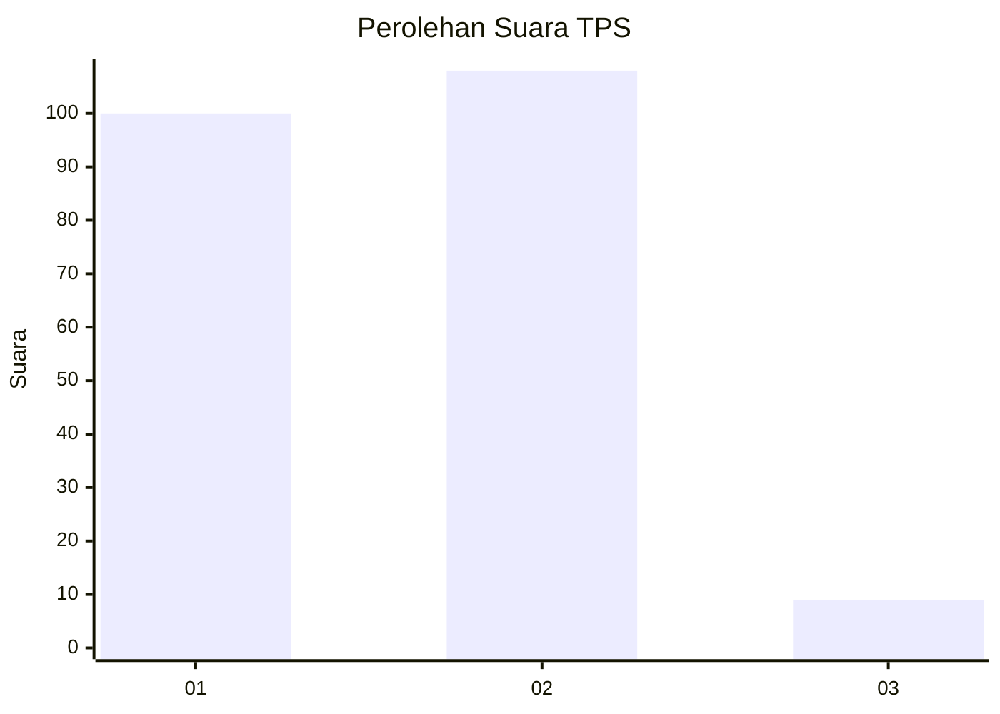
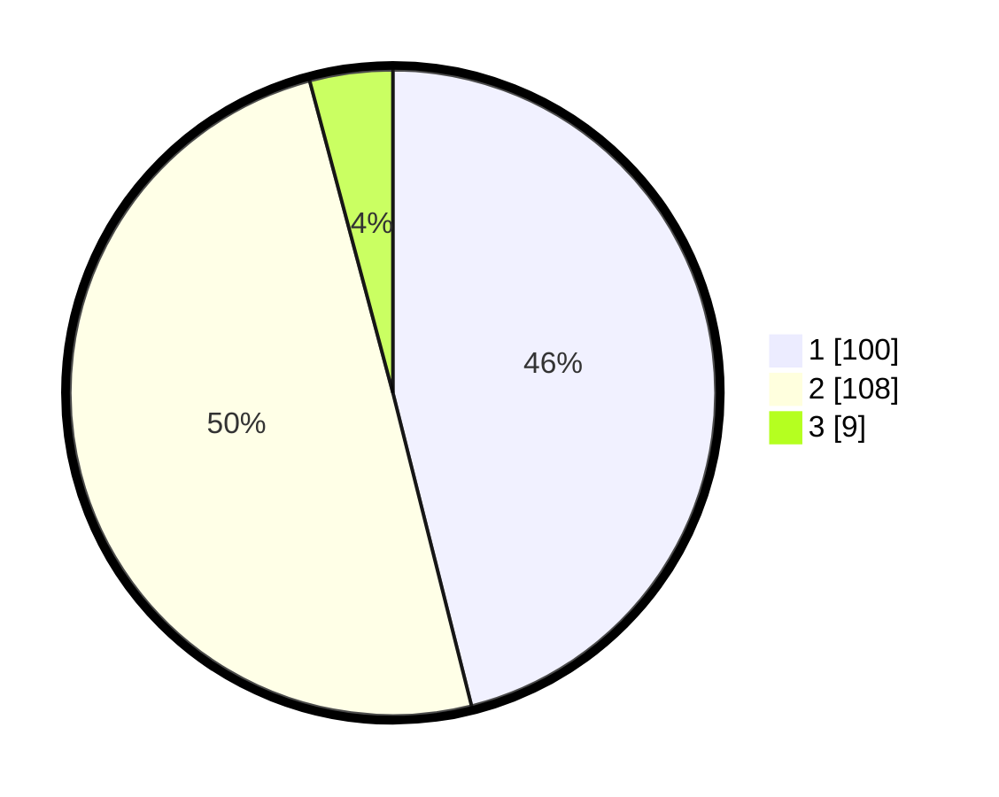

# Hasil

## Grafik

## Tabel

| No. | Nama Paslon    | Suara | Suara (raw) | Persentase |
|:--- |:-------------- | -----:| -----------:| ----------:|
| 1   | ANIES MUHAIMIN | 100   | [100][p-1]  | 46,08      |
| 2   | PRABOWO GIBRAN | 108   | [108][p-2]  | 49,77      |
| 3   | GANJAR MAHFUD  | 9     | [9][p-3]    | 4,15       |

[p-1]: https://github.com/gigit-pemilu/pemilu-2024-35-jawa-timur/blob/main/pilpres/hitung-suara/sub/35-jawa-timur/sub/10-banyuwangi/sub/18-wongsorejo/sub/2003-alasbuluh/sub/011-tps/sub/paslon-1.txt
[p-2]: https://github.com/gigit-pemilu/pemilu-2024-35-jawa-timur/blob/main/pilpres/hitung-suara/sub/35-jawa-timur/sub/10-banyuwangi/sub/18-wongsorejo/sub/2003-alasbuluh/sub/011-tps/sub/paslon-2.txt
[p-3]: https://github.com/gigit-pemilu/pemilu-2024-35-jawa-timur/blob/main/pilpres/hitung-suara/sub/35-jawa-timur/sub/10-banyuwangi/sub/18-wongsorejo/sub/2003-alasbuluh/sub/011-tps/sub/paslon-3.txt

## Foto C Plano

https://sirekap-obj-formc.kpu.go.id/948c/pemilu/ppwp/35/10/18/20/03/3510182003011-20240215-193022--5b3d3f8d-aab7-408a-ba36-89f67c65d33b.jpg

https://sirekap-obj-formc.kpu.go.id/948c/pemilu/ppwp/35/10/18/20/03/3510182003011-20240215-193120--3683c754-309f-4cbc-bc99-12afb1a9d2f6.jpg

https://sirekap-obj-formc.kpu.go.id/948c/pemilu/ppwp/35/10/18/20/03/3510182003011-20240215-193245--753f4e86-d20e-432e-9397-92944d4546a5.jpg

## Metadata

| Key        | Value               |
| ---------- | ------------------- |
| Time Stamp | 2024-02-24 22:31:28 |

