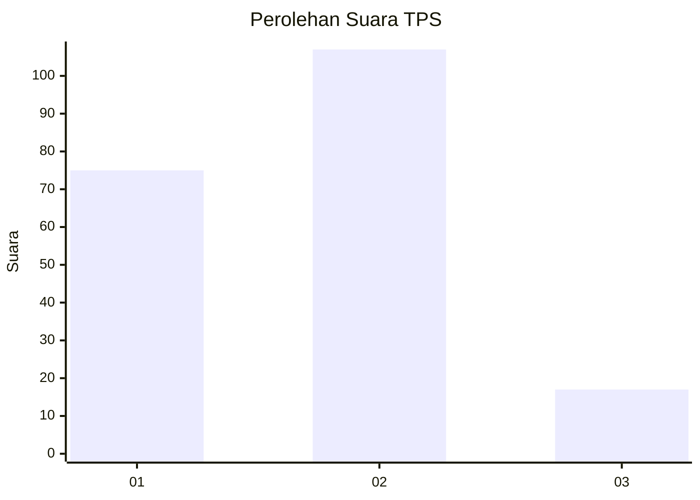
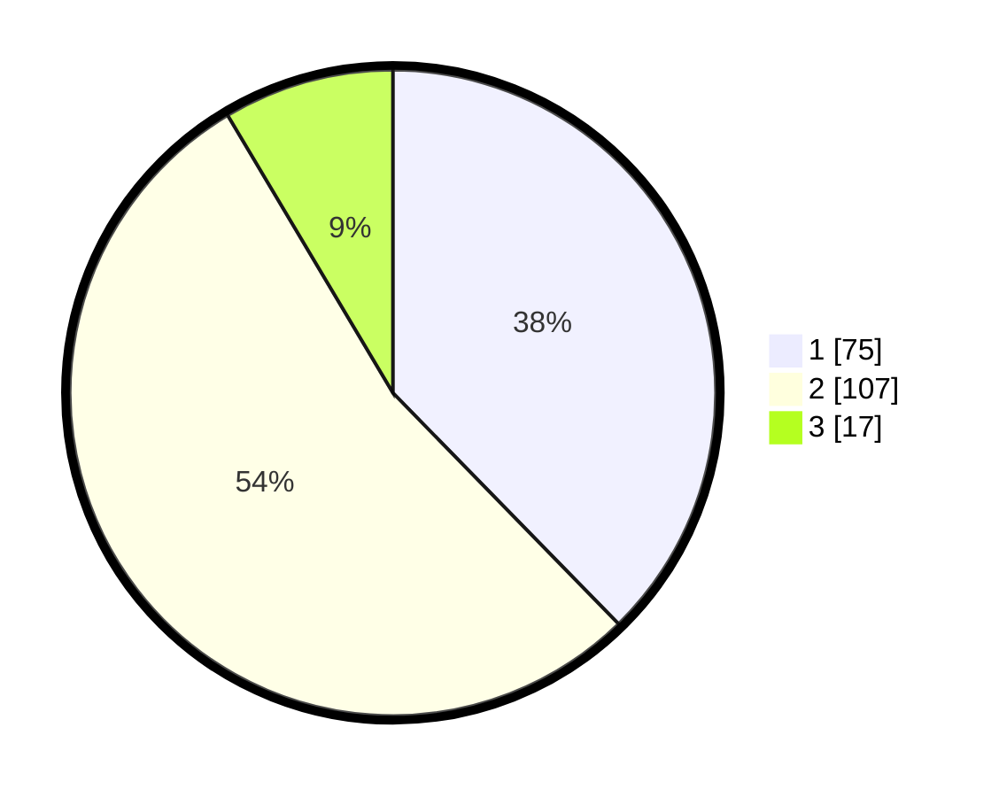

# Hasil

## Grafik

## Tabel

| No. | Nama Paslon    | Suara | Suara (raw) | Persentase |
|:--- |:-------------- | -----:| -----------:| ----------:|
| 1   | ANIES MUHAIMIN | 75    | [75][p-1]   | 37,69      |
| 2   | PRABOWO GIBRAN | 107   | [107][p-2]  | 53,77      |
| 3   | GANJAR MAHFUD  | 17    | [17][p-3]   | 8,54       |

[p-1]: https://github.com/gigit-pemilu/pemilu-2024/blob/main/pilpres/hitung-suara/sub/35-jawa-timur/sub/10-banyuwangi/sub/18-wongsorejo/sub/2003-alasbuluh/sub/027-tps/sub/paslon-1.txt
[p-2]: https://github.com/gigit-pemilu/pemilu-2024/blob/main/pilpres/hitung-suara/sub/35-jawa-timur/sub/10-banyuwangi/sub/18-wongsorejo/sub/2003-alasbuluh/sub/027-tps/sub/paslon-2.txt
[p-3]: https://github.com/gigit-pemilu/pemilu-2024/blob/main/pilpres/hitung-suara/sub/35-jawa-timur/sub/10-banyuwangi/sub/18-wongsorejo/sub/2003-alasbuluh/sub/027-tps/sub/paslon-3.txt

## Foto C Plano

https://sirekap-obj-formc.kpu.go.id/7eff/pemilu/ppwp/35/10/18/20/03/3510182003027-20240214-233403--92b2cb65-3cf7-4ddc-bf65-3998b6f4a723.jpg

https://sirekap-obj-formc.kpu.go.id/7eff/pemilu/ppwp/35/10/18/20/03/3510182003027-20240214-233757--a346b553-8b78-40a3-94a9-e80b0a715e4b.jpg

https://sirekap-obj-formc.kpu.go.id/7eff/pemilu/ppwp/35/10/18/20/03/3510182003027-20240214-234016--4ebe4be2-016e-4a9b-8277-41a00e54ce03.jpg

## Metadata

| Key        | Value               |
| ---------- | ------------------- |
| Time Stamp | 2024-02-24 22:31:28 |

