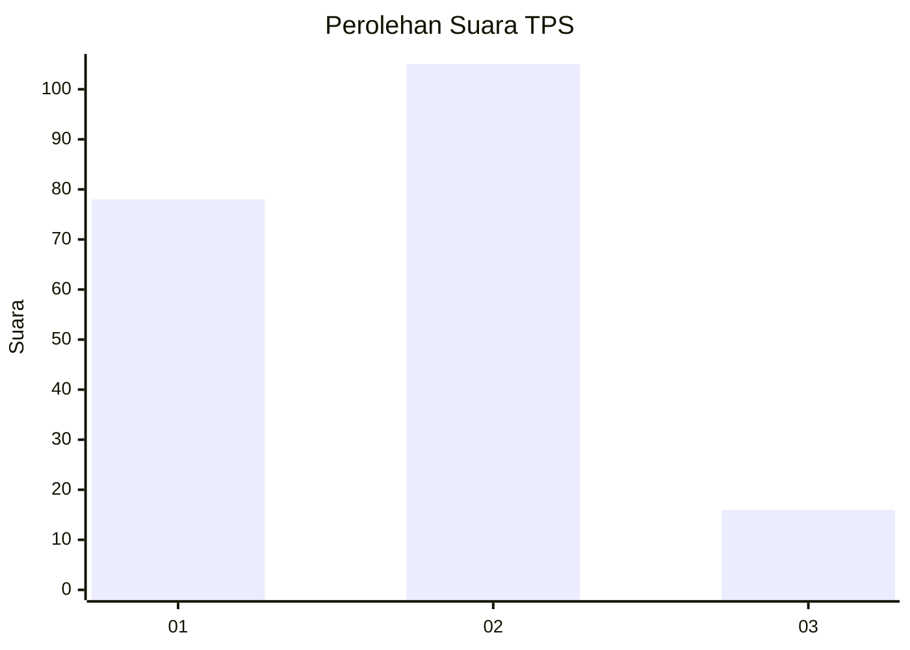
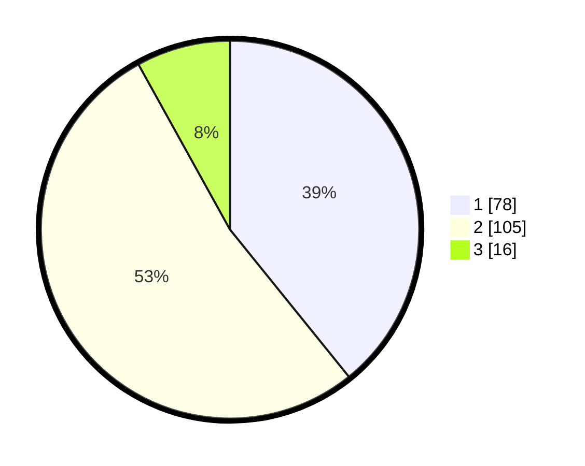

# Hasil

## Grafik

## Tabel

| No. | Nama Paslon    | Suara | Suara (raw) | Persentase |
|:--- |:-------------- | -----:| -----------:| ----------:|
| 1   | ANIES MUHAIMIN | 78    | [78][p-1]   | 39,20      |
| 2   | PRABOWO GIBRAN | 105   | [105][p-2]  | 52,76      |
| 3   | GANJAR MAHFUD  | 16    | [16][p-3]   | 8,04       |

[p-1]: https://github.com/gigit-pemilu/pemilu-2024-35-jawa-timur/blob/main/pilpres/hitung-suara/sub/35-jawa-timur/sub/10-banyuwangi/sub/18-wongsorejo/sub/2004-wongsorejo/sub/012-tps/sub/paslon-1.txt
[p-2]: https://github.com/gigit-pemilu/pemilu-2024-35-jawa-timur/blob/main/pilpres/hitung-suara/sub/35-jawa-timur/sub/10-banyuwangi/sub/18-wongsorejo/sub/2004-wongsorejo/sub/012-tps/sub/paslon-2.txt
[p-3]: https://github.com/gigit-pemilu/pemilu-2024-35-jawa-timur/blob/main/pilpres/hitung-suara/sub/35-jawa-timur/sub/10-banyuwangi/sub/18-wongsorejo/sub/2004-wongsorejo/sub/012-tps/sub/paslon-3.txt

## Foto C Plano

https://sirekap-obj-formc.kpu.go.id/249d/pemilu/ppwp/35/10/18/20/04/3510182004012-20240215-034333--9ae46d9f-770b-45a0-8b21-68b144cac6b9.jpg

https://sirekap-obj-formc.kpu.go.id/249d/pemilu/ppwp/35/10/18/20/04/3510182004012-20240215-034613--6ef518a2-c4f9-4d0e-9370-a00406c6e8f8.jpg

https://sirekap-obj-formc.kpu.go.id/249d/pemilu/ppwp/35/10/18/20/04/3510182004012-20240216-181557--06bb916b-40f1-4dca-9c46-70edd6b2044e.jpg

## Metadata

| Key        | Value               |
| ---------- | ------------------- |
| Time Stamp | 2024-02-16 21:01:00 |

