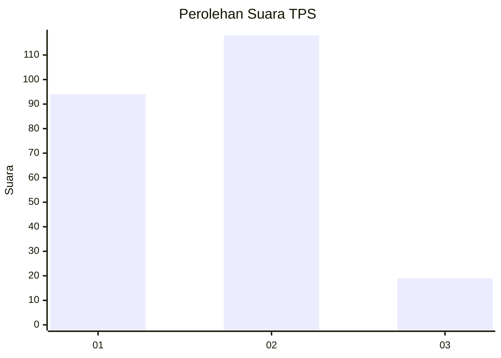
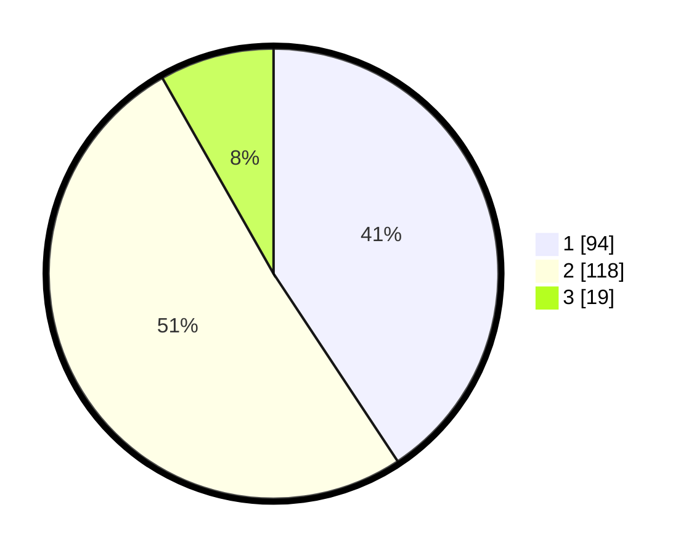

# Hasil

## Grafik

## Tabel

| No. | Nama Paslon    | Suara | Suara (raw) | Persentase |
|:--- |:-------------- | -----:| -----------:| ----------:|
| 1   | ANIES MUHAIMIN | 94    | [94][p-1]   | 40,69      |
| 2   | PRABOWO GIBRAN | 118   | [118][p-2]  | 51,08      |
| 3   | GANJAR MAHFUD  | 19    | [19][p-3]   | 8,23       |

[p-1]: https://github.com/gigit-pemilu/pemilu-2024/blob/main/pilpres/hitung-suara/sub/35-jawa-timur/sub/10-banyuwangi/sub/18-wongsorejo/sub/2004-wongsorejo/sub/015-tps/sub/paslon-1.txt
[p-2]: https://github.com/gigit-pemilu/pemilu-2024/blob/main/pilpres/hitung-suara/sub/35-jawa-timur/sub/10-banyuwangi/sub/18-wongsorejo/sub/2004-wongsorejo/sub/015-tps/sub/paslon-2.txt
[p-3]: https://github.com/gigit-pemilu/pemilu-2024/blob/main/pilpres/hitung-suara/sub/35-jawa-timur/sub/10-banyuwangi/sub/18-wongsorejo/sub/2004-wongsorejo/sub/015-tps/sub/paslon-3.txt

## Foto C Plano

https://sirekap-obj-formc.kpu.go.id/8d40/pemilu/ppwp/35/10/18/20/04/3510182004015-20240215-175806--368741ec-44c0-4b15-b7a3-b274e17d0f78.jpg

https://sirekap-obj-formc.kpu.go.id/8d40/pemilu/ppwp/35/10/18/20/04/3510182004015-20240215-175854--de301038-d10c-4e53-81a7-0f234deaa1b3.jpg

https://sirekap-obj-formc.kpu.go.id/8d40/pemilu/ppwp/35/10/18/20/04/3510182004015-20240214-200552--039c063f-2bda-4a2b-af0d-f71afe8e16c4.jpg

## Metadata

| Key        | Value               |
| ---------- | ------------------- |
| Time Stamp | 2024-02-24 22:31:28 |

