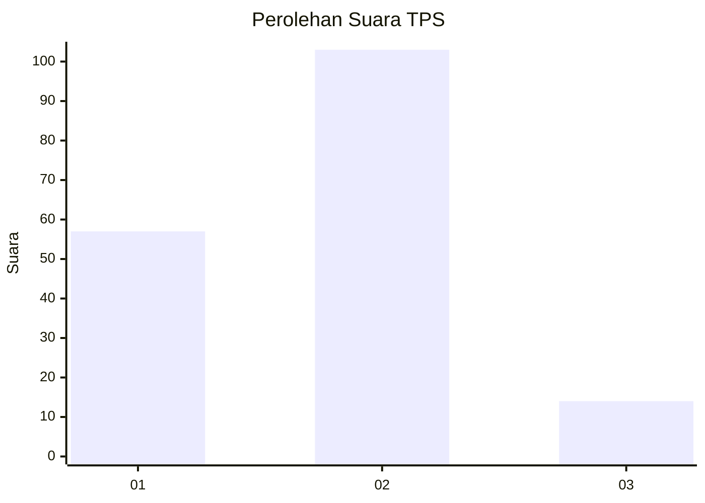
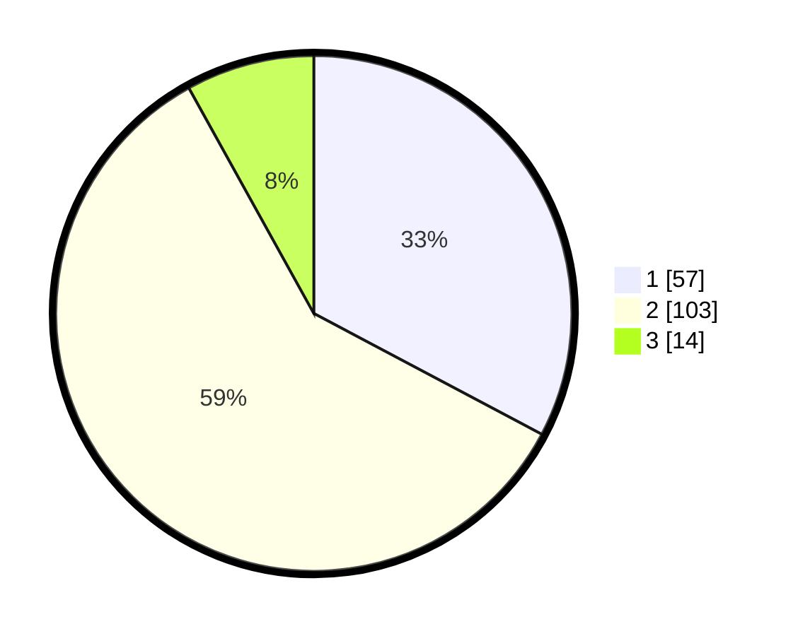

# Hasil

## Grafik

## Tabel

| No. | Nama Paslon    | Suara | Suara (raw) | Persentase |
|:--- |:-------------- | -----:| -----------:| ----------:|
| 1   | ANIES MUHAIMIN | 57    | [57][p-1]   | 32,76      |
| 2   | PRABOWO GIBRAN | 103   | [103][p-2]  | 59,20      |
| 3   | GANJAR MAHFUD  | 14    | [14][p-3]   | 8,05       |

[p-1]: https://github.com/gigit-pemilu/pemilu-2024/blob/main/pilpres/hitung-suara/sub/35-jawa-timur/sub/10-banyuwangi/sub/18-wongsorejo/sub/2004-wongsorejo/sub/019-tps/sub/paslon-1.txt
[p-2]: https://github.com/gigit-pemilu/pemilu-2024/blob/main/pilpres/hitung-suara/sub/35-jawa-timur/sub/10-banyuwangi/sub/18-wongsorejo/sub/2004-wongsorejo/sub/019-tps/sub/paslon-2.txt
[p-3]: https://github.com/gigit-pemilu/pemilu-2024/blob/main/pilpres/hitung-suara/sub/35-jawa-timur/sub/10-banyuwangi/sub/18-wongsorejo/sub/2004-wongsorejo/sub/019-tps/sub/paslon-3.txt

## Foto C Plano

https://sirekap-obj-formc.kpu.go.id/4555/pemilu/ppwp/35/10/18/20/04/3510182004019-20240215-195322--9cb162e0-8bf2-41da-bb70-1e8abe35f939.jpg

https://sirekap-obj-formc.kpu.go.id/4555/pemilu/ppwp/35/10/18/20/04/3510182004019-20240215-195704--9c0ccfc6-f119-4633-95a1-ec2604564629.jpg

https://sirekap-obj-formc.kpu.go.id/4555/pemilu/ppwp/35/10/18/20/04/3510182004019-20240215-195809--529f8232-1dc7-4c40-8be8-63f9efa11feb.jpg

## Metadata

| Key        | Value               |
| ---------- | ------------------- |
| Time Stamp | 2024-02-15 23:29:50 |

