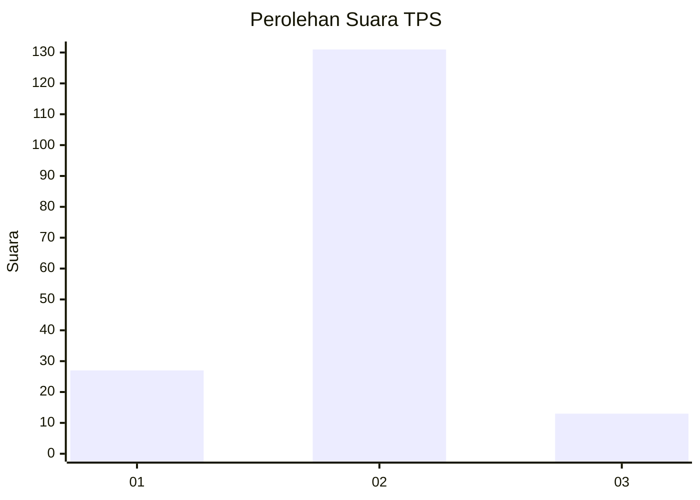
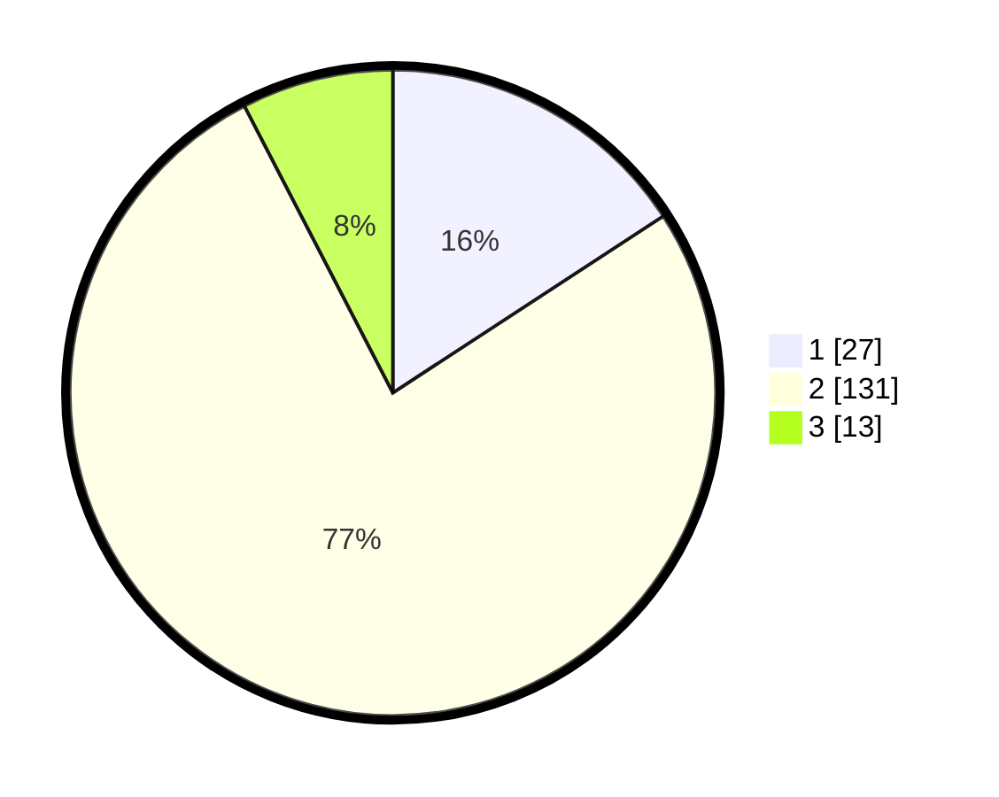

# Hasil

## Grafik

## Tabel

| No. | Nama Paslon    | Suara | Suara (raw) | Persentase |
|:--- |:-------------- | -----:| -----------:| ----------:|
| 1   | ANIES MUHAIMIN | 27    | [27][p-1]   | 15,79      |
| 2   | PRABOWO GIBRAN | 131   | [131][p-2]  | 76,61      |
| 3   | GANJAR MAHFUD  | 13    | [13][p-3]   | 7,60       |

[p-1]: https://github.com/gigit-pemilu/pemilu-2024-35-jawa-timur/blob/main/pilpres/hitung-suara/sub/35-jawa-timur/sub/10-banyuwangi/sub/18-wongsorejo/sub/2004-wongsorejo/sub/031-tps/sub/paslon-1.txt
[p-2]: https://github.com/gigit-pemilu/pemilu-2024-35-jawa-timur/blob/main/pilpres/hitung-suara/sub/35-jawa-timur/sub/10-banyuwangi/sub/18-wongsorejo/sub/2004-wongsorejo/sub/031-tps/sub/paslon-2.txt
[p-3]: https://github.com/gigit-pemilu/pemilu-2024-35-jawa-timur/blob/main/pilpres/hitung-suara/sub/35-jawa-timur/sub/10-banyuwangi/sub/18-wongsorejo/sub/2004-wongsorejo/sub/031-tps/sub/paslon-3.txt

## Foto C Plano

https://sirekap-obj-formc.kpu.go.id/32ab/pemilu/ppwp/35/10/18/20/04/3510182004031-20240215-065355--06e51f4e-fbf8-4602-b149-8c50ef05d9f4.jpg

https://sirekap-obj-formc.kpu.go.id/32ab/pemilu/ppwp/35/10/18/20/04/3510182004031-20240215-065458--5d00ee2c-c44a-40ec-bfca-f9684607e9b7.jpg

https://sirekap-obj-formc.kpu.go.id/32ab/pemilu/ppwp/35/10/18/20/04/3510182004031-20240215-065609--77c41b06-a39f-4453-bdda-337bf9fc649c.jpg

## Metadata

| Key        | Value               |
| ---------- | ------------------- |
| Time Stamp | 2024-02-24 22:31:28 |

