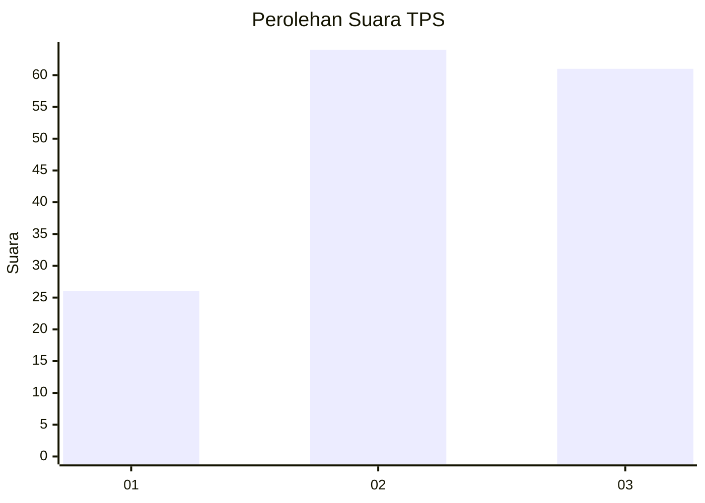
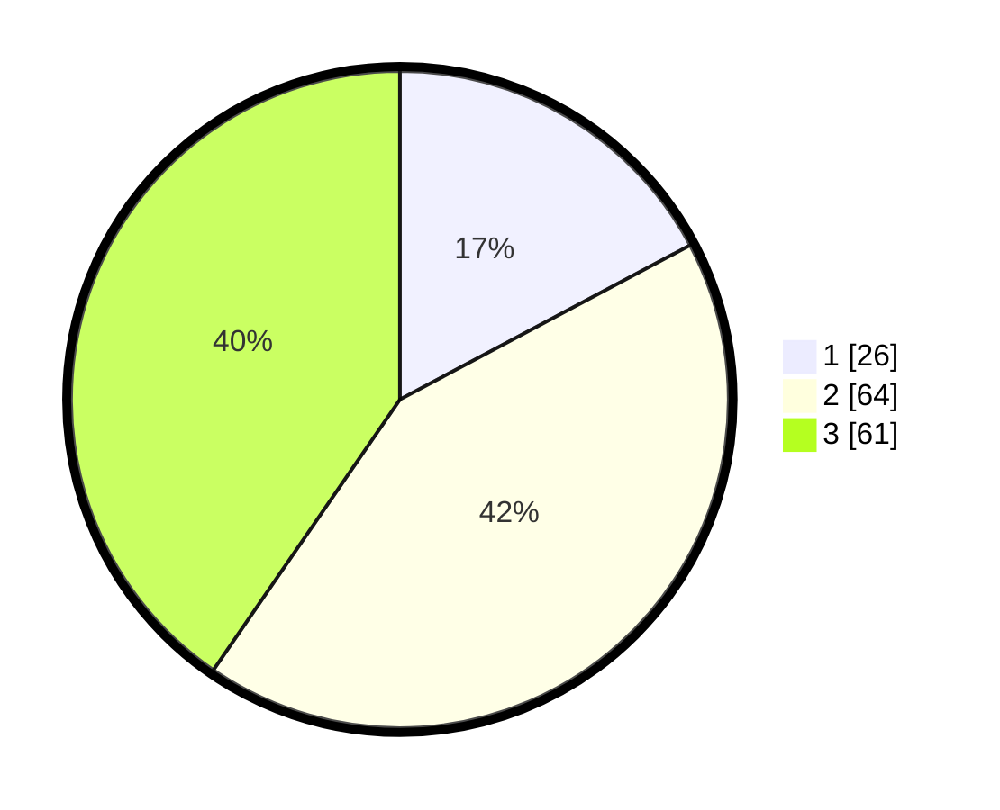

# Hasil

## Grafik

## Tabel

| No. | Nama Paslon    | Suara | Suara (raw) | Persentase |
|:--- |:-------------- | -----:| -----------:| ----------:|
| 1   | ANIES MUHAIMIN | 26    | [26][p-1]   | 17,22      |
| 2   | PRABOWO GIBRAN | 64    | [64][p-2]   | 42,38      |
| 3   | GANJAR MAHFUD  | 61    | [61][p-3]   | 40,40      |

[p-1]: https://github.com/gigit-pemilu/pemilu-2024/blob/main/pilpres/hitung-suara/sub/35-jawa-timur/sub/10-banyuwangi/sub/18-wongsorejo/sub/2004-wongsorejo/sub/034-tps/sub/paslon-1.txt
[p-2]: https://github.com/gigit-pemilu/pemilu-2024/blob/main/pilpres/hitung-suara/sub/35-jawa-timur/sub/10-banyuwangi/sub/18-wongsorejo/sub/2004-wongsorejo/sub/034-tps/sub/paslon-2.txt
[p-3]: https://github.com/gigit-pemilu/pemilu-2024/blob/main/pilpres/hitung-suara/sub/35-jawa-timur/sub/10-banyuwangi/sub/18-wongsorejo/sub/2004-wongsorejo/sub/034-tps/sub/paslon-3.txt

## Foto C Plano

https://sirekap-obj-formc.kpu.go.id/9938/pemilu/ppwp/35/10/18/20/04/3510182004034-20240215-201820--3286f4fd-accf-47cc-84b5-7d1f990c9dee.jpg

https://sirekap-obj-formc.kpu.go.id/9938/pemilu/ppwp/35/10/18/20/04/3510182004034-20240215-200803--19a3edf6-e32f-4db9-9814-22665d85f36e.jpg

https://sirekap-obj-formc.kpu.go.id/9938/pemilu/ppwp/35/10/18/20/04/3510182004034-20240215-201541--8703be7b-bc1d-4d48-bbcb-476a9a97d312.jpg

## Metadata

| Key        | Value               |
| ---------- | ------------------- |
| Time Stamp | 2024-02-24 22:31:28 |

