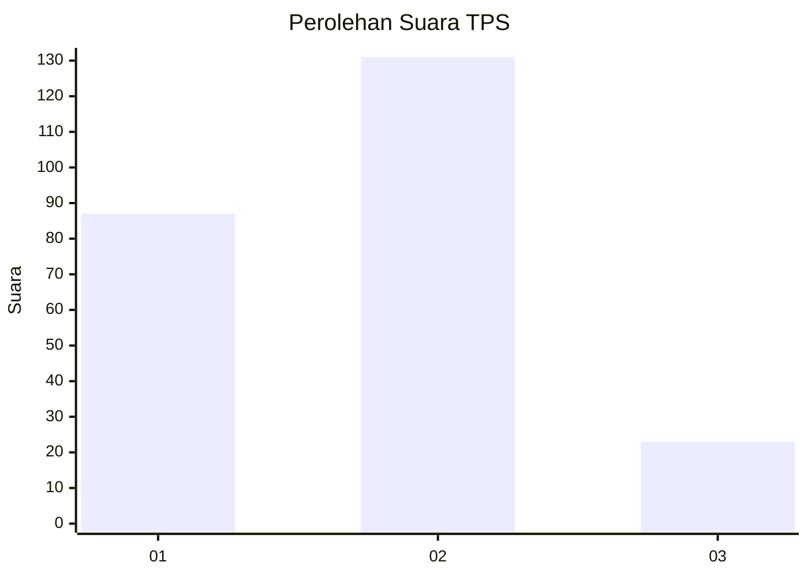

# Hasil

## Grafik

## Tabel

| No. | Nama Paslon    | Suara | Suara (raw) | Persentase |
|:--- |:-------------- | -----:| -----------:| ----------:|
| 1   | ANIES MUHAIMIN | 87    | [87][p-1]   | 36,10      |
| 2   | PRABOWO GIBRAN | 131   | [131][p-2]  | 54,36      |
| 3   | GANJAR MAHFUD  | 23    | [23][p-3]   | 9,54       |

[p-1]: https://github.com/gigit-pemilu/pemilu-2024-35-jawa-timur/blob/main/pilpres/hitung-suara/sub/35-jawa-timur/sub/10-banyuwangi/sub/18-wongsorejo/sub/2005-sumberkencono/sub/007-tps/sub/paslon-1.txt
[p-2]: https://github.com/gigit-pemilu/pemilu-2024-35-jawa-timur/blob/main/pilpres/hitung-suara/sub/35-jawa-timur/sub/10-banyuwangi/sub/18-wongsorejo/sub/2005-sumberkencono/sub/007-tps/sub/paslon-2.txt
[p-3]: https://github.com/gigit-pemilu/pemilu-2024-35-jawa-timur/blob/main/pilpres/hitung-suara/sub/35-jawa-timur/sub/10-banyuwangi/sub/18-wongsorejo/sub/2005-sumberkencono/sub/007-tps/sub/paslon-3.txt

## Foto C Plano

https://sirekap-obj-formc.kpu.go.id/7f82/pemilu/ppwp/35/10/18/20/05/3510182005007-20240214-231340--7250530e-fe14-478b-9273-7bb00870b1af.jpg

https://sirekap-obj-formc.kpu.go.id/7f82/pemilu/ppwp/35/10/18/20/05/3510182005007-20240214-231429--1a951a44-8e65-44e0-8e27-2bdad009c393.jpg

https://sirekap-obj-formc.kpu.go.id/7f82/pemilu/ppwp/35/10/18/20/05/3510182005007-20240214-231108--ad67ff0d-9f2f-403a-830b-e88627bfaafe.jpg

## Metadata

| Key        | Value               |
| ---------- | ------------------- |
| Time Stamp | 2024-02-15 09:00:24 |

